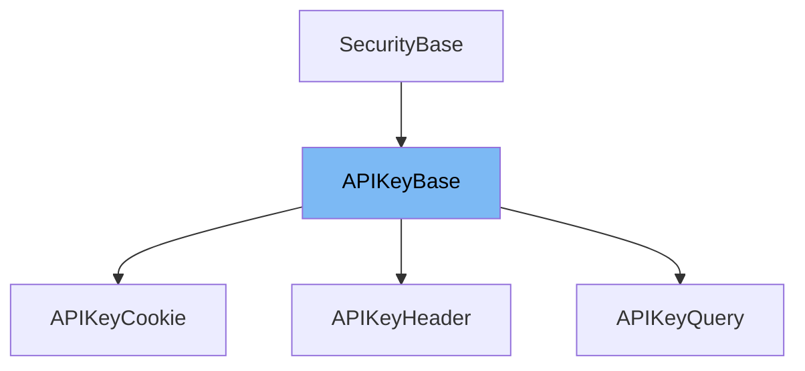

This document will cover the following aspects of the `APIKeyBase` class:

1. What is `APIKeyBase`.
2. Variables and functions in `APIKeyBase`.
3. An example of how to use `APIKeyBase`.



# What is APIKeyBase

`APIKeyBase` is a class in the `fastapi/security/api_key.py` file. It is a base class for API key authentication. It doesn't contain any variables or functions, but it is extended by other classes like `APIKeyQuery`, `APIKeyHeader`, and `APIKeyCookie` which provide specific implementations for API key authentication using a query parameter, a header, and a cookie respectively.

<SwmSnippet path="/fastapi/security/api_key.py" line="11">

---

# Variables and functions

`APIKeyBase` is a class that inherits from `SecurityBase`. It doesn't define any variables or functions of its own.

```python
class APIKeyBase(SecurityBase):
    pass
```

---

</SwmSnippet>

<SwmSnippet path="/fastapi/security/api_key.py" line="15">

---

# Usage example

`APIKeyQuery` is an example of a class that extends `APIKeyBase`. It provides an implementation for API key authentication using a query parameter. It defines the name of the query parameter that should be provided in the request with the API key and integrates that into the OpenAPI documentation. It extracts the key value sent in the query parameter automatically and provides it as the dependency result.

````python
class APIKeyQuery(APIKeyBase):
    """
    API key authentication using a query parameter.

    This defines the name of the query parameter that should be provided in the request
    with the API key and integrates that into the OpenAPI documentation. It extracts
    the key value sent in the query parameter automatically and provides it as the
    dependency result. But it doesn't define how to send that API key to the client.

    ## Usage

    Create an instance object and use that object as the dependency in `Depends()`.

    The dependency result will be a string containing the key value.

    ## Example

    ```python
    from fastapi import Depends, FastAPI
    from fastapi.security import APIKeyQuery

````

---

</SwmSnippet>

&nbsp;

*This is an auto-generated document by Swimm AI 🌊 and has not yet been verified by a human*

<SwmMeta version="3.0.0" repo-id="Z2l0aHViJTNBJTNBREVNTy1mYXN0YXBpJTNBJTNBZ2lsYWRuYXZvdA==" repo-name="DEMO-fastapi" doc-type="class"><sup>Powered by [Swimm](/)</sup></SwmMeta>
