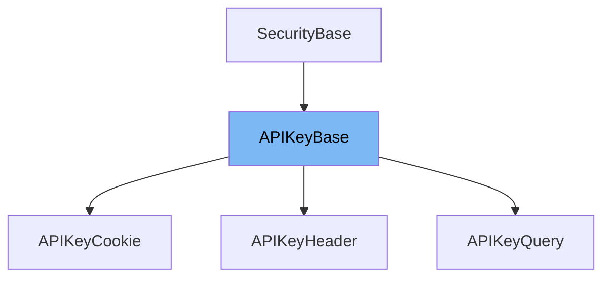

This document will cover the `APIKeyBase` class in the `fastapi/security/api_key.py` file. We'll cover:

1. What `APIKeyBase` is and its purpose.
2. The variables and functions defined in `APIKeyBase`.
3. An example of how `APIKeyBase` is used in `APIKeyQuery`.



# What is APIKeyBase

`APIKeyBase` is a class in the `fastapi/security/api_key.py` file. It's a base class for API key authentication. It doesn't contain any variables or functions, but it's extended by other classes like `APIKeyQuery`, `APIKeyHeader`, and `APIKeyCookie` to implement different types of API key authentication.

<SwmSnippet path="/fastapi/security/api_key.py" line="11">

---

# Variables and functions

`APIKeyBase` doesn't define any variables or functions. It's a base class that other classes extend to implement specific types of API key authentication.

```python
class APIKeyBase(SecurityBase):
    pass
```

---

</SwmSnippet>

<SwmSnippet path="/fastapi/security/api_key.py" line="15">

---

# Usage example

`APIKeyBase` is extended by the `APIKeyQuery` class. `APIKeyQuery` uses a query parameter for API key authentication. It defines the name of the query parameter that should be provided in the request with the API key and integrates that into the OpenAPI documentation. It extracts the key value sent in the query parameter automatically and provides it as the dependency result.

````python
class APIKeyQuery(APIKeyBase):
    """
    API key authentication using a query parameter.

    This defines the name of the query parameter that should be provided in the request
    with the API key and integrates that into the OpenAPI documentation. It extracts
    the key value sent in the query parameter automatically and provides it as the
    dependency result. But it doesn't define how to send that API key to the client.

    ## Usage

    Create an instance object and use that object as the dependency in `Depends()`.

    The dependency result will be a string containing the key value.

    ## Example

    ```python
    from fastapi import Depends, FastAPI
    from fastapi.security import APIKeyQuery

````

---

</SwmSnippet>

&nbsp;

*This is an auto-generated document by Swimm AI 🌊 and has not yet been verified by a human*

<SwmMeta version="3.0.0" repo-id="Z2l0aHViJTNBJTNBREVNTy1mYXN0YXBpJTNBJTNBZ2lsYWRuYXZvdA==" repo-name="DEMO-fastapi" doc-type="class"><sup>Powered by [Swimm](/)</sup></SwmMeta>
