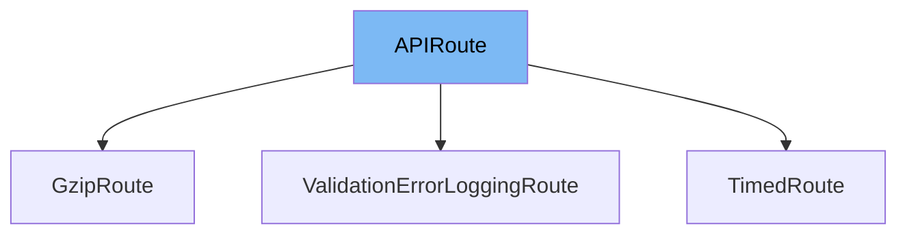

This document will cover the following topics:

1. What is APIRoute
2. Variables and functions in APIRoute
3. Usage example of APIRoute



# What is APIRoute

APIRoute is a class in FastAPI that is used to define a single API route. It is responsible for handling HTTP requests to a specific path, processing the request data, calling the appropriate endpoint function, and generating the response. It also handles route parameters, request bodies, and other details of the HTTP request.

<SwmSnippet path="/fastapi/routing.py" line="390">

---

# Variables and functions in APIRoute

The `path` variable is used to store the URL path for this route. It is a string that is provided when the APIRoute is created.

```python
    def __init__(
```

---

</SwmSnippet>

<SwmSnippet path="/fastapi/routing.py" line="391">

---

The `endpoint` variable is the function that should be called when this route is matched. It is provided when the APIRoute is created.

```python
        self,
```

---

</SwmSnippet>

<SwmSnippet path="/fastapi/routing.py" line="393">

---

The `response_model` variable is a Pydantic model that the endpoint function's return data should be serialized with.

```python
        endpoint: Callable[..., Any],
```

---

</SwmSnippet>

<SwmSnippet path="/fastapi/routing.py" line="396">

---

The `tags` variable is a list of tags for this route. These tags are used in the automatic API documentation.

```python
        status_code: Optional[int] = None,
```

---

</SwmSnippet>

<SwmSnippet path="/fastapi/routing.py" line="397">

---

The `dependencies` variable is a list of dependencies for this route. These dependencies are resolved before the endpoint function is called and can be used to handle things like data validation, authentication, and database sessions.

```python
        tags: Optional[List[Union[str, Enum]]] = None,
```

---

</SwmSnippet>

<SwmSnippet path="/fastapi/routing.py" line="398">

---

The `summary` variable is a short summary of what the endpoint does. It is used in the automatic API documentation.

```python
        dependencies: Optional[Sequence[params.Depends]] = None,
```

---

</SwmSnippet>

<SwmSnippet path="/fastapi/routing.py" line="399">

---

The `description` variable is a longer description of what the endpoint does. It is used in the automatic API documentation.

```python
        summary: Optional[str] = None,
```

---

</SwmSnippet>

<SwmSnippet path="/fastapi/routing.py" line="400">

---

The `response_description` variable is a description of what the endpoint's response means. It is used in the automatic API documentation.

```python
        description: Optional[str] = None,
```

---

</SwmSnippet>

<SwmSnippet path="/fastapi/routing.py" line="401">

---

The `responses` variable is a dictionary of additional response descriptions. The keys are status codes and the values are descriptions. This is used in the automatic API documentation.

```python
        response_description: str = "Successful Response",
```

---

</SwmSnippet>

<SwmSnippet path="/fastapi/routing.py" line="402">

---

The `deprecated` variable is a boolean that indicates whether this endpoint is deprecated.

```python
        responses: Optional[Dict[Union[int, str], Dict[str, Any]]] = None,
```

---

</SwmSnippet>

<SwmSnippet path="/fastapi/routing.py" line="403">

---

The `methods` variable is a set of HTTP methods that this route should respond to.

```python
        deprecated: Optional[bool] = None,
```

---

</SwmSnippet>

<SwmSnippet path="/fastapi/routing.py" line="404">

---

The `operation_id` variable is a unique identifier for this operation. It is used in the automatic API documentation.

```python
        name: Optional[str] = None,
```

---

</SwmSnippet>

<SwmSnippet path="/fastapi/routing.py" line="405">

---

The `response_model_include` variable is a set of fields to include in the response model. If not provided, all fields are included.

```python
        methods: Optional[Union[Set[str], List[str]]] = None,
```

---

</SwmSnippet>

<SwmSnippet path="/fastapi/routing.py" line="406">

---

The `response_model_exclude` variable is a set of fields to exclude from the response model. If not provided, no fields are excluded.

```python
        operation_id: Optional[str] = None,
```

---

</SwmSnippet>

<SwmSnippet path="/fastapi/routing.py" line="407">

---

The `response_model_by_alias` variable is a boolean that determines whether the response model should use alias names.

```python
        response_model_include: Optional[IncEx] = None,
```

---

</SwmSnippet>

<SwmSnippet path="/fastapi/routing.py" line="408">

---

The `response_model_exclude_unset` variable is a boolean that determines whether fields with unset values should be excluded from the response model.

```python
        response_model_exclude: Optional[IncEx] = None,
```

---

</SwmSnippet>

<SwmSnippet path="/fastapi/routing.py" line="409">

---

The `include_in_schema` variable is a boolean that determines whether this route should be included in the automatic API documentation.

```python
        response_model_by_alias: bool = True,
```

---

</SwmSnippet>

<SwmSnippet path="/fastapi/routing.py" line="410">

---

The `response_class` variable is the class that should be used for the response. By default, it is a JSONResponse.

```python
        response_model_exclude_unset: bool = False,
```

---

</SwmSnippet>

<SwmSnippet path="/fastapi/routing.py" line="411">

---

The `name` variable is a name for this route. It is only used internally.

```python
        response_model_exclude_defaults: bool = False,
```

---

</SwmSnippet>

<SwmSnippet path="/fastapi/routing.py" line="412">

---

The `dependency_overrides_provider` variable is used to override dependencies for this route.

```python
        response_model_exclude_none: bool = False,
```

---

</SwmSnippet>

<SwmSnippet path="/fastapi/routing.py" line="413">

---

The `callbacks` variable is a list of callback routes that should be executed after this route.

```python
        include_in_schema: bool = True,
```

---

</SwmSnippet>

<SwmSnippet path="/fastapi/routing.py" line="414">

---

The `openapi_extra` variable is a dictionary of additional metadata to include in the OpenAPI schema for this route.

```python
        response_class: Union[Type[Response], DefaultPlaceholder] = Default(
```

---

</SwmSnippet>

<SwmSnippet path="/fastapi/routing.py" line="415">

---

The `generate_unique_id_function` variable is a function that generates a unique ID for this route. It is used in the automatic API documentation.

```python
            JSONResponse
```

---

</SwmSnippet>

<SwmSnippet path="/fastapi/routing.py" line="522">

---

The `get_route_handler` function returns a request handler function for this route. The request handler is responsible for processing the HTTP request and calling the appropriate endpoint function.

```python
    def get_route_handler(self) -> Callable[[Request], Coroutine[Any, Any, Response]]:
        return get_request_handler(
            dependant=self.dependant,
            body_field=self.body_field,
            status_code=self.status_code,
            response_class=self.response_class,
            response_field=self.secure_cloned_response_field,
            response_model_include=self.response_model_include,
            response_model_exclude=self.response_model_exclude,
            response_model_by_alias=self.response_model_by_alias,
            response_model_exclude_unset=self.response_model_exclude_unset,
            response_model_exclude_defaults=self.response_model_exclude_defaults,
            response_model_exclude_none=self.response_model_exclude_none,
            dependency_overrides_provider=self.dependency_overrides_provider,
        )
```

---

</SwmSnippet>

# Usage example

APIRoute is used internally by FastAPI and you generally do not need to use it directly. Instead, you define route functions using the FastAPI route decorators like `@app.get()`, `@app.post()`, etc. These decorators create instances of APIRoute for each route.

&nbsp;

*This is an auto-generated document by Swimm AI 🌊 and has not yet been verified by a human*

<SwmMeta version="3.0.0" repo-id="Z2l0aHViJTNBJTNBREVNTy1mYXN0YXBpJTNBJTNBZ2lsYWRuYXZvdA==" repo-name="DEMO-fastapi" doc-type="class"><sup>Powered by [Swimm](/)</sup></SwmMeta>
