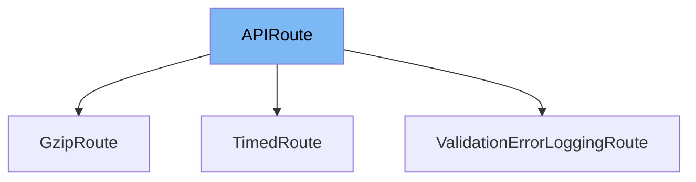

This document will cover the `APIRoute` class in the `fastapi/routing.py` file. We'll cover:

1. What is `APIRoute`
2. Variables and functions in `APIRoute`
3. Usage example of `APIRoute` in `GzipRoute`.



# What is APIRoute

`APIRoute` is a class in the `fastapi/routing.py` file. It is a key component of the FastAPI framework and is used to define individual API routes. An API route is a specific endpoint or path in the API, such as `/items` or `/users`. Each route is associated with a specific HTTP method (like `GET`, `POST`, etc.), a specific function that should be executed when the route is called, and additional metadata like response model, status code, tags, etc.

<SwmSnippet path="/fastapi/routing.py" line="389">

---

# Variables and functions in APIRoute

This is the definition of the `APIRoute` class. It includes several variables and functions. The variables include `path`, `endpoint`, `response_model`, `status_code`, `tags`, `dependencies`, `summary`, `description`, `response_description`, `responses`, `deprecated`, `methods`, `operation_id`, `response_model_include`, `response_model_exclude`, `response_model_by_alias`, `response_model_exclude_unset`, `response_model_exclude_defaults`, `response_model_exclude_none`, `include_in_schema`, `response_class`, `name`, `methods`, `operation_id`, `response_model_include`, `response_model_exclude`, `response_model_by_alias`, `response_model_exclude_unset`, `response_model_exclude_defaults`, `response_model_exclude_none`, `include_in_schema`, `response_class`, `name`, `dependency_overrides_provider`, `callbacks`, `openapi_extra`, `response_field`, `response_fields`, `status_code`, `dependencies`, `body_field`, `app`.

```python
class APIRoute(routing.Route):
    def __init__(
        self,
        path: str,
        endpoint: Callable[..., Any],
        *,
        response_model: Any = Default(None),
        status_code: Optional[int] = None,
        tags: Optional[List[Union[str, Enum]]] = None,
        dependencies: Optional[Sequence[params.Depends]] = None,
        summary: Optional[str] = None,
        description: Optional[str] = None,
        response_description: str = "Successful Response",
        responses: Optional[Dict[Union[int, str], Dict[str, Any]]] = None,
        deprecated: Optional[bool] = None,
        name: Optional[str] = None,
        methods: Optional[Union[Set[str], List[str]]] = None,
        operation_id: Optional[str] = None,
        response_model_include: Optional[IncEx] = None,
        response_model_exclude: Optional[IncEx] = None,
        response_model_by_alias: bool = True,
```

---

</SwmSnippet>

<SwmSnippet path="/fastapi/routing.py" line="389">

---

The `APIRoute` class also includes several functions. These include `__init__`, `get_route_handler`, `matches`, and others. Each of these functions plays a crucial role in the functionality of the `APIRoute` class.

```python
class APIRoute(routing.Route):
    def __init__(
        self,
        path: str,
        endpoint: Callable[..., Any],
        *,
        response_model: Any = Default(None),
        status_code: Optional[int] = None,
        tags: Optional[List[Union[str, Enum]]] = None,
        dependencies: Optional[Sequence[params.Depends]] = None,
        summary: Optional[str] = None,
        description: Optional[str] = None,
        response_description: str = "Successful Response",
        responses: Optional[Dict[Union[int, str], Dict[str, Any]]] = None,
        deprecated: Optional[bool] = None,
        name: Optional[str] = None,
        methods: Optional[Union[Set[str], List[str]]] = None,
        operation_id: Optional[str] = None,
        response_model_include: Optional[IncEx] = None,
        response_model_exclude: Optional[IncEx] = None,
        response_model_by_alias: bool = True,
```

---

</SwmSnippet>

# Usage example of APIRoute in GzipRoute

Unfortunately, the `GzipRoute` example is not available in the provided context. However, `APIRoute` is typically used in FastAPI applications when defining new routes. It's instantiated with the path and the endpoint function, along with optional parameters like `response_model`, `status_code`, etc. The instance of `APIRoute` is then usually added to an `APIRouter`.

&nbsp;

*This is an auto-generated document by Swimm AI 🌊 and has not yet been verified by a human*

<SwmMeta version="3.0.0" repo-id="Z2l0aHViJTNBJTNBREVNTy1mYXN0YXBpJTNBJTNBZ2lsYWRuYXZvdA==" repo-name="DEMO-fastapi" doc-type="class"><sup>Powered by [Swimm](/)</sup></SwmMeta>
