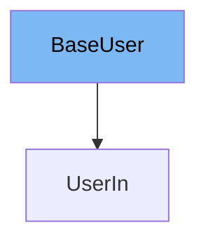

This document will cover the `BaseUser` class. We'll cover:

1. What is `BaseUser`
2. Variables and functions in `BaseUser`
3. Usage example of `BaseUser`.



# What is BaseUser

`BaseUser` is a class that represents a user in the application. It is used to store and validate user information. It is a subclass of the `BaseModel` class from the `pydantic` library, which provides runtime data validation and settings management using Python type annotations.

<SwmSnippet path="/docs_src/response_model/tutorial003_01.py" line="10">

---

# Variables in BaseUser

The variable `username` is a string that stores the username of the user.

```python
    username: str
```

---

</SwmSnippet>

<SwmSnippet path="/docs_src/response_model/tutorial003_01.py" line="11">

---

The variable `email` is an instance of `EmailStr` from the `pydantic` library, which validates that the email is a valid email string.

```python
    email: EmailStr
```

---

</SwmSnippet>

<SwmSnippet path="/docs_src/response_model/tutorial003_01.py" line="12">

---

The variable `full_name` is a string that stores the full name of the user. It is optional and can be `None`.

```python
    full_name: Union[str, None] = None
```

---

</SwmSnippet>

<SwmSnippet path="/docs_src/response_model/tutorial003_01.py" line="15">

---

# Usage example

`BaseUser` is used as a base class for the `UserIn` class. `UserIn` extends `BaseUser` and adds a `password` field. This shows how `BaseUser` can be extended to add more fields for different use cases.

```python
class UserIn(BaseUser):
    password: str
```

---

</SwmSnippet>

<SwmSnippet path="/docs_src/response_model/tutorial003_01.py" line="19">

---

Here, `BaseUser` is used as the return type of the `create_user` function. This function takes a `UserIn` instance as input and returns a `BaseUser` instance. This shows how `BaseUser` can be used to define the input and output types of API endpoints.

```python
@app.post("/user/")
async def create_user(user: UserIn) -> BaseUser:
    return user
```

---

</SwmSnippet>

&nbsp;

*This is an auto-generated document by Swimm AI 🌊 and has not yet been verified by a human*

<SwmMeta version="3.0.0" repo-id="Z2l0aHViJTNBJTNBREVNTy1mYXN0YXBpJTNBJTNBZ2lsYWRuYXZvdA==" repo-name="DEMO-fastapi" doc-type="general-class"><sup>Powered by [Swimm](/)</sup></SwmMeta>
