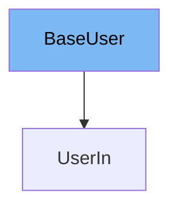

This document will cover the `BaseUser` class in the DEMO-fastapi repository. We'll cover:

1. What is `BaseUser`
2. Variables and functions in `BaseUser`
3. Usage example of `BaseUser`



# What is BaseUser

`BaseUser` is a class that represents a user in the codebase. It is used to store information about a user and is the base class for other user-related classes.

<SwmSnippet path="/docs_src/response_model/tutorial003_01_py310.py" line="8">

---

# Variables in BaseUser

The variable `username` is used to store the username of the user. It is a required string.

```python
    username: str
```

---

</SwmSnippet>

<SwmSnippet path="/docs_src/response_model/tutorial003_01_py310.py" line="9">

---

The variable `email` is used to store the email of the user. It is a required string and must be a valid email.

```python
    email: EmailStr
```

---

</SwmSnippet>

<SwmSnippet path="/docs_src/response_model/tutorial003_01_py310.py" line="10">

---

The variable `full_name` is used to store the full name of the user. It is an optional string and can be null.

```python
    full_name: str | None = None
```

---

</SwmSnippet>

<SwmSnippet path="/docs_src/response_model/tutorial003_01_py310.py" line="13">

---

# Usage example

`UserIn` class extends the `BaseUser` class. It adds a `password` field to the base user fields. This is an example of how to use `BaseUser`.

```python
class UserIn(BaseUser):
    password: str
```

---

</SwmSnippet>

&nbsp;

*This is an auto-generated document by Swimm AI 🌊 and has not yet been verified by a human*

<SwmMeta version="3.0.0" repo-id="Z2l0aHViJTNBJTNBREVNTy1mYXN0YXBpJTNBJTNBZ2lsYWRuYXZvdA==" repo-name="DEMO-fastapi" doc-type="general-class"><sup>Powered by [Swimm](/)</sup></SwmMeta>
