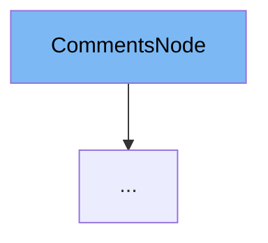

This document will cover the following aspects of the `CommentsNode` class:

1. What is `CommentsNode`
2. Variables and functions in `CommentsNode`
3. Usage example of `CommentsNode`



# What is CommentsNode

`CommentsNode` is a class defined in the `main.py` file of the `people` app in the `.github/actions` directory. It is a data model that represents a comment node in a discussion. It is used to store and manage the data related to a comment in a discussion.

<SwmSnippet path="/.github/actions/people/app/main.py" line="150">

---

# Variables in CommentsNode

`CommentsNode` has two variables: `createdAt` and `author`. `createdAt` is a datetime object that stores the time when the comment was created. `author` is an instance of the `Author` class or None, it represents the author of the comment.

```python
class CommentsNode(BaseModel):
    createdAt: datetime
    author: Union[Author, None] = None

```

---

</SwmSnippet>

<SwmSnippet path="/.github/actions/people/app/main.py" line="159">

---

# Usage of CommentsNode

`CommentsNode` is used as a base class for `DiscussionsCommentsNode`. `DiscussionsCommentsNode` extends `CommentsNode` and adds an additional variable `replies` which is an instance of the `Replies` class.

```python
class DiscussionsCommentsNode(CommentsNode):
    replies: Replies

```

---

</SwmSnippet>

&nbsp;

*This is an auto-generated document by Swimm AI 🌊 and has not yet been verified by a human*

<SwmMeta version="3.0.0" repo-id="Z2l0aHViJTNBJTNBREVNTy1mYXN0YXBpJTNBJTNBZ2lsYWRuYXZvdA==" repo-name="DEMO-fastapi" doc-type="general-class"><sup>Powered by [Swimm](/)</sup></SwmMeta>
