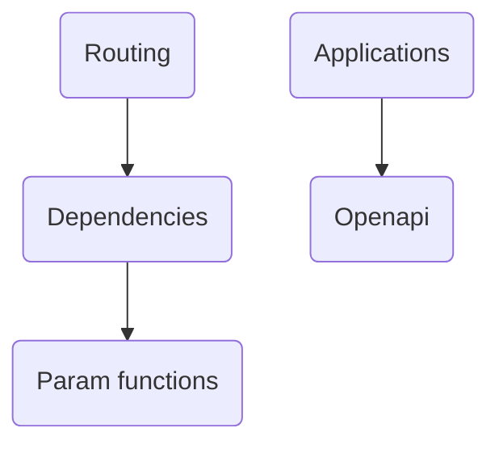

The DEMO-fastapi repository is a demonstration of the FastAPI framework. It's a high-performance Python framework used for building APIs. It provides examples of creating API endpoints, running the server, and using features such as validation, serialization, automatic documentation, and dependency injection.

- <SwmLink doc-title="Api">[Api](.swm/api.465qsp4v.sw.md)</SwmLink>

## Modules

### Compat

The 'compat' module is a compatibility layer for Pydantic. It provides a unified interface for different versions of Pydantic, abstracting away the differences and allowing consistent interaction with Pydantic across the codebase.

- <SwmLink doc-title="Exploring compat in demo fastapi">[Exploring compat in demo fastapi](.swm/exploring-compat-in-demo-fastapi.226mxs0t.sw.md)</SwmLink>

### Param functions

Param functions are a crucial part of FastAPI's request handling mechanism. They allow developers to declare and validate parameters in a type-safe manner, while also providing a way to specify additional metadata for the parameters. This makes it easier to build robust and error-free APIs.

- <SwmLink doc-title="Overview of param functions">[Overview of param functions](.swm/overview-of-param-functions.09012wr9.sw.md)</SwmLink>

### Routing

Routing is a fundamental aspect of any web application. It allows the application to respond to different URLs or paths, and HTTP methods (like GET, POST, PUT, DELETE, etc.). In FastAPI, routing is achieved using Python decorators that are applied to specific functions. These functions are then mapped to specific URLs or paths. When a request comes in, FastAPI uses the path and the HTTP method of the request to find the corresponding function (also known as a route handler or endpoint) to execute. FastAPI also provides dynamic routing, where parts of the URL can be processed as parameters, allowing for flexible and variable URLs.

- <SwmLink doc-title="Understanding routing">[Understanding routing](.swm/understanding-routing.aatn9p6x.sw.md)</SwmLink>
- <SwmLink doc-title="Apiroute class in fastapi">[Apiroute class in fastapi](.swm/apiroute-class-in-fastapi.wqfoe.sw.md)</SwmLink>

### Openapi

OpenAPI is a specification that provides a standardized and language-agnostic interface to RESTful APIs. It allows both humans and computers to understand the capabilities of a service without direct access to the source code. In the context of the DEMO-fastapi repository, OpenAPI is used to automatically generate interactive API documentation, client SDKs, and other useful resources. The `get_openapi` function in the `fastapi/openapi/utils.py` file is a key part of this process, as it generates the OpenAPI schema for the API. This schema includes information about the API's paths, components, and tags, among other things. The `get_openapi` function relies on several other functions to generate the schema, including `get_openapi_path`, `get_openapi_operation_metadata`, and `get_openapi_operation_parameters`.

- <SwmLink doc-title="Exploring openapi in fastapi">[Exploring openapi in fastapi](.swm/exploring-openapi-in-fastapi.8wvb7nwi.sw.md)</SwmLink>
- <SwmLink doc-title="Generating the openapi schema">[Generating the openapi schema](.swm/generating-the-openapi-schema.jmw6mcs7.sw.md)</SwmLink>
- <SwmLink doc-title="Openapi extension process">[Openapi extension process](.swm/openapi-extension-process.uu5r9fqz.sw.md)</SwmLink>
- <SwmLink doc-title="Overview of basemodelwithconfig">[Overview of basemodelwithconfig](.swm/overview-of-basemodelwithconfig.lkuhk.sw.md)</SwmLink>

### Dependencies

In the context of FastAPI, dependencies are a set of tools that allow you to declare and manage components that can be reused across multiple endpoints. They are used to manage shared resources like database connections, authentication and authorization mechanisms, and more. Dependencies are declared using Python's type annotations and FastAPI's `Depends` function. They can be resolved automatically by FastAPI and can also be overridden for testing purposes. The `Dependant` class is used to represent a dependency, and the `solve_dependencies` function is used to resolve them.

- <SwmLink doc-title="Basic concepts of dependencies">[Basic concepts of dependencies](.swm/basic-concepts-of-dependencies.y757q9ve.sw.md)</SwmLink>
- <SwmLink doc-title="Websocket request handling in fastapi">[Websocket request handling in fastapi](.swm/websocket-request-handling-in-fastapi.uetyu0bo.sw.md)</SwmLink>
- <SwmLink doc-title="Request handling in fastapi">[Request handling in fastapi](.swm/request-handling-in-fastapi.hsjjglrp.sw.md)</SwmLink>
- <SwmLink doc-title="Routing and dependency resolution in fastapi">[Routing and dependency resolution in fastapi](.swm/routing-and-dependency-resolution-in-fastapi.ulo7tnak.sw.md)</SwmLink>

### Applications

The FastAPI class is used to create instances of your application. It provides methods for defining request handling functions, known as 'path operations', for different HTTP methods and paths. These path operations can include parameters for path variables, query parameters, request bodies, and more. FastAPI uses these parameters, along with Python type annotations, to perform automatic request validation and serialization. It also uses this information to automatically generate API documentation using the OpenAPI standard. The FastAPI class also provides methods for adding middleware, exception handlers, and event handlers to your application.

- <SwmLink doc-title="Basic concepts of applications">[Basic concepts of applications](.swm/basic-concepts-of-applications.qg5h7rov.sw.md)</SwmLink>

### Security

Security in FastAPI is primarily handled through the OAuth2 protocol, with support for different flows and scopes. It also provides utilities for handling HTTP authorization and API keys. The `SecurityScopes` class is used to manage the OAuth2 scopes required by all dependencies in the same chain, allowing for different scopes even within the same path operation. The `OAuth2` class is the base class for OAuth2 authentication, with subclasses for each OAuth2 flow. It also provides an option for optional authentication, where the absence of an HTTP Authorization header does not automatically result in an error.

- <SwmLink doc-title="Exploring security in fastapi">[Exploring security in fastapi](.swm/exploring-security-in-fastapi.5dyt977i.sw.md)</SwmLink>
- <SwmLink doc-title="Apikeybase class overview">[Apikeybase class overview](.swm/apikeybase-class-overview.fla5l.sw.md)</SwmLink>
- **Oauth2**
  - <SwmLink doc-title="Overview of oauth2">[Overview of oauth2](.swm/overview-of-oauth2.xw6210p0.sw.md)</SwmLink>
  - <SwmLink doc-title="Oauth2passwordrequestform class overview">[Oauth2passwordrequestform class overview](.swm/oauth2passwordrequestform-class-overview.1i0ia.sw.md)</SwmLink>

### Params

In the DEMO-fastapi repository, 'Params' are used to define the data that an API endpoint expects to receive. They are defined using classes such as 'Param', 'Query', 'Path', 'Header', 'Cookie', 'Form', 'File', 'Depends', and 'Security'. Each class represents a different type of parameter and has its own specific properties and behaviors. For example, 'Query' is used for parameters that are passed in the URL query string, while 'Path' is used for parameters that are part of the URL path. 'Depends' is used to express dependencies between parameters, and 'Security' is used for parameters related to security, such as API keys or tokens.

- <SwmLink doc-title="Understanding params in fastapi">[Understanding params in fastapi](.swm/understanding-params-in-fastapi.wxr3h871.sw.md)</SwmLink>
- <SwmLink doc-title="Overview of the param class">[Overview of the param class](.swm/overview-of-the-param-class.uut9k.sw.md)</SwmLink>
- <SwmLink doc-title="The file class overview">[The file class overview](.swm/the-file-class-overview.2ou44.sw.md)</SwmLink>
- <SwmLink doc-title="The depends class overview">[The depends class overview](.swm/the-depends-class-overview.c8hju.sw.md)</SwmLink>

### Flows

- <SwmLink doc-title="Updating language configuration in fastapi documentation">[Updating language configuration in fastapi documentation](.swm/updating-language-configuration-in-fastapi-documentation.dslli68x.sw.md)</SwmLink>

## Classes

- <SwmLink doc-title="Validationexception overview">[Validationexception overview](.swm/validationexception-overview.2wys6.sw.md)</SwmLink>
- <SwmLink doc-title="Overview of the baseitem class">[Overview of the baseitem class](.swm/overview-of-the-baseitem-class.5x1y6.sw.md)</SwmLink>
- <SwmLink doc-title="Overview of the baseitem class">[Overview of the baseitem class](.swm/overview-of-the-baseitem-class.4lwd5.sw.md)</SwmLink>
- <SwmLink doc-title="Userbase class overview">[Userbase class overview](.swm/userbase-class-overview.8doel.sw.md)</SwmLink>
- <SwmLink doc-title="Userbase class overview">[Userbase class overview](.swm/userbase-class-overview.qub3l.sw.md)</SwmLink>
- <SwmLink doc-title="Overview of the user class">[Overview of the user class](.swm/overview-of-the-user-class.svihe.sw.md)</SwmLink>
- <SwmLink doc-title="Overview of the user class">[Overview of the user class](.swm/overview-of-the-user-class.u5fid.sw.md)</SwmLink>
- <SwmLink doc-title="User class overview">[User class overview](.swm/user-class-overview.es6i5.sw.md)</SwmLink>
- <SwmLink doc-title="Overview of the user class">[Overview of the user class](.swm/overview-of-the-user-class.grh9d.sw.md)</SwmLink>
- <SwmLink doc-title="Overview of the user class">[Overview of the user class](.swm/overview-of-the-user-class.iwn2s.sw.md)</SwmLink>
- <SwmLink doc-title="Overview of the user class">[Overview of the user class](.swm/overview-of-the-user-class.7t9x4.sw.md)</SwmLink>
- <SwmLink doc-title="Overview of the user class">[Overview of the user class](.swm/overview-of-the-user-class.xccf6.sw.md)</SwmLink>
- <SwmLink doc-title="User class overview">[User class overview](.swm/user-class-overview.zp566.sw.md)</SwmLink>
- <SwmLink doc-title="Overview of the user class">[Overview of the user class](.swm/overview-of-the-user-class.wu61d.sw.md)</SwmLink>
- <SwmLink doc-title="Overview of the user class">[Overview of the user class](.swm/overview-of-the-user-class.vl9sv.sw.md)</SwmLink>
- <SwmLink doc-title="Baseuser class overview">[Baseuser class overview](.swm/baseuser-class-overview.2k5jc.sw.md)</SwmLink>
- <SwmLink doc-title="Overview of the user class">[Overview of the user class](.swm/overview-of-the-user-class.2yt90.sw.md)</SwmLink>
- <SwmLink doc-title="Overview of the user class">[Overview of the user class](.swm/overview-of-the-user-class.294j8.sw.md)</SwmLink>
- <SwmLink doc-title="Baseuser class overview">[Baseuser class overview](.swm/baseuser-class-overview.fzh4t.sw.md)</SwmLink>
- <SwmLink doc-title="Overview of the user class">[Overview of the user class](.swm/overview-of-the-user-class.mzlrm.sw.md)</SwmLink>
- <SwmLink doc-title="Overview of the user class">[Overview of the user class](.swm/overview-of-the-user-class.qwids.sw.md)</SwmLink>
- <SwmLink doc-title="Overview of the user class">[Overview of the user class](.swm/overview-of-the-user-class.omoyr.sw.md)</SwmLink>
- <SwmLink doc-title="Overview of the user class">[Overview of the user class](.swm/overview-of-the-user-class.p3xdm.sw.md)</SwmLink>
- <SwmLink doc-title="Overview of the user class">[Overview of the user class](.swm/overview-of-the-user-class.topfc.sw.md)</SwmLink>
- <SwmLink doc-title="Overview of the userbase class">[Overview of the userbase class](.swm/overview-of-the-userbase-class.7i545.sw.md)</SwmLink>
- <SwmLink doc-title="Itembase class overview">[Itembase class overview](.swm/itembase-class-overview.99rdd.sw.md)</SwmLink>
- <SwmLink doc-title="Itembase class overview">[Itembase class overview](.swm/itembase-class-overview.qybii.sw.md)</SwmLink>
- <SwmLink doc-title="Overview of userbase class">[Overview of userbase class](.swm/overview-of-userbase-class.ybnb2.sw.md)</SwmLink>
- <SwmLink doc-title="Overview of the itembase class">[Overview of the itembase class](.swm/overview-of-the-itembase-class.w2003.sw.md)</SwmLink>
- <SwmLink doc-title="Userbase class overview">[Userbase class overview](.swm/userbase-class-overview.ken3a.sw.md)</SwmLink>
- <SwmLink doc-title="Itembase class overview">[Itembase class overview](.swm/itembase-class-overview.4jt2t.sw.md)</SwmLink>
- <SwmLink doc-title="Userbase class overview">[Userbase class overview](.swm/userbase-class-overview.i0rul.sw.md)</SwmLink>
- <SwmLink doc-title="Overview of the commentsnode class">[Overview of the commentsnode class](.swm/overview-of-the-commentsnode-class.v3e3j.sw.md)</SwmLink>

&nbsp;

*This is an auto-generated document by Swimm AI 🌊 and has not yet been verified by a human*

<SwmMeta version="3.0.0" repo-id="Z2l0aHViJTNBJTNBREVNTy1mYXN0YXBpJTNBJTNBZ2lsYWRuYXZvdA==" repo-name="DEMO-fastapi" doc-type="other">Powered by [Swimm](/)</SwmMeta>
