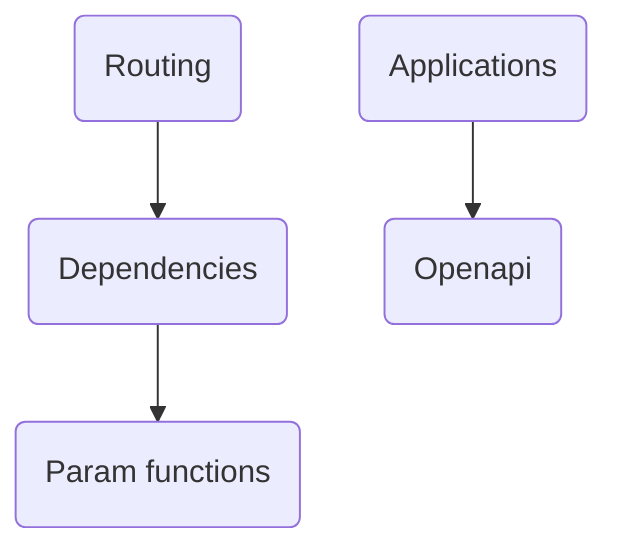

DEMO-fastapi is a demonstration repository for the FastAPI framework. It's designed to showcase how to use FastAPI to build high-performance APIs with Python. The repository includes examples and guides on how to install and use FastAPI, create an API, run it, and use the interactive API docs. It also provides information on the performance of FastAPI and its dependencies.

- <SwmLink doc-title="Api">[Api](.swm/api.3o5rufyh.sw.md)</SwmLink>

## Modules

### Compat

The 'compat' module is used to ensure that the DEMO-fastapi codebase can work with different versions of the Pydantic library. It provides a unified interface for Pydantic, abstracting away the differences between versions and allowing the rest of the codebase to interact with Pydantic in a consistent manner. This is achieved through a series of functions and classes that handle the differences between Pydantic versions.

- <SwmLink doc-title="Understanding compat">[Understanding compat](.swm/understanding-compat.inkyjj0o.sw.md)</SwmLink>

### Param functions

Param functions in FastAPI are used to declare and configure parameters for path operations. They provide a way to specify the type of the parameter (path, query, header, etc.), set default values, and add additional metadata. These functions are part of the FastAPI framework's dependency injection system, which automatically handles request data parsing, validation, serialization, and documentation.

- <SwmLink doc-title="Getting started with param functions">[Getting started with param functions](.swm/getting-started-with-param-functions.ikuk4rjw.sw.md)</SwmLink>

### Routing

Routing is a fundamental aspect of any web application. In FastAPI, it is used to map HTTP requests to appropriate endpoints or functions. This allows the application to respond correctly based on the request's URL and HTTP method. FastAPI provides a set of decorators to define these routes in a simple and intuitive manner.

- <SwmLink doc-title="Understanding routing in fastapi">[Understanding routing in fastapi](.swm/understanding-routing-in-fastapi.cvxd2f7t.sw.md)</SwmLink>
- <SwmLink doc-title="Apiroute class overview">[Apiroute class overview](.swm/apiroute-class-overview.o2p90.sw.md)</SwmLink>

### Applications

The FastAPI class is the core of the FastAPI framework. It is used to create an application instance and define its behavior. This includes setting up routes, handling HTTP methods, and configuring middleware and exception handlers. The class also provides methods for generating OpenAPI schemas and setting up the application.

- <SwmLink doc-title="Basic concepts of applications">[Basic concepts of applications](.swm/basic-concepts-of-applications.qjmfs50r.sw.md)</SwmLink>

### Openapi

OpenAPI is a specification that provides a standardized and language-agnostic interface to RESTful APIs. It allows both humans and computers to understand the capabilities of a service without accessing the source code. In the context of the DEMO-fastapi repo, OpenAPI is used to generate interactive API documentation, which helps developers understand the API's endpoints, request/response models, and expected HTTP responses. The `get_openapi` function in `fastapi/openapi/utils.py` is the main function responsible for generating this OpenAPI specification. It collects information about the API's routes, models, and more, and returns a dictionary that represents the API in an OpenAPI-compliant format.

- <SwmLink doc-title="Understanding openapi">[Understanding openapi](.swm/understanding-openapi.cggztw74.sw.md)</SwmLink>
- <SwmLink doc-title="Openapi schema generation in fastapi">[Openapi schema generation in fastapi](.swm/openapi-schema-generation-in-fastapi.m177x7ue.sw.md)</SwmLink>
- <SwmLink doc-title="Generating openapi documentation">[Generating openapi documentation](.swm/generating-openapi-documentation.m3ti3buw.sw.md)</SwmLink>
- <SwmLink doc-title="Overview of the basemodelwithconfig class">[Overview of the basemodelwithconfig class](.swm/overview-of-the-basemodelwithconfig-class.vz3zr.sw.md)</SwmLink>
- <SwmLink doc-title="Handling changes in pydantic model fields">[Handling changes in pydantic model fields](.swm/handling-changes-in-pydantic-model-fields.i40ayn3z.sw.md)</SwmLink>
- <SwmLink doc-title="Field type specific validation in fastapi">[Field type specific validation in fastapi](.swm/field-type-specific-validation-in-fastapi.rxxkikzf.sw.md)</SwmLink>

### Dependencies

Dependencies in the DEMO-fastapi repository are used to manage the relationships between different parts of the codebase. They are used to define how different parts of the application interact with each other and how data flows between them. The `solve_dependencies` function is a key part of this system, as it is responsible for resolving these dependencies and ensuring that each part of the application has the data it needs to function correctly. This function takes a number of parameters, including the request, the dependant, and optional parameters for the body, background tasks, response, and dependency cache. It then works through the dependencies of the dependant, resolving each one in turn. If there are any errors during this process, they are added to a list of errors. Once all dependencies have been resolved, the function returns a tuple containing the values, any errors, the background tasks, the response, and the dependency cache. This system of dependencies helps to keep the codebase organized and makes it easier to understand how different parts of the application interact with each other.

- <SwmLink doc-title="Basic concepts of dependencies in fastapi">[Basic concepts of dependencies in fastapi](.swm/basic-concepts-of-dependencies-in-fastapi.f0xntrwl.sw.md)</SwmLink>
- <SwmLink doc-title="Websocket application initialization in fastapi">[Websocket application initialization in fastapi](.swm/websocket-application-initialization-in-fastapi.8fd9ocoa.sw.md)</SwmLink>
- <SwmLink doc-title="Route handling in fastapi">[Route handling in fastapi](.swm/route-handling-in-fastapi.z45l2g0t.sw.md)</SwmLink>
- <SwmLink doc-title="Routing in fastapi">[Routing in fastapi](.swm/routing-in-fastapi.0ty35szm.sw.md)</SwmLink>
- <SwmLink doc-title="Usage of fastapi dependencies in api routing">[Usage of fastapi dependencies in api routing](.swm/usage-of-fastapi-dependencies-in-api-routing.jy9cp2ni.sw.md)</SwmLink>

### Security

Security in FastAPI is primarily handled through the OAuth2 protocol, with support for different flows and scopes. The `SecurityScopes` class is used to manage the OAuth2 scopes required by all dependencies in the same chain. The `OAuth2` class is the base class for OAuth2 authentication, and is used as a dependency. It is customized for each OAuth2 flow by its subclasses. The `SecurityBase` class is a base class for security schemes, and the `get_authorization_scheme_param` function is a utility function to extract the scheme and parameter from an authorization header.

- <SwmLink doc-title="Understanding security in fastapi">[Understanding security in fastapi](.swm/understanding-security-in-fastapi.g3ivl7n3.sw.md)</SwmLink>
- <SwmLink doc-title="Apikeybase overview">[Apikeybase overview](.swm/apikeybase-overview.b5hle.sw.md)</SwmLink>
- <SwmLink doc-title="Integration of security measures with fastapis routers requests and responses">[Integration of security measures with fastapis routers requests and responses](.swm/integration-of-security-measures-with-fastapis-routers-requests-and-responses.g5inb0m9.sw.md)</SwmLink>
- **Oauth2**
  - <SwmLink doc-title="Understanding oauth2">[Understanding oauth2](.swm/understanding-oauth2.2vwr64ja.sw.md)</SwmLink>
  - <SwmLink doc-title="Overview of the oauth2passwordrequestform class">[Overview of the oauth2passwordrequestform class](.swm/overview-of-the-oauth2passwordrequestform-class.bn62b.sw.md)</SwmLink>

### Params

In the DEMO-fastapi repository, 'Params' are classes that define the different types of parameters that can be used in the API endpoints. These include Query, Path, Header, Cookie, Form, File, Depends, and Security. Each of these classes inherits from the base class 'Param' or 'Body' and sets the 'in\_' attribute to the appropriate 'ParamTypes' value. The 'Param' class itself inherits from 'FieldInfo' and provides a constructor that accepts various attributes such as 'default', 'alias', 'title', 'description', and many others. These attributes are used to define the behavior and validation of the parameter.

- <SwmLink doc-title="Understanding params in fastapi">[Understanding params in fastapi](.swm/understanding-params-in-fastapi.irakjrvu.sw.md)</SwmLink>
- <SwmLink doc-title="Overview of the param class in fastapi">[Overview of the param class in fastapi](.swm/overview-of-the-param-class-in-fastapi.uafpn.sw.md)</SwmLink>
- <SwmLink doc-title="The file class overview">[The file class overview](.swm/the-file-class-overview.x60xk.sw.md)</SwmLink>
- <SwmLink doc-title="The depends class overview">[The depends class overview](.swm/the-depends-class-overview.rwc7k.sw.md)</SwmLink>

### Flows

- <SwmLink doc-title="Updating language configuration in fastapi documentation">[Updating language configuration in fastapi documentation](.swm/updating-language-configuration-in-fastapi-documentation.n52h6x2e.sw.md)</SwmLink>

## Classes

- <SwmLink doc-title="Validationexception in fastapi">[Validationexception in fastapi](.swm/validationexception-in-fastapi.7bpzm.sw.md)</SwmLink>
- <SwmLink doc-title="Overview of the userbase class">[Overview of the userbase class](.swm/overview-of-the-userbase-class.fppd9.sw.md)</SwmLink>
- <SwmLink doc-title="Overview of the baseitem class">[Overview of the baseitem class](.swm/overview-of-the-baseitem-class.dcz75.sw.md)</SwmLink>
- <SwmLink doc-title="Overview of the baseitem class">[Overview of the baseitem class](.swm/overview-of-the-baseitem-class.hsbzo.sw.md)</SwmLink>
- <SwmLink doc-title="Userbase class overview">[Userbase class overview](.swm/userbase-class-overview.h7qfe.sw.md)</SwmLink>
- <SwmLink doc-title="Overview of the user class">[Overview of the user class](.swm/overview-of-the-user-class.7kord.sw.md)</SwmLink>
- <SwmLink doc-title="Overview of the user class">[Overview of the user class](.swm/overview-of-the-user-class.xfqdq.sw.md)</SwmLink>
- <SwmLink doc-title="Overview of the user class">[Overview of the user class](.swm/overview-of-the-user-class.fbds0.sw.md)</SwmLink>
- <SwmLink doc-title="Overview of the user class">[Overview of the user class](.swm/overview-of-the-user-class.9eap1.sw.md)</SwmLink>
- <SwmLink doc-title="User class overview">[User class overview](.swm/user-class-overview.12re2.sw.md)</SwmLink>
- <SwmLink doc-title="User class overview">[User class overview](.swm/user-class-overview.ufeyr.sw.md)</SwmLink>
- <SwmLink doc-title="Overview of the user class">[Overview of the user class](.swm/overview-of-the-user-class.s0u0t.sw.md)</SwmLink>
- <SwmLink doc-title="User class overview">[User class overview](.swm/user-class-overview.xymfa.sw.md)</SwmLink>
- <SwmLink doc-title="User class overview">[User class overview](.swm/user-class-overview.c0uf6.sw.md)</SwmLink>
- <SwmLink doc-title="Baseuser class overview">[Baseuser class overview](.swm/baseuser-class-overview.k9qlx.sw.md)</SwmLink>
- <SwmLink doc-title="Overview of the user class">[Overview of the user class](.swm/overview-of-the-user-class.ojp60.sw.md)</SwmLink>
- <SwmLink doc-title="User class overview">[User class overview](.swm/user-class-overview.bci6a.sw.md)</SwmLink>
- <SwmLink doc-title="Overview of the user class">[Overview of the user class](.swm/overview-of-the-user-class.teiw5.sw.md)</SwmLink>
- <SwmLink doc-title="Baseuser class overview">[Baseuser class overview](.swm/baseuser-class-overview.f6kq6.sw.md)</SwmLink>
- <SwmLink doc-title="Overview of the user class">[Overview of the user class](.swm/overview-of-the-user-class.ct9k6.sw.md)</SwmLink>
- <SwmLink doc-title="User class overview">[User class overview](.swm/user-class-overview.o9l9g.sw.md)</SwmLink>
- <SwmLink doc-title="User class overview">[User class overview](.swm/user-class-overview.0siqj.sw.md)</SwmLink>
- <SwmLink doc-title="Itembase class overview">[Itembase class overview](.swm/itembase-class-overview.uwvim.sw.md)</SwmLink>
- <SwmLink doc-title="User class overview">[User class overview](.swm/user-class-overview.zpol4.sw.md)</SwmLink>
- <SwmLink doc-title="Overview of the user class">[Overview of the user class](.swm/overview-of-the-user-class.8mz16.sw.md)</SwmLink>
- <SwmLink doc-title="Userbase class overview">[Userbase class overview](.swm/userbase-class-overview.y8ekl.sw.md)</SwmLink>
- <SwmLink doc-title="The userbase class">[The userbase class](.swm/the-userbase-class.7rnze.sw.md)</SwmLink>
- <SwmLink doc-title="Itembase class overview">[Itembase class overview](.swm/itembase-class-overview.1sm0x.sw.md)</SwmLink>
- <SwmLink doc-title="Userbase class overview">[Userbase class overview](.swm/userbase-class-overview.yl3y3.sw.md)</SwmLink>
- <SwmLink doc-title="Overview of the userbase class">[Overview of the userbase class](.swm/overview-of-the-userbase-class.fpob3.sw.md)</SwmLink>
- <SwmLink doc-title="Itembase class overview">[Itembase class overview](.swm/itembase-class-overview.016pb.sw.md)</SwmLink>
- <SwmLink doc-title="Itembase class overview">[Itembase class overview](.swm/itembase-class-overview.8zpxw.sw.md)</SwmLink>
- <SwmLink doc-title="Commentsnode class overview">[Commentsnode class overview](.swm/commentsnode-class-overview.8biah.sw.md)</SwmLink>

&nbsp;

*This is an auto-generated document by Swimm AI 🌊 and has not yet been verified by a human*

<SwmMeta version="3.0.0" repo-id="Z2l0aHViJTNBJTNBREVNTy1mYXN0YXBpJTNBJTNBZ2lsYWRuYXZvdA==" repo-name="DEMO-fastapi" doc-type="other">Powered by [Swimm](/)</SwmMeta>
