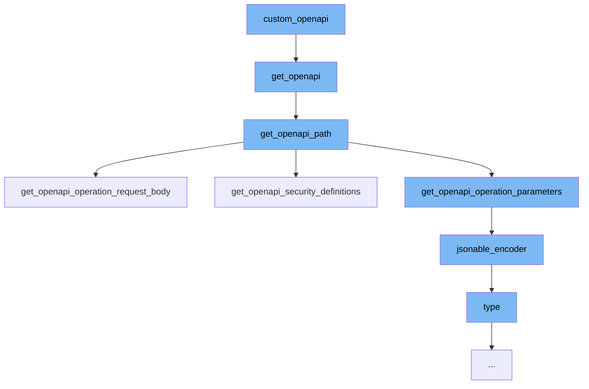

This document will cover the process of generating OpenAPI documentation in the DEMO-fastapi repository. The process includes:

1. Customizing the OpenAPI schema
2. Generating the OpenAPI schema
3. Constructing the OpenAPI paths
4. Encoding the OpenAPI schema into a JSON-compatible format.



<SwmSnippet path="/docs_src/extending_openapi/tutorial001.py" line="1">

---

# Customizing the OpenAPI schema

The `custom_openapi` function in `tutorial001.py` is the starting point of the OpenAPI documentation generation process. It customizes the OpenAPI schema by adding a custom `description` and `termsOfService`.

```python
from fastapi import FastAPI
from fastapi.openapi.utils import get_openapi

app = FastAPI()


@app.get("/items/")
async def read_items():
    return [{"name": "Foo"}]


def custom_openapi():
    if app.openapi_schema:
        return app.openapi_schema
    openapi_schema = get_openapi(
        title="Custom title",
        version="2.5.0",
        summary="This is a very custom OpenAPI schema",
        description="Here's a longer description of the custom **OpenAPI** schema",
        routes=app.routes,
    )
```

---

</SwmSnippet>

<SwmSnippet path="/fastapi/openapi/utils.py" line="438">

---

# Generating the OpenAPI schema

The `get_openapi` function in `utils.py` generates the OpenAPI schema. It takes in various parameters such as `title`, `version`, `routes`, etc., and constructs the OpenAPI schema.

```python
def get_openapi(
    *,
    title: str,
    version: str,
    openapi_version: str = "3.1.0",
    summary: Optional[str] = None,
    description: Optional[str] = None,
    routes: Sequence[BaseRoute],
    webhooks: Optional[Sequence[BaseRoute]] = None,
    tags: Optional[List[Dict[str, Any]]] = None,
    servers: Optional[List[Dict[str, Union[str, Any]]]] = None,
    terms_of_service: Optional[str] = None,
    contact: Optional[Dict[str, Union[str, Any]]] = None,
    license_info: Optional[Dict[str, Union[str, Any]]] = None,
    separate_input_output_schemas: bool = True,
) -> Dict[str, Any]:
    info: Dict[str, Any] = {"title": title, "version": version}
    if summary:
        info["summary"] = summary
    if description:
        info["description"] = description
```

---

</SwmSnippet>

<SwmSnippet path="/fastapi/openapi/utils.py" line="215">

---

# Constructing the OpenAPI paths

The `get_openapi_path` function in `utils.py` constructs the OpenAPI paths. It takes in a `route` and other parameters, and generates the OpenAPI paths for the route.

```python
def get_openapi_path(
    *,
    route: routing.APIRoute,
    operation_ids: Set[str],
    schema_generator: GenerateJsonSchema,
    model_name_map: ModelNameMap,
    field_mapping: Dict[
        Tuple[ModelField, Literal["validation", "serialization"]], JsonSchemaValue
    ],
    separate_input_output_schemas: bool = True,
) -> Tuple[Dict[str, Any], Dict[str, Any], Dict[str, Any]]:
    path = {}
    security_schemes: Dict[str, Any] = {}
    definitions: Dict[str, Any] = {}
    assert route.methods is not None, "Methods must be a list"
    if isinstance(route.response_class, DefaultPlaceholder):
        current_response_class: Type[Response] = route.response_class.value
    else:
        current_response_class = route.response_class
    assert current_response_class, "A response class is needed to generate OpenAPI"
    route_response_media_type: Optional[str] = current_response_class.media_type
```

---

</SwmSnippet>

<SwmSnippet path="/fastapi/encoders.py" line="102">

---

# Encoding the OpenAPI schema into a JSON-compatible format

The `jsonable_encoder` function in `encoders.py` encodes the OpenAPI schema into a JSON-compatible format. It takes in an object and converts it into a format that can be encoded into JSON.

```python
def jsonable_encoder(
    obj: Annotated[
        Any,
        Doc(
            """
            The input object to convert to JSON.
            """
        ),
    ],
    include: Annotated[
        Optional[IncEx],
        Doc(
            """
            Pydantic's `include` parameter, passed to Pydantic models to set the
            fields to include.
            """
        ),
    ] = None,
    exclude: Annotated[
        Optional[IncEx],
        Doc(
```

---

</SwmSnippet>

&nbsp;

*This is an auto-generated document by Swimm AI 🌊 and has not yet been verified by a human*

<SwmMeta version="3.0.0" repo-id="Z2l0aHViJTNBJTNBREVNTy1mYXN0YXBpJTNBJTNBZ2lsYWRuYXZvdA==" repo-name="DEMO-fastapi" doc-type="flows"><sup>Powered by [Swimm](/)</sup></SwmMeta>
