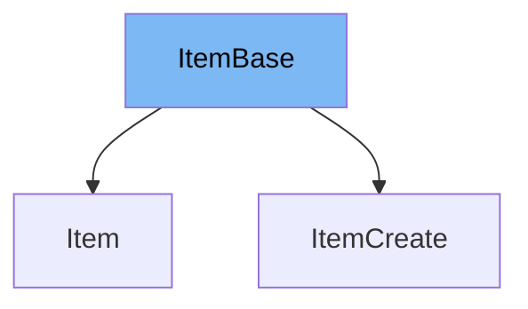

This document will cover the `ItemBase` class in the DEMO-fastapi repository. We'll cover:

1. What `ItemBase` is and its purpose.
2. The variables and functions defined in `ItemBase`.
3. An example of how `ItemBase` is used in `ItemCreate`.



# What is ItemBase

`ItemBase` is a class that serves as a base model for items in the application. It is defined using the Pydantic `BaseModel` and is used to represent the common properties of an item.

<SwmSnippet path="/docs_src/sql_databases/sql_app/schemas.py" line="7">

---

# Variables in ItemBase

The `title` variable is a string that represents the title of the item.

```python
    title: str
```

---

</SwmSnippet>

<SwmSnippet path="/docs_src/sql_databases/sql_app/schemas.py" line="8">

---

The `description` variable is an optional string that provides a description of the item. It can be `None` if no description is provided.

```python
    description: Union[str, None] = None
```

---

</SwmSnippet>

<SwmSnippet path="/docs_src/sql_databases/sql_app/schemas.py" line="11">

---

# Usage example

`ItemBase` is used as a base class for `ItemCreate`. This allows `ItemCreate` to inherit the properties of `ItemBase`.

```python
class ItemCreate(ItemBase):
    pass
```

---

</SwmSnippet>

&nbsp;

*This is an auto-generated document by Swimm AI 🌊 and has not yet been verified by a human*

<SwmMeta version="3.0.0" repo-id="Z2l0aHViJTNBJTNBREVNTy1mYXN0YXBpJTNBJTNBZ2lsYWRuYXZvdA==" repo-name="DEMO-fastapi" doc-type="general-class"><sup>Powered by [Swimm](/)</sup></SwmMeta>
