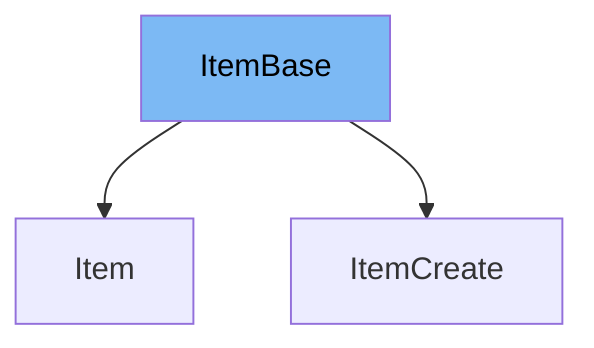

This document will cover the `ItemBase` class in the DEMO-fastapi repository. We'll cover:

1. What is `ItemBase`
2. Variables in `ItemBase`
3. Usage example of `ItemBase`



# What is ItemBase

`ItemBase` is a class that serves as a base model for items in the application. It is defined using the Pydantic `BaseModel` and includes properties that are common to all items.

<SwmSnippet path="/docs_src/sql_databases/sql_app_py310/schemas.py" line="5">

---

# Variables in ItemBase

The `title` variable is a string that represents the title of the item.

```python
    title: str
```

---

</SwmSnippet>

<SwmSnippet path="/docs_src/sql_databases/sql_app_py310/schemas.py" line="6">

---

The `description` variable is an optional string that provides a description of the item. If no description is provided, it defaults to `None`.

```python
    description: str | None = None
```

---

</SwmSnippet>

<SwmSnippet path="/docs_src/sql_databases/sql_app_py310/schemas.py" line="9">

---

# Usage example of ItemBase

`ItemBase` is used as a base class for `ItemCreate`. This allows `ItemCreate` to inherit the `title` and `description` properties from `ItemBase`.

```python
class ItemCreate(ItemBase):
    pass
```

---

</SwmSnippet>

&nbsp;

*This is an auto-generated document by Swimm AI 🌊 and has not yet been verified by a human*

<SwmMeta version="3.0.0" repo-id="Z2l0aHViJTNBJTNBREVNTy1mYXN0YXBpJTNBJTNBZ2lsYWRuYXZvdA==" repo-name="DEMO-fastapi" doc-type="general-class"><sup>Powered by [Swimm](/)</sup></SwmMeta>
