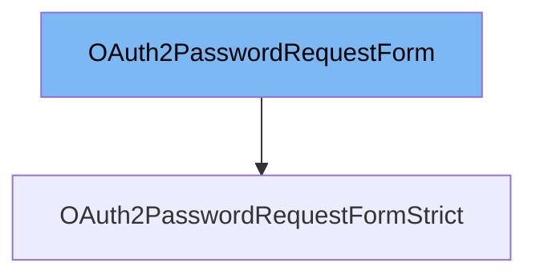

This document will cover the following aspects of the `OAuth2PasswordRequestForm` class:

1. What is `OAuth2PasswordRequestForm`.
2. Variables and functions defined in `OAuth2PasswordRequestForm`.
3. Usage example of `OAuth2PasswordRequestForm`.



# What is OAuth2PasswordRequestForm

`OAuth2PasswordRequestForm` is a dependency class used to collect the `username` and `password` as form data for an OAuth2 password flow. According to the OAuth2 specification, for a password flow, the data should be collected using form data (instead of JSON) and it should have the specific fields `username` and `password`. All the initialization parameters are extracted from the request.

<SwmSnippet path="/fastapi/security/oauth2.py" line="144">

---

# Variables and functions

The variable `grant_type` is used to store the grant type of the OAuth2 password flow. According to the OAuth2 specification, it is required and MUST be the fixed string 'password'. However, this dependency class is permissive and allows not passing it.

```python
        self.grant_type = grant_type
```

---

</SwmSnippet>

<SwmSnippet path="/fastapi/security/oauth2.py" line="145">

---

The variable `username` is used to store the username. According to the OAuth2 specification, the exact field name `username` is required.

```python
        self.username = username
```

---

</SwmSnippet>

<SwmSnippet path="/fastapi/security/oauth2.py" line="146">

---

The variable `password` is used to store the password. According to the OAuth2 specification, the exact field name `password` is required.

```python
        self.password = password
```

---

</SwmSnippet>

<SwmSnippet path="/fastapi/security/oauth2.py" line="147">

---

The variable `scopes` is used to store the scopes. It is a single string with several scopes separated by spaces. Each scope is also a string.

```python
        self.scopes = scope.split()
```

---

</SwmSnippet>

<SwmSnippet path="/fastapi/security/oauth2.py" line="148">

---

The variable `client_id` is used to store the client id. If there's a `client_id`, it can be sent as part of the form fields. But the OAuth2 specification recommends sending the `client_id` and `client_secret` (if any) using HTTP Basic auth.

```python
        self.client_id = client_id
```

---

</SwmSnippet>

<SwmSnippet path="/fastapi/security/oauth2.py" line="149">

---

The variable `client_secret` is used to store the client secret. If there's a `client_password` (and a `client_id`), they can be sent as part of the form fields. But the OAuth2 specification recommends sending the `client_id` and `client_secret` (if any) using HTTP Basic auth.

```python
        self.client_secret = client_secret
```

---

</SwmSnippet>

<SwmSnippet path="/fastapi/security/oauth2.py" line="152">

---

# Usage example

`OAuth2PasswordRequestFormStrict` is an example of how to use `OAuth2PasswordRequestForm`. The only difference between `OAuth2PasswordRequestFormStrict` and `OAuth2PasswordRequestForm` is that `OAuth2PasswordRequestFormStrict` requires the client to send the form field `grant_type` with the value 'password', which is required in the OAuth2 specification, while for `OAuth2PasswordRequestForm`, `grant_type` is optional.

```python
class OAuth2PasswordRequestFormStrict(OAuth2PasswordRequestForm):
    """
    This is a dependency class to collect the `username` and `password` as form data
    for an OAuth2 password flow.

    The OAuth2 specification dictates that for a password flow the data should be
    collected using form data (instead of JSON) and that it should have the specific
    fields `username` and `password`.

    All the initialization parameters are extracted from the request.

    The only difference between `OAuth2PasswordRequestFormStrict` and
    `OAuth2PasswordRequestForm` is that `OAuth2PasswordRequestFormStrict` requires the
    client to send the form field `grant_type` with the value `"password"`, which
    is required in the OAuth2 specification (it seems that for no particular reason),
    while for `OAuth2PasswordRequestForm` `grant_type` is optional.

    Read more about it in the
    [FastAPI docs for Simple OAuth2 with Password and Bearer](https://fastapi.tiangolo.com/tutorial/security/simple-oauth2/).

    ## Example
```

---

</SwmSnippet>

&nbsp;

*This is an auto-generated document by Swimm AI 🌊 and has not yet been verified by a human*

<SwmMeta version="3.0.0" repo-id="Z2l0aHViJTNBJTNBREVNTy1mYXN0YXBpJTNBJTNBZ2lsYWRuYXZvdA==" repo-name="DEMO-fastapi" doc-type="class"><sup>Powered by [Swimm](/)</sup></SwmMeta>
