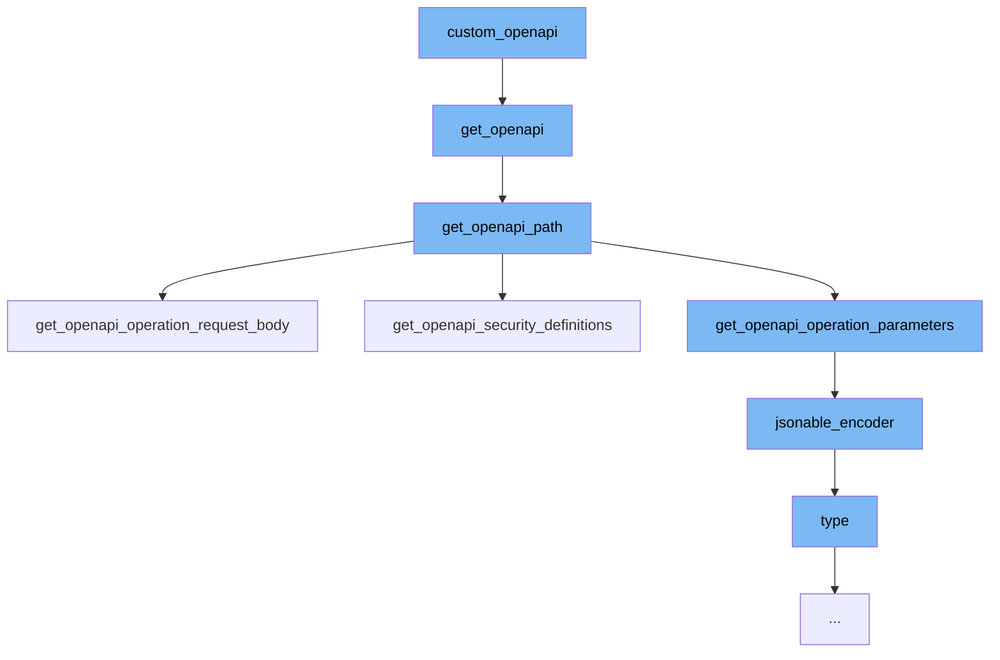

This document will cover the process of extending OpenAPI in the DEMO-fastapi repository. We'll cover:

1. The role of the `custom_openapi` function
2. How `get_openapi` function generates OpenAPI schema
3. The purpose of `get_openapi_path` function
4. The functionality of `get_openapi_operation_request_body` function
5. The use of `jsonable_encoder` function
6. The role of `type` method in the process.



# The role of the `custom_openapi` function

The `custom_openapi` function in `docs_src/extending_openapi/tutorial001.py` is the starting point of the flow. It is responsible for customizing the OpenAPI schema. It calls the `get_openapi` function to generate the OpenAPI schema.

<SwmSnippet path="/fastapi/openapi/utils.py" line="438">

---

# How `get_openapi` function generates OpenAPI schema

The `get_openapi` function in `fastapi/openapi/utils.py` generates the OpenAPI schema. It takes various parameters like title, version, routes, etc., and constructs the OpenAPI schema. It also calls the `get_openapi_path` function for each route to get the OpenAPI path.

```python
def get_openapi(
    *,
    title: str,
    version: str,
    openapi_version: str = "3.1.0",
    summary: Optional[str] = None,
    description: Optional[str] = None,
    routes: Sequence[BaseRoute],
    webhooks: Optional[Sequence[BaseRoute]] = None,
    tags: Optional[List[Dict[str, Any]]] = None,
    servers: Optional[List[Dict[str, Union[str, Any]]]] = None,
    terms_of_service: Optional[str] = None,
    contact: Optional[Dict[str, Union[str, Any]]] = None,
    license_info: Optional[Dict[str, Union[str, Any]]] = None,
    separate_input_output_schemas: bool = True,
) -> Dict[str, Any]:
    info: Dict[str, Any] = {"title": title, "version": version}
    if summary:
        info["summary"] = summary
    if description:
        info["description"] = description
```

---

</SwmSnippet>

<SwmSnippet path="/fastapi/openapi/utils.py" line="215">

---

# The purpose of `get_openapi_path` function

The `get_openapi_path` function in `fastapi/openapi/utils.py` is used to get the OpenAPI path for a given route. It takes various parameters like route, operation_ids, etc., and constructs the OpenAPI path. It also calls the `get_openapi_operation_request_body` function if the method allows a body.

```python
def get_openapi_path(
    *,
    route: routing.APIRoute,
    operation_ids: Set[str],
    schema_generator: GenerateJsonSchema,
    model_name_map: ModelNameMap,
    field_mapping: Dict[
        Tuple[ModelField, Literal["validation", "serialization"]], JsonSchemaValue
    ],
    separate_input_output_schemas: bool = True,
) -> Tuple[Dict[str, Any], Dict[str, Any], Dict[str, Any]]:
    path = {}
    security_schemes: Dict[str, Any] = {}
    definitions: Dict[str, Any] = {}
    assert route.methods is not None, "Methods must be a list"
    if isinstance(route.response_class, DefaultPlaceholder):
        current_response_class: Type[Response] = route.response_class.value
    else:
        current_response_class = route.response_class
    assert current_response_class, "A response class is needed to generate OpenAPI"
    route_response_media_type: Optional[str] = current_response_class.media_type
```

---

</SwmSnippet>

<SwmSnippet path="/fastapi/openapi/utils.py" line="131">

---

# The functionality of `get_openapi_operation_request_body` function

The `get_openapi_operation_request_body` function in `fastapi/openapi/utils.py` is used to get the OpenAPI operation request body. It takes a body_field and constructs the OpenAPI operation request body.

```python
def get_openapi_operation_request_body(
    *,
    body_field: Optional[ModelField],
    schema_generator: GenerateJsonSchema,
    model_name_map: ModelNameMap,
    field_mapping: Dict[
        Tuple[ModelField, Literal["validation", "serialization"]], JsonSchemaValue
    ],
    separate_input_output_schemas: bool = True,
) -> Optional[Dict[str, Any]]:
    if not body_field:
        return None
    assert isinstance(body_field, ModelField)
    body_schema = get_schema_from_model_field(
        field=body_field,
        schema_generator=schema_generator,
        model_name_map=model_name_map,
        field_mapping=field_mapping,
        separate_input_output_schemas=separate_input_output_schemas,
    )
    field_info = cast(Body, body_field.field_info)
```

---

</SwmSnippet>

<SwmSnippet path="/fastapi/encoders.py" line="102">

---

# The use of `jsonable_encoder` function

The `jsonable_encoder` function in `fastapi/encoders.py` is used to convert any object to something that can be encoded in JSON. This is used to ensure anything returned can be encoded as JSON before it is sent to the client.

```python
def jsonable_encoder(
    obj: Annotated[
        Any,
        Doc(
            """
            The input object to convert to JSON.
            """
        ),
    ],
    include: Annotated[
        Optional[IncEx],
        Doc(
            """
            Pydantic's `include` parameter, passed to Pydantic models to set the
            fields to include.
            """
        ),
    ] = None,
    exclude: Annotated[
        Optional[IncEx],
        Doc(
```

---

</SwmSnippet>

<SwmSnippet path="/docs/en/docs/js/termynal.js" line="167">

---

# The role of `type` method in the process

The `type` method in `docs/en/docs/js/termynal.js` is used to animate a typed line. It's not directly related to the OpenAPI extension process, but it's part of the overall codebase and might be used for UI animations.

```javascript
    /**
     * Animate a typed line.
     * @param {Node} line - The line element to render.
     */
    async type(line) {
        const chars = [...line.textContent];
        line.textContent = '';
        this.container.appendChild(line);

        for (let char of chars) {
            const delay = line.getAttribute(`${this.pfx}-typeDelay`) || this.typeDelay;
            await this._wait(delay);
            line.textContent += char;
        }
    }
```

---

</SwmSnippet>

&nbsp;

*This is an auto-generated document by Swimm AI 🌊 and has not yet been verified by a human*

<SwmMeta version="3.0.0" repo-id="Z2l0aHViJTNBJTNBREVNTy1mYXN0YXBpJTNBJTNBZ2lsYWRuYXZvdA==" repo-name="DEMO-fastapi" doc-type="flows"><sup>Powered by [Swimm](/)</sup></SwmMeta>
