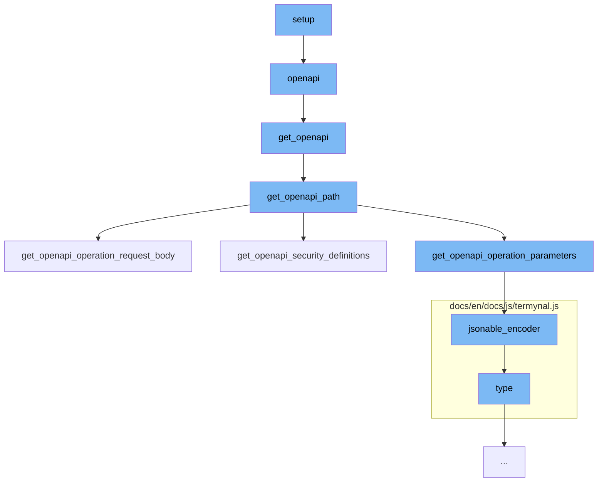

This document will cover the process of generating the OpenAPI schema in the FastAPI application. The process includes the following steps:

1. Invoking the `openapi` function in `fastapi/applications.py`
2. Calling the `get_openapi` function in `fastapi/openapi/utils.py`
3. Invoking the `get_openapi_path` function in `fastapi/openapi/utils.py`
4. Calling the `get_openapi_operation_request_body` function in `fastapi/openapi/utils.py`
5. Invoking the `jsonable_encoder` function in `fastapi/encoders.py`



<SwmSnippet path="/fastapi/applications.py" line="966">

---

# Invoking the `openapi` function

The `openapi` function generates the OpenAPI schema of the application. It is called internally by FastAPI. The first time it is called, it stores the result in the attribute `app.openapi_schema`, and subsequent calls just return the same result. This avoids the cost of generating the schema every time.

```python
    def openapi(self) -> Dict[str, Any]:
        """
        Generate the OpenAPI schema of the application. This is called by FastAPI
        internally.

        The first time it is called it stores the result in the attribute
        `app.openapi_schema`, and next times it is called, it just returns that same
        result. To avoid the cost of generating the schema every time.

        If you need to modify the generated OpenAPI schema, you could modify it.

        Read more in the
        [FastAPI docs for OpenAPI](https://fastapi.tiangolo.com/how-to/extending-openapi/).
        """
        if not self.openapi_schema:
            self.openapi_schema = get_openapi(
                title=self.title,
                version=self.version,
                openapi_version=self.openapi_version,
                summary=self.summary,
                description=self.description,
```

---

</SwmSnippet>

<SwmSnippet path="/fastapi/openapi/utils.py" line="438">

---

# Calling the `get_openapi` function

The `get_openapi` function is called by the `openapi` function. It generates the OpenAPI schema based on the application's routes, webhooks, tags, servers, and other parameters. The result is then encoded into JSON format.

```python
def get_openapi(
    *,
    title: str,
    version: str,
    openapi_version: str = "3.1.0",
    summary: Optional[str] = None,
    description: Optional[str] = None,
    routes: Sequence[BaseRoute],
    webhooks: Optional[Sequence[BaseRoute]] = None,
    tags: Optional[List[Dict[str, Any]]] = None,
    servers: Optional[List[Dict[str, Union[str, Any]]]] = None,
    terms_of_service: Optional[str] = None,
    contact: Optional[Dict[str, Union[str, Any]]] = None,
    license_info: Optional[Dict[str, Union[str, Any]]] = None,
    separate_input_output_schemas: bool = True,
) -> Dict[str, Any]:
    info: Dict[str, Any] = {"title": title, "version": version}
    if summary:
        info["summary"] = summary
    if description:
        info["description"] = description
```

---

</SwmSnippet>

<SwmSnippet path="/fastapi/openapi/utils.py" line="215">

---

# Invoking the `get_openapi_path` function

The `get_openapi_path` function is called by the `get_openapi` function. It generates the OpenAPI path for each route in the application. This includes the operation metadata, parameters, request body, responses, and callbacks for each route.

```python
def get_openapi_path(
    *,
    route: routing.APIRoute,
    operation_ids: Set[str],
    schema_generator: GenerateJsonSchema,
    model_name_map: ModelNameMap,
    field_mapping: Dict[
        Tuple[ModelField, Literal["validation", "serialization"]], JsonSchemaValue
    ],
    separate_input_output_schemas: bool = True,
) -> Tuple[Dict[str, Any], Dict[str, Any], Dict[str, Any]]:
    path = {}
    security_schemes: Dict[str, Any] = {}
    definitions: Dict[str, Any] = {}
    assert route.methods is not None, "Methods must be a list"
    if isinstance(route.response_class, DefaultPlaceholder):
        current_response_class: Type[Response] = route.response_class.value
    else:
        current_response_class = route.response_class
    assert current_response_class, "A response class is needed to generate OpenAPI"
    route_response_media_type: Optional[str] = current_response_class.media_type
```

---

</SwmSnippet>

<SwmSnippet path="/fastapi/openapi/utils.py" line="131">

---

# Calling the `get_openapi_operation_request_body` function

The `get_openapi_operation_request_body` function is called by the `get_openapi_path` function. It generates the OpenAPI operation request body based on the body field of the route. The result is then included in the OpenAPI path for the route.

```python
def get_openapi_operation_request_body(
    *,
    body_field: Optional[ModelField],
    schema_generator: GenerateJsonSchema,
    model_name_map: ModelNameMap,
    field_mapping: Dict[
        Tuple[ModelField, Literal["validation", "serialization"]], JsonSchemaValue
    ],
    separate_input_output_schemas: bool = True,
) -> Optional[Dict[str, Any]]:
    if not body_field:
        return None
    assert isinstance(body_field, ModelField)
    body_schema = get_schema_from_model_field(
        field=body_field,
        schema_generator=schema_generator,
        model_name_map=model_name_map,
        field_mapping=field_mapping,
        separate_input_output_schemas=separate_input_output_schemas,
    )
    field_info = cast(Body, body_field.field_info)
```

---

</SwmSnippet>

<SwmSnippet path="/fastapi/encoders.py" line="102">

---

# Invoking the `jsonable_encoder` function

The `jsonable_encoder` function is called by the `get_openapi` function. It converts any object to something that can be encoded in JSON. This is used to ensure that the OpenAPI schema can be encoded as JSON before it is sent to the client.

```python
def jsonable_encoder(
    obj: Annotated[
        Any,
        Doc(
            """
            The input object to convert to JSON.
            """
        ),
    ],
    include: Annotated[
        Optional[IncEx],
        Doc(
            """
            Pydantic's `include` parameter, passed to Pydantic models to set the
            fields to include.
            """
        ),
    ] = None,
    exclude: Annotated[
        Optional[IncEx],
        Doc(
```

---

</SwmSnippet>

&nbsp;

*This is an auto-generated document by Swimm AI 🌊 and has not yet been verified by a human*

<SwmMeta version="3.0.0" repo-id="Z2l0aHViJTNBJTNBREVNTy1mYXN0YXBpJTNBJTNBZ2lsYWRuYXZvdA==" repo-name="DEMO-fastapi" doc-type="flows"><sup>Powered by [Swimm](/)</sup></SwmMeta>
