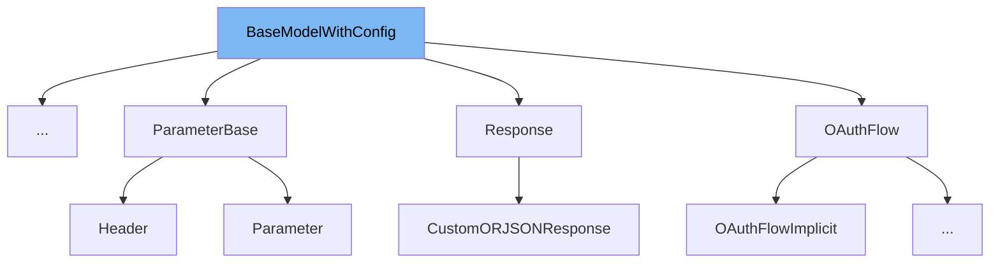

This document will cover the following aspects of the `BaseModelWithConfig` class:

1. What is `BaseModelWithConfig`
2. Variables and functions in `BaseModelWithConfig`
3. Usage example of `BaseModelWithConfig`



# What is BaseModelWithConfig

`BaseModelWithConfig` is a class in the `fastapi/openapi/models.py` file. It is a subclass of the `BaseModel` class from the `pydantic` library. The purpose of this class is to provide a base model with a specific configuration. This configuration allows extra fields to be included in the model, which are not defined in the model fields, hence providing flexibility in the data that can be included in the model.

<SwmSnippet path="/fastapi/openapi/models.py" line="58">

---

# Variables and functions

The `BaseModelWithConfig` class has a nested `Config` class. This `Config` class has a single variable `extra` which is set to `allow`. This configuration allows extra fields to be included in the model, which are not defined in the model fields.

```python
class BaseModelWithConfig(BaseModel):
    if PYDANTIC_V2:
        model_config = {"extra": "allow"}

    else:

        class Config:
            extra = "allow"
```

---

</SwmSnippet>

<SwmSnippet path="/fastapi/openapi/models.py" line="68">

---

# Usage example

The `Contact` class is an example of how `BaseModelWithConfig` is used. `Contact` inherits from `BaseModelWithConfig`, and defines additional fields `name`, `url`, and `email`. Due to the `extra = 'allow'` configuration in `BaseModelWithConfig`, instances of `Contact` can include additional fields beyond `name`, `url`, and `email`.

```python
class Contact(BaseModelWithConfig):
    name: Optional[str] = None
    url: Optional[AnyUrl] = None
    email: Optional[EmailStr] = None
```

---

</SwmSnippet>

&nbsp;

*This is an auto-generated document by Swimm AI 🌊 and has not yet been verified by a human*

<SwmMeta version="3.0.0" repo-id="Z2l0aHViJTNBJTNBREVNTy1mYXN0YXBpJTNBJTNBZ2lsYWRuYXZvdA==" repo-name="DEMO-fastapi" doc-type="class"><sup>Powered by [Swimm](/)</sup></SwmMeta>
