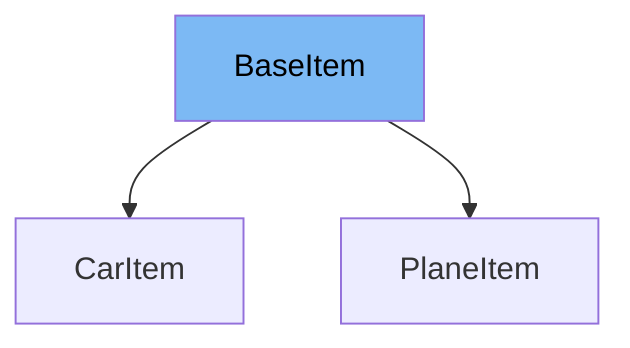

This document will cover the `BaseItem` class from the `docs_src/extra_models/tutorial003.py` file. We'll cover:

1. What is BaseItem
2. Variables and functions in BaseItem
3. Usage example of BaseItem



# What is BaseItem

The `BaseItem` class is a Pydantic model that serves as a base class for other item classes in the application. It defines common attributes that are shared by all items, such as `description` and `type`.

<SwmSnippet path="/docs_src/extra_models/tutorial003.py" line="10">

---

# Variables in BaseItem

The `description` variable is a string that holds a description of the item.

```python
    description: str
```

---

</SwmSnippet>

<SwmSnippet path="/docs_src/extra_models/tutorial003.py" line="11">

---

The `type` variable is a string that holds the type of the item.

```python
    type: str
```

---

</SwmSnippet>

<SwmSnippet path="/docs_src/extra_models/tutorial003.py" line="14">

---

# Usage example of BaseItem

`CarItem` is an example of a class that extends `BaseItem`. It inherits the `description` and `type` variables from `BaseItem` and sets the `type` variable to 'car'.

```python
class CarItem(BaseItem):
    type: str = "car"
```

---

</SwmSnippet>

&nbsp;

*This is an auto-generated document by Swimm AI 🌊 and has not yet been verified by a human*

<SwmMeta version="3.0.0" repo-id="Z2l0aHViJTNBJTNBREVNTy1mYXN0YXBpJTNBJTNBZ2lsYWRuYXZvdA==" repo-name="DEMO-fastapi" doc-type="general-class"><sup>Powered by [Swimm](/)</sup></SwmMeta>
