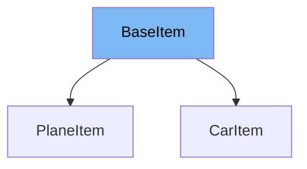

This document will cover the following aspects of the `BaseItem` class:

1. What is `BaseItem`.
2. Variables and functions in `BaseItem`.
3. An example of how to use `BaseItem`.



# What is BaseItem

`BaseItem` is a class that serves as a base model for other classes in the application. It is used to define common attributes that are shared among different item types in the application.

<SwmSnippet path="/docs_src/extra_models/tutorial003.py" line="10">

---

# Variables in BaseItem

The `description` variable is a string that holds the description of the item.

```python
    description: str
```

---

</SwmSnippet>

<SwmSnippet path="/docs_src/extra_models/tutorial003.py" line="11">

---

The `type` variable is a string that holds the type of the item.

```python
    type: str
```

---

</SwmSnippet>

<SwmSnippet path="/docs_src/extra_models/tutorial003.py" line="14">

---

# Usage example

`CarItem` is an example of how `BaseItem` is used. `CarItem` extends `BaseItem` and sets the `type` variable to 'car'.

```python
class CarItem(BaseItem):
    type: str = "car"
```

---

</SwmSnippet>

&nbsp;

*This is an auto-generated document by Swimm AI 🌊 and has not yet been verified by a human*

<SwmMeta version="3.0.0" repo-id="Z2l0aHViJTNBJTNBREVNTy1mYXN0YXBpJTNBJTNBZ2lsYWRuYXZvdA==" repo-name="DEMO-fastapi" doc-type="general-class"><sup>Powered by [Swimm](/)</sup></SwmMeta>
