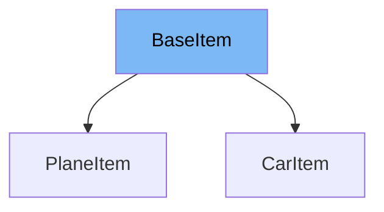

This document will cover the `BaseItem` class in the DEMO-fastapi repository. We'll cover:

1. What is `BaseItem`
2. Variables and functions in `BaseItem`
3. Usage example of `BaseItem`



# What is BaseItem

`BaseItem` is a class that serves as a base model for other classes in the codebase. It is defined using the `BaseModel` from the `pydantic` library, which is a data validation library used to create data classes. `BaseItem` is used to define common attributes for other classes.

<SwmSnippet path="/docs_src/extra_models/tutorial003_py310.py" line="10">

---

# Variables in BaseItem

The variable `description` is a string that is used to store the description of the item.

```python
    description: str
```

---

</SwmSnippet>

<SwmSnippet path="/docs_src/extra_models/tutorial003_py310.py" line="11">

---

The variable `type` is a string that is used to store the type of the item.

```python
    type: str
```

---

</SwmSnippet>

<SwmSnippet path="/docs_src/extra_models/tutorial003_py310.py" line="14">

---

# Usage example

`BaseItem` is used as a base class for `CarItem`. `CarItem` inherits the variables from `BaseItem` and also defines a new variable `type` with a default value of 'car'.

```python
class CarItem(BaseItem):
    type: str = "car"
```

---

</SwmSnippet>

&nbsp;

*This is an auto-generated document by Swimm AI 🌊 and has not yet been verified by a human*

<SwmMeta version="3.0.0" repo-id="Z2l0aHViJTNBJTNBREVNTy1mYXN0YXBpJTNBJTNBZ2lsYWRuYXZvdA==" repo-name="DEMO-fastapi" doc-type="general-class"><sup>Powered by [Swimm](/)</sup></SwmMeta>
