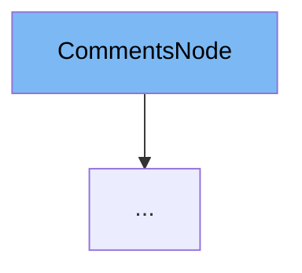

This document will cover the `CommentsNode` class in the DEMO-fastapi repository. We'll cover:

1. What is `CommentsNode`
2. Variables and functions in `CommentsNode`
3. Usage example of `CommentsNode`



# What is CommentsNode

`CommentsNode` is a class defined in the `app/main.py` file of the DEMO-fastapi repository. It is a Pydantic `BaseModel` that represents a comment node in a discussion. It is used to store and validate data related to a comment, such as the creation time and the author of the comment.

<SwmSnippet path="/.github/actions/people/app/main.py" line="151">

---

# Variables in CommentsNode

`createdAt` is a datetime variable that stores the time when the comment was created.

```python
    createdAt: datetime
    author: Union[Author, None] = None
```

---

</SwmSnippet>

<SwmSnippet path="/.github/actions/people/app/main.py" line="152">

---

`author` is a variable that can be either an instance of the `Author` class or `None`. It stores the author of the comment.

```python
    author: Union[Author, None] = None
```

---

</SwmSnippet>

<SwmSnippet path="/.github/actions/people/app/main.py" line="159">

---

# Usage example of CommentsNode

`CommentsNode` is used as a base class for `DiscussionsCommentsNode`. `DiscussionsCommentsNode` extends `CommentsNode` by adding a `replies` variable, which stores the replies to a comment.

```python
class DiscussionsCommentsNode(CommentsNode):
    replies: Replies

```

---

</SwmSnippet>

&nbsp;

*This is an auto-generated document by Swimm AI 🌊 and has not yet been verified by a human*

<SwmMeta version="3.0.0" repo-id="Z2l0aHViJTNBJTNBREVNTy1mYXN0YXBpJTNBJTNBZ2lsYWRuYXZvdA==" repo-name="DEMO-fastapi" doc-type="general-class"><sup>Powered by [Swimm](/)</sup></SwmMeta>
