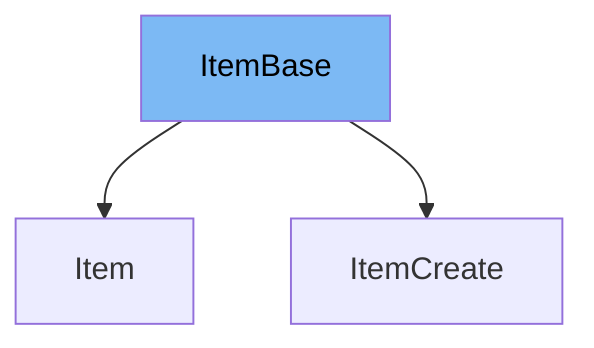

This document will cover the `ItemBase` class in the DEMO-fastapi repository. We will discuss:

1. What is `ItemBase`.
2. The variables and functions defined in `ItemBase`.
3. An example of how to use `ItemBase` in `ItemCreate`.



# What is ItemBase

`ItemBase` is a class defined in the `schemas.py` file of the `sql_databases_peewee/sql_app` directory. It is a Pydantic model that serves as a base model for other classes in the application. It is used to define the common attributes of an item in the application.

<SwmSnippet path="/docs_src/sql_databases_peewee/sql_app/schemas.py" line="17">

---

# Variables in ItemBase

The `title` variable is a string that represents the title of an item.

```python
    title: str
```

---

</SwmSnippet>

<SwmSnippet path="/docs_src/sql_databases_peewee/sql_app/schemas.py" line="18">

---

The `description` variable is an optional string that provides a description of an item. It can be `None`.

```python
    description: Union[str, None] = None
```

---

</SwmSnippet>

<SwmSnippet path="/docs_src/sql_databases_peewee/sql_app/schemas.py" line="21">

---

# Usage example

`ItemBase` is used as a base class for `ItemCreate`. `ItemCreate` inherits all the attributes of `ItemBase`.

```python
class ItemCreate(ItemBase):
    pass
```

---

</SwmSnippet>

&nbsp;

*This is an auto-generated document by Swimm AI 🌊 and has not yet been verified by a human*

<SwmMeta version="3.0.0" repo-id="Z2l0aHViJTNBJTNBREVNTy1mYXN0YXBpJTNBJTNBZ2lsYWRuYXZvdA==" repo-name="DEMO-fastapi" doc-type="general-class"><sup>Powered by [Swimm](/)</sup></SwmMeta>
