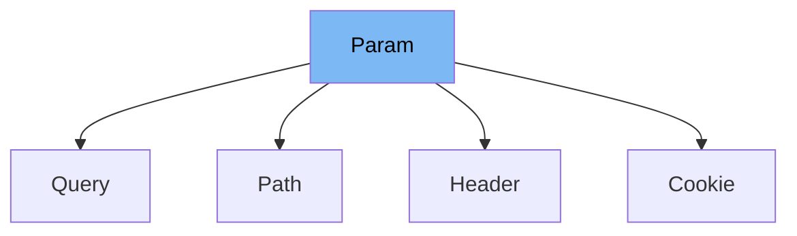

This document will cover the `Param` class in the `fastapi/params.py` file. We'll cover:

1. What is `Param`
2. Variables and functions in `Param`
3. Usage example of `Param`



# What is Param

`Param` is a class in the `fastapi/params.py` file. It is a subclass of `FieldInfo` and is used to provide extra information about a field, including its type, default value, and validation constraints. `Param` is the base class for other classes like `Path`, `Query`, `Header`, `Cookie`, `Body`, `Form`, `File`, `Depends`, and `Security` which are used to define different types of parameters in FastAPI.

<SwmSnippet path="/fastapi/params.py" line="22">

---

# Variables and functions in Param

`in_` is a variable of type `ParamTypes`. It is used to specify the location of the parameter.

```python
    in_: ParamTypes
```

---

</SwmSnippet>

<SwmSnippet path="/fastapi/params.py" line="24">

---

The `__init__` function is used to initialize a `Param` instance. It takes in a variety of parameters such as `default`, `default_factory`, `annotation`, `alias`, `title`, `description`, `gt`, `ge`, `lt`, `le`, `min_length`, `max_length`, `pattern`, `regex`, `discriminator`, `strict`, `multiple_of`, `allow_inf_nan`, `max_digits`, `decimal_places`, `examples`, `example`, `openapi_examples`, `deprecated`, `include_in_schema`, `json_schema_extra`, and `extra`. These parameters provide information about the field and its validation constraints.

```python
    def __init__(
        self,
        default: Any = Undefined,
        *,
        default_factory: Union[Callable[[], Any], None] = _Unset,
        annotation: Optional[Any] = None,
        alias: Optional[str] = None,
        alias_priority: Union[int, None] = _Unset,
        # TODO: update when deprecating Pydantic v1, import these types
        # validation_alias: str | AliasPath | AliasChoices | None
        validation_alias: Union[str, None] = None,
        serialization_alias: Union[str, None] = None,
        title: Optional[str] = None,
        description: Optional[str] = None,
        gt: Optional[float] = None,
        ge: Optional[float] = None,
        lt: Optional[float] = None,
        le: Optional[float] = None,
        min_length: Optional[int] = None,
        max_length: Optional[int] = None,
        pattern: Optional[str] = None,
```

---

</SwmSnippet>

<SwmSnippet path="/fastapi/params.py" line="131">

---

The `__repr__` function is used to provide a string representation of the `Param` instance. It returns the class name and the default value of the instance.

```python
    def __repr__(self) -> str:
        return f"{self.__class__.__name__}({self.default})"
```

---

</SwmSnippet>

<SwmSnippet path="/fastapi/params.py" line="221">

---

# Usage example of Param

`Query` is an example of a class that extends `Param`. It sets `in_` to `ParamTypes.query` to specify that it represents a query parameter. The `__init__` function of `Query` calls the `__init__` function of `Param` to initialize its fields.

```python
class Query(Param):
    in_ = ParamTypes.query

    def __init__(
        self,
        default: Any = Undefined,
        *,
        default_factory: Union[Callable[[], Any], None] = _Unset,
        annotation: Optional[Any] = None,
        alias: Optional[str] = None,
        alias_priority: Union[int, None] = _Unset,
        # TODO: update when deprecating Pydantic v1, import these types
        # validation_alias: str | AliasPath | AliasChoices | None
        validation_alias: Union[str, None] = None,
        serialization_alias: Union[str, None] = None,
        title: Optional[str] = None,
        description: Optional[str] = None,
        gt: Optional[float] = None,
        ge: Optional[float] = None,
        lt: Optional[float] = None,
        le: Optional[float] = None,
```

---

</SwmSnippet>

&nbsp;

*This is an auto-generated document by Swimm AI 🌊 and has not yet been verified by a human*

<SwmMeta version="3.0.0" repo-id="Z2l0aHViJTNBJTNBREVNTy1mYXN0YXBpJTNBJTNBZ2lsYWRuYXZvdA==" repo-name="DEMO-fastapi" doc-type="class"><sup>Powered by [Swimm](/)</sup></SwmMeta>
