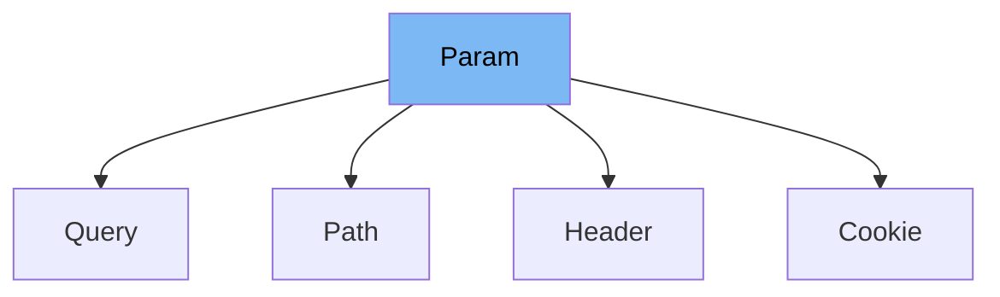

This document will cover the `Param` class in the `fastapi/params.py` file. We'll cover:

1. What the `Param` class is and what it is used for.
2. The variables and functions defined in the `Param` class.
3. An example of how to use `Param` in `Query`.



# What is Param

The `Param` class in `fastapi/params.py` is a fundamental part of the FastAPI framework. It is used to define parameters for API endpoints, including their types, validation rules, and documentation. The `Param` class is a subclass of `FieldInfo` from the `pydantic` library, which provides runtime data validation and settings management using Python type annotations.

<SwmSnippet path="/fastapi/params.py" line="22">

---

# Variables and functions

The `in_` variable is an instance of `ParamTypes` Enum. It defines where the parameter should be located (e.g., path, query, header, cookie).

```python
    in_: ParamTypes
```

---

</SwmSnippet>

<SwmSnippet path="/fastapi/params.py" line="24">

---

The `__init__` function is the constructor of the `Param` class. It initializes the class with a variety of attributes such as `default`, `alias`, `title`, `description`, `deprecated`, and many more. These attributes are used for validation, serialization, and documentation of the parameter.

```python
    def __init__(
        self,
        default: Any = Undefined,
        *,
        default_factory: Union[Callable[[], Any], None] = _Unset,
        annotation: Optional[Any] = None,
        alias: Optional[str] = None,
        alias_priority: Union[int, None] = _Unset,
        # TODO: update when deprecating Pydantic v1, import these types
        # validation_alias: str | AliasPath | AliasChoices | None
        validation_alias: Union[str, None] = None,
        serialization_alias: Union[str, None] = None,
        title: Optional[str] = None,
        description: Optional[str] = None,
        gt: Optional[float] = None,
        ge: Optional[float] = None,
        lt: Optional[float] = None,
        le: Optional[float] = None,
        min_length: Optional[int] = None,
        max_length: Optional[int] = None,
        pattern: Optional[str] = None,
```

---

</SwmSnippet>

<SwmSnippet path="/fastapi/params.py" line="131">

---

The `__repr__` function is used to provide a string representation of the `Param` instance. It returns the class name and the default value of the parameter.

```python
    def __repr__(self) -> str:
        return f"{self.__class__.__name__}({self.default})"
```

---

</SwmSnippet>

<SwmSnippet path="/fastapi/params.py" line="221">

---

# Usage example

Here is an example of how `Param` is used in `Query`. The `Query` class is a subclass of `Param` and sets `in_` to `ParamTypes.query`. It uses the `super().__init__()` function to inherit the initialization from the `Param` class.

```python
class Query(Param):
    in_ = ParamTypes.query

    def __init__(
        self,
        default: Any = Undefined,
        *,
        default_factory: Union[Callable[[], Any], None] = _Unset,
        annotation: Optional[Any] = None,
        alias: Optional[str] = None,
        alias_priority: Union[int, None] = _Unset,
        # TODO: update when deprecating Pydantic v1, import these types
        # validation_alias: str | AliasPath | AliasChoices | None
        validation_alias: Union[str, None] = None,
        serialization_alias: Union[str, None] = None,
        title: Optional[str] = None,
        description: Optional[str] = None,
        gt: Optional[float] = None,
        ge: Optional[float] = None,
        lt: Optional[float] = None,
        le: Optional[float] = None,
```

---

</SwmSnippet>

&nbsp;

*This is an auto-generated document by Swimm AI 🌊 and has not yet been verified by a human*

<SwmMeta version="3.0.0" repo-id="Z2l0aHViJTNBJTNBREVNTy1mYXN0YXBpJTNBJTNBZ2lsYWRuYXZvdA==" repo-name="DEMO-fastapi" doc-type="class"><sup>Powered by [Swimm](/)</sup></SwmMeta>
