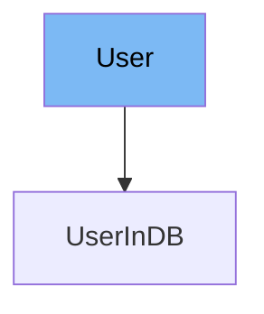

This document will cover the `User` class in the DEMO-fastapi repository. We'll discuss:

1. What the `User` class is and its purpose.
2. The variables and functions defined in the `User` class.
3. An example of how to use the `User` class in `UserInDB`.



# What is User

The `User` class in `docs_src/security/tutorial004_py310.py` is a Pydantic model that represents a user in the application. It is used to validate and serialize user data.

<SwmSnippet path="/docs_src/security/tutorial004_py310.py" line="38">

---

# Variables in User

The `username` variable is a required string that represents the username of the user.

```python
    username: str
```

---

</SwmSnippet>

<SwmSnippet path="/docs_src/security/tutorial004_py310.py" line="39">

---

The `email` variable is an optional string that represents the email of the user.

```python
    email: str | None = None
```

---

</SwmSnippet>

<SwmSnippet path="/docs_src/security/tutorial004_py310.py" line="40">

---

The `full_name` variable is an optional string that represents the full name of the user.

```python
    full_name: str | None = None
```

---

</SwmSnippet>

<SwmSnippet path="/docs_src/security/tutorial004_py310.py" line="41">

---

The `disabled` variable is an optional boolean that represents whether the user is disabled or not.

```python
    disabled: bool | None = None
```

---

</SwmSnippet>

<SwmSnippet path="/docs_src/security/tutorial004_py310.py" line="44">

---

# Usage example

The `UserInDB` class extends the `User` class and adds a `hashed_password` variable. This shows how the `User` class can be extended to add more attributes specific to the application's needs.

```python
class UserInDB(User):
    hashed_password: str

```

---

</SwmSnippet>

&nbsp;

*This is an auto-generated document by Swimm AI 🌊 and has not yet been verified by a human*

<SwmMeta version="3.0.0" repo-id="Z2l0aHViJTNBJTNBREVNTy1mYXN0YXBpJTNBJTNBZ2lsYWRuYXZvdA==" repo-name="DEMO-fastapi" doc-type="general-class"><sup>Powered by [Swimm](/)</sup></SwmMeta>
