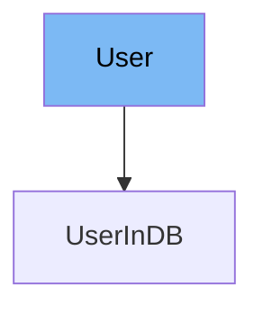

This document will cover the User class in the DEMO-fastapi repository. We'll discuss:

1. What the User class is and its purpose.
2. The variables and functions within the User class.
3. An example of how to use the User class in UserInDB.



# What is User

The User class is a Pydantic model in the FastAPI framework. It is used to define the structure of a user object, including the data types and default values. This class is crucial for data validation, serialization, and documentation in the API.

<SwmSnippet path="/docs_src/security/tutorial003_an.py" line="36">

---

# Variables in User

The `username` variable is a required string that represents the username of the user.

```python
    username: str
```

---

</SwmSnippet>

<SwmSnippet path="/docs_src/security/tutorial003_an.py" line="37">

---

The `email` variable is an optional string that represents the email of the user. It can be None.

```python
    email: Union[str, None] = None
```

---

</SwmSnippet>

<SwmSnippet path="/docs_src/security/tutorial003_an.py" line="38">

---

The `full_name` variable is an optional string that represents the full name of the user. It can be None.

```python
    full_name: Union[str, None] = None
```

---

</SwmSnippet>

<SwmSnippet path="/docs_src/security/tutorial003_an.py" line="39">

---

The `disabled` variable is an optional boolean that represents whether the user is disabled. It can be None.

```python
    disabled: Union[bool, None] = None
```

---

</SwmSnippet>

<SwmSnippet path="/docs_src/security/tutorial003_an.py" line="42">

---

# Usage example

The User class is extended by the UserInDB class. UserInDB inherits all the variables from User and adds an additional `hashed_password` variable. This shows how the User class can be used as a base for other user-related classes.

```python
class UserInDB(User):
    hashed_password: str
```

---

</SwmSnippet>

&nbsp;

*This is an auto-generated document by Swimm AI 🌊 and has not yet been verified by a human*

<SwmMeta version="3.0.0" repo-id="Z2l0aHViJTNBJTNBREVNTy1mYXN0YXBpJTNBJTNBZ2lsYWRuYXZvdA==" repo-name="DEMO-fastapi" doc-type="general-class"><sup>Powered by [Swimm](/)</sup></SwmMeta>
