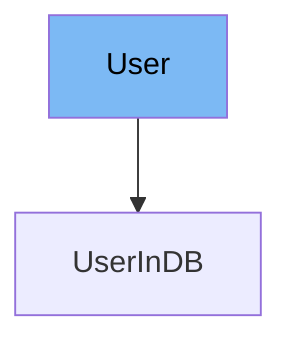

This document will cover the `User` class in the DEMO-fastapi repository. We'll cover:

1. What the `User` class is and its purpose.
2. The variables and functions defined in the `User` class.
3. An example of how to use the `User` class in `UserInDB`.



# What is User

The `User` class is a Pydantic model that represents a user in the application. It is used to validate and store information about a user.

<SwmSnippet path="/docs_src/security/tutorial003_an.py" line="36">

---

# Variables in User

The `username` variable is a required string that stores the username of the user.

```python
    username: str
```

---

</SwmSnippet>

<SwmSnippet path="/docs_src/security/tutorial003_an.py" line="37">

---

The `email` variable is an optional string that stores the email of the user.

```python
    email: Union[str, None] = None
```

---

</SwmSnippet>

<SwmSnippet path="/docs_src/security/tutorial003_an.py" line="38">

---

The `full_name` variable is an optional string that stores the full name of the user.

```python
    full_name: Union[str, None] = None
```

---

</SwmSnippet>

<SwmSnippet path="/docs_src/security/tutorial003_an.py" line="39">

---

The `disabled` variable is an optional boolean that stores the status of the user.

```python
    disabled: Union[bool, None] = None
```

---

</SwmSnippet>

<SwmSnippet path="/docs_src/security/tutorial003_an.py" line="42">

---

# Usage example

The `UserInDB` class extends the `User` class and adds a `hashed_password` variable. This is an example of how to use the `User` class.

```python
class UserInDB(User):
    hashed_password: str
```

---

</SwmSnippet>

&nbsp;

*This is an auto-generated document by Swimm AI 🌊 and has not yet been verified by a human*

<SwmMeta version="3.0.0" repo-id="Z2l0aHViJTNBJTNBREVNTy1mYXN0YXBpJTNBJTNBZ2lsYWRuYXZvdA==" repo-name="DEMO-fastapi" doc-type="general-class"><sup>Powered by [Swimm](/)</sup></SwmMeta>
