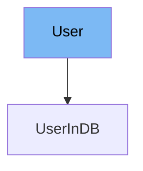

This document will cover the following aspects of the `User` class in the DEMO-fastapi repository:

1. What is `User`
2. Variables and functions in `User`
3. Usage example of `User`



# What is User

The `User` class is a Pydantic model that represents a user in the application. It is used to validate the data of a user and to provide a clear model of what a user object should look like in the system.

<SwmSnippet path="/docs_src/security/tutorial005.py" line="51">

---

# Variables in User

The `username` variable is a string that stores the username of the user.

```python
    username: str
```

---

</SwmSnippet>

<SwmSnippet path="/docs_src/security/tutorial005.py" line="52">

---

The `email` variable is an optional string that stores the email of the user.

```python
    email: Union[str, None] = None
```

---

</SwmSnippet>

<SwmSnippet path="/docs_src/security/tutorial005.py" line="53">

---

The `full_name` variable is an optional string that stores the full name of the user.

```python
    full_name: Union[str, None] = None
```

---

</SwmSnippet>

<SwmSnippet path="/docs_src/security/tutorial005.py" line="54">

---

The `disabled` variable is an optional boolean that stores the status of the user, indicating whether the user is disabled or not.

```python
    disabled: Union[bool, None] = None
```

---

</SwmSnippet>

<SwmSnippet path="/docs_src/security/tutorial005.py" line="57">

---

# Usage example

The `UserInDB` class is an example of how to use the `User` class. It extends the `User` class and adds an additional `hashed_password` variable to store the hashed password of the user.

```python
class UserInDB(User):
    hashed_password: str

```

---

</SwmSnippet>

&nbsp;

*This is an auto-generated document by Swimm AI 🌊 and has not yet been verified by a human*

<SwmMeta version="3.0.0" repo-id="Z2l0aHViJTNBJTNBREVNTy1mYXN0YXBpJTNBJTNBZ2lsYWRuYXZvdA==" repo-name="DEMO-fastapi" doc-type="general-class"><sup>Powered by [Swimm](/)</sup></SwmMeta>
