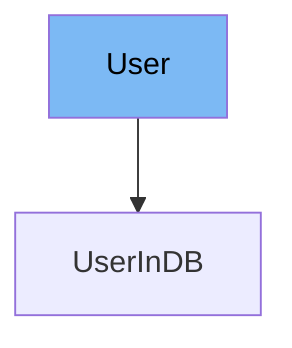

This document will cover the following aspects of the 'User' class in the DEMO-fastapi repository:

1. What is 'User'
2. Variables and functions in 'User'
3. Usage example of 'User'



# What is User

The 'User' class is a Pydantic model used to represent a user in the application. It is used to validate the data of a user, ensuring that the data is in the correct format and type before it is processed by the application.

<SwmSnippet path="/docs_src/security/tutorial005_py310.py" line="50">

---

# Variables in User

The 'username' variable is a required string that represents the username of the user.

```python
    username: str
```

---

</SwmSnippet>

<SwmSnippet path="/docs_src/security/tutorial005_py310.py" line="51">

---

The 'email' variable is an optional string that represents the email of the user. It defaults to None if not provided.

```python
    email: str | None = None
```

---

</SwmSnippet>

<SwmSnippet path="/docs_src/security/tutorial005_py310.py" line="52">

---

The 'full_name' variable is an optional string that represents the full name of the user. It defaults to None if not provided.

```python
    full_name: str | None = None
```

---

</SwmSnippet>

<SwmSnippet path="/docs_src/security/tutorial005_py310.py" line="53">

---

The 'disabled' variable is an optional boolean that represents whether the user is disabled. It defaults to None if not provided.

```python
    disabled: bool | None = None
```

---

</SwmSnippet>

<SwmSnippet path="/docs_src/security/tutorial005_py310.py" line="56">

---

# Usage example

The 'UserInDB' class is an example of how to use the 'User' class. It extends the 'User' class and adds an additional 'hashed_password' variable. This shows how you can extend the 'User' class to add more information about the user.

```python
class UserInDB(User):
    hashed_password: str

```

---

</SwmSnippet>

&nbsp;

*This is an auto-generated document by Swimm AI 🌊 and has not yet been verified by a human*

<SwmMeta version="3.0.0" repo-id="Z2l0aHViJTNBJTNBREVNTy1mYXN0YXBpJTNBJTNBZ2lsYWRuYXZvdA==" repo-name="DEMO-fastapi" doc-type="general-class"><sup>Powered by [Swimm](/)</sup></SwmMeta>
