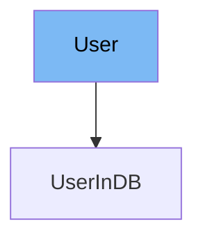

This document will cover the following aspects of the `User` class in the DEMO-fastapi repository:

1. What is the `User` class
2. Variables and functions in the `User` class
3. Usage example of the `User` class



# What is User

The `User` class is a Pydantic model that represents a user in the application. It is used to validate and serialize user data. The class includes fields for the username, email, full name, and a disabled status.

<SwmSnippet path="/docs_src/security/tutorial004_an_py39.py" line="39">

---

# Variables in User

The `username` variable is a required string that represents the username of the user.

```python
    username: str
```

---

</SwmSnippet>

<SwmSnippet path="/docs_src/security/tutorial004_an_py39.py" line="40">

---

The `email` variable is an optional string that represents the email of the user. It defaults to `None` if not provided.

```python
    email: Union[str, None] = None
```

---

</SwmSnippet>

<SwmSnippet path="/docs_src/security/tutorial004_an_py39.py" line="41">

---

The `full_name` variable is an optional string that represents the full name of the user. It defaults to `None` if not provided.

```python
    full_name: Union[str, None] = None
```

---

</SwmSnippet>

<SwmSnippet path="/docs_src/security/tutorial004_an_py39.py" line="42">

---

The `disabled` variable is an optional boolean that represents whether the user is disabled. It defaults to `None` if not provided.

```python
    disabled: Union[bool, None] = None
```

---

</SwmSnippet>

<SwmSnippet path="/docs_src/security/tutorial004_an_py39.py" line="45">

---

# Usage example

The `User` class is extended by the `UserInDB` class. `UserInDB` includes all the fields from `User` and adds a `hashed_password` field. This is an example of how the `User` class can be used to create more specific user models.

```python
class UserInDB(User):
    hashed_password: str

```

---

</SwmSnippet>

&nbsp;

*This is an auto-generated document by Swimm AI 🌊 and has not yet been verified by a human*

<SwmMeta version="3.0.0" repo-id="Z2l0aHViJTNBJTNBREVNTy1mYXN0YXBpJTNBJTNBZ2lsYWRuYXZvdA==" repo-name="DEMO-fastapi" doc-type="general-class"><sup>Powered by [Swimm](/)</sup></SwmMeta>
