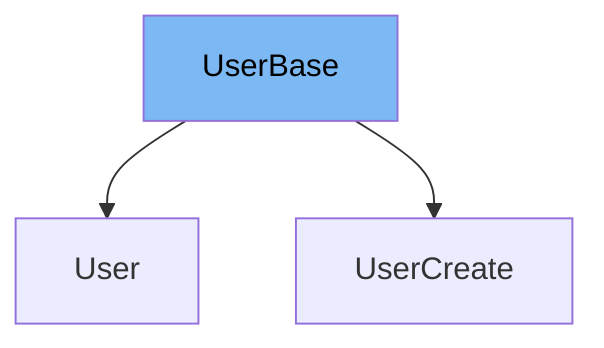

This document will cover the `UserBase` class in the DEMO-fastapi repository. We'll cover:

1. What is UserBase
2. Variables in UserBase
3. Usage example of UserBase



# What is UserBase

The `UserBase` class is a Pydantic model that represents the base attributes of a user in the application. It is used as a base class for other user-related models, providing a common set of attributes for all user models.

<SwmSnippet path="/docs_src/sql_databases/sql_app_py310/schemas.py" line="22">

---

# Variables in UserBase

The `email` variable is a string that stores the email of the user. It is the only attribute defined in the `UserBase` class.

```python
    email: str
```

---

</SwmSnippet>

<SwmSnippet path="/docs_src/sql_databases/sql_app_py310/schemas.py" line="25">

---

# Usage example of UserBase

`UserBase` is used as a base class for the `UserCreate` class. `UserCreate` inherits the `email` attribute from `UserBase` and adds a `password` attribute.

```python
class UserCreate(UserBase):
    password: str
```

---

</SwmSnippet>

&nbsp;

*This is an auto-generated document by Swimm AI 🌊 and has not yet been verified by a human*

<SwmMeta version="3.0.0" repo-id="Z2l0aHViJTNBJTNBREVNTy1mYXN0YXBpJTNBJTNBZ2lsYWRuYXZvdA==" repo-name="DEMO-fastapi" doc-type="general-class"><sup>Powered by [Swimm](/)</sup></SwmMeta>
