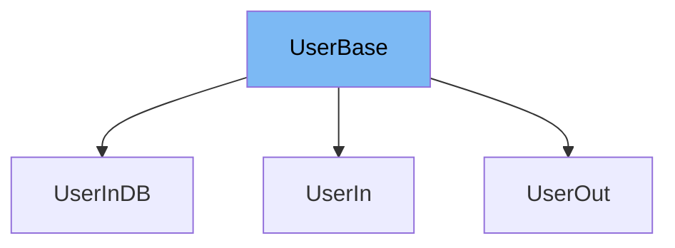

This document will cover the `UserBase` class from the `tutorial002_py310.py` file. We'll discuss:

1. What `UserBase` is and its purpose.
2. The variables and functions defined in `UserBase`.
3. An example of how `UserBase` is used in `UserIn`.



# What is UserBase

`UserBase` is a class that serves as a base model for user-related classes in the application. It is used to define the common attributes that a user should have, such as username, email, and full name.

<SwmSnippet path="/docs_src/extra_models/tutorial002_py310.py" line="8">

---

# Variables in UserBase

The `username` variable is a string that stores the username of the user.

```python
    username: str
```

---

</SwmSnippet>

<SwmSnippet path="/docs_src/extra_models/tutorial002_py310.py" line="9">

---

The `email` variable is of type `EmailStr` from the `pydantic` library, which validates that the input is a valid email string.

```python
    email: EmailStr
```

---

</SwmSnippet>

<SwmSnippet path="/docs_src/extra_models/tutorial002_py310.py" line="10">

---

The `full_name` variable is an optional string that stores the full name of the user. It defaults to `None` if not provided.

```python
    full_name: str | None = None
```

---

</SwmSnippet>

<SwmSnippet path="/docs_src/extra_models/tutorial002_py310.py" line="13">

---

# Usage example

`UserBase` is extended by the `UserIn` class, which adds a `password` field to the base model. This shows how `UserBase` can be used as a foundation for other user-related classes.

```python
class UserIn(UserBase):
    password: str
```

---

</SwmSnippet>

&nbsp;

*This is an auto-generated document by Swimm AI 🌊 and has not yet been verified by a human*

<SwmMeta version="3.0.0" repo-id="Z2l0aHViJTNBJTNBREVNTy1mYXN0YXBpJTNBJTNBZ2lsYWRuYXZvdA==" repo-name="DEMO-fastapi" doc-type="general-class"><sup>Powered by [Swimm](/)</sup></SwmMeta>
