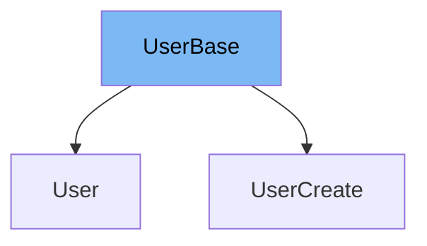

This document will cover the `UserBase` class from the DEMO-fastapi repository. We will discuss:

1. What is `UserBase`.
2. Variables and functions in `UserBase`.
3. An example of how to use `UserBase`.



# What is UserBase

`UserBase` is a class in the DEMO-fastapi repository that serves as a base model for user-related classes. It is defined using the Pydantic `BaseModel` and includes user-related attributes.

<SwmSnippet path="/docs_src/sql_databases/sql_app_py39/schemas.py" line="24">

---

# Variables in UserBase

`email` is a variable in `UserBase` used to store the email of the user. It is of type string.

```python
    email: str
```

---

</SwmSnippet>

<SwmSnippet path="/docs_src/sql_databases/sql_app_py39/schemas.py" line="27">

---

# Usage of UserBase

`UserBase` is used as a base class for `UserCreate`. `UserCreate` extends `UserBase` and adds an additional attribute `password`.

```python
class UserCreate(UserBase):
    password: str
```

---

</SwmSnippet>

&nbsp;

*This is an auto-generated document by Swimm AI 🌊 and has not yet been verified by a human*

<SwmMeta version="3.0.0" repo-id="Z2l0aHViJTNBJTNBREVNTy1mYXN0YXBpJTNBJTNBZ2lsYWRuYXZvdA==" repo-name="DEMO-fastapi" doc-type="general-class"><sup>Powered by [Swimm](/)</sup></SwmMeta>
