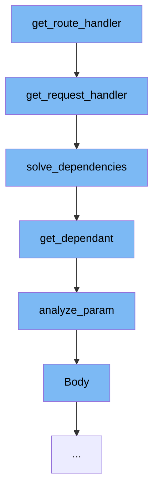

This document will explain the process of handling requests in the FastAPI framework, specifically focusing on the function `get_route_handler` in `fastapi/routing.py`. The process involves the following steps:

1. Getting the request handler
2. Solving dependencies
3. Getting the dependent
4. Analyzing the parameter
5. Processing the body of the request.



<SwmSnippet path="/fastapi/routing.py" line="196">

---

# Getting the Request Handler

The function `get_request_handler` is responsible for handling the incoming request. It takes in several parameters including the dependant, body_field, status_code, response_class, etc. The function checks if the dependant call is a coroutine, if the body_field is a form, and sets the actual_response_class. It then defines an asynchronous function `app` which processes the request and returns a response.

```python
def get_request_handler(
    dependant: Dependant,
    body_field: Optional[ModelField] = None,
    status_code: Optional[int] = None,
    response_class: Union[Type[Response], DefaultPlaceholder] = Default(JSONResponse),
    response_field: Optional[ModelField] = None,
    response_model_include: Optional[IncEx] = None,
    response_model_exclude: Optional[IncEx] = None,
    response_model_by_alias: bool = True,
    response_model_exclude_unset: bool = False,
    response_model_exclude_defaults: bool = False,
    response_model_exclude_none: bool = False,
    dependency_overrides_provider: Optional[Any] = None,
) -> Callable[[Request], Coroutine[Any, Any, Response]]:
    assert dependant.call is not None, "dependant.call must be a function"
    is_coroutine = asyncio.iscoroutinefunction(dependant.call)
    is_body_form = body_field and isinstance(body_field.field_info, params.Form)
    if isinstance(response_class, DefaultPlaceholder):
        actual_response_class: Type[Response] = response_class.value
    else:
        actual_response_class = response_class
```

---

</SwmSnippet>

<SwmSnippet path="/fastapi/dependencies/utils.py" line="524">

---

# Solving Dependencies

The function `solve_dependencies` is called within `get_request_handler`. This function is responsible for solving the dependencies of the request. It takes in several parameters including the request, dependant, body, background_tasks, response, etc. It processes the dependencies of the dependant and solves them. It also handles errors and updates the values accordingly.

```python
async def solve_dependencies(
    *,
    request: Union[Request, WebSocket],
    dependant: Dependant,
    body: Optional[Union[Dict[str, Any], FormData]] = None,
    background_tasks: Optional[StarletteBackgroundTasks] = None,
    response: Optional[Response] = None,
    dependency_overrides_provider: Optional[Any] = None,
    dependency_cache: Optional[Dict[Tuple[Callable[..., Any], Tuple[str]], Any]] = None,
    async_exit_stack: AsyncExitStack,
) -> Tuple[
    Dict[str, Any],
    List[Any],
    Optional[StarletteBackgroundTasks],
    Response,
    Dict[Tuple[Callable[..., Any], Tuple[str]], Any],
]:
    values: Dict[str, Any] = {}
    errors: List[Any] = []
    if response is None:
        response = Response()
```

---

</SwmSnippet>

<SwmSnippet path="/fastapi/dependencies/utils.py" line="241">

---

# Getting the Dependant

The function `get_dependant` is called within `solve_dependencies`. This function gets the dependant for the given path and call. It processes the parameters of the call and creates a dependant object.

```python
def get_dependant(
    *,
    path: str,
    call: Callable[..., Any],
    name: Optional[str] = None,
    security_scopes: Optional[List[str]] = None,
    use_cache: bool = True,
) -> Dependant:
    path_param_names = get_path_param_names(path)
    endpoint_signature = get_typed_signature(call)
    signature_params = endpoint_signature.parameters
    dependant = Dependant(
        call=call,
        name=name,
        path=path,
        security_scopes=security_scopes,
        use_cache=use_cache,
    )
    for param_name, param in signature_params.items():
        is_path_param = param_name in path_param_names
        type_annotation, depends, param_field = analyze_param(
```

---

</SwmSnippet>

<SwmSnippet path="/fastapi/dependencies/utils.py" line="317">

---

# Analyzing the Parameter

The function `analyze_param` is called within `get_dependant`. This function analyzes the given parameter. It checks if the parameter has any dependencies or field_info. It also handles different types of parameters and their respective conditions.

```python
def analyze_param(
    *,
    param_name: str,
    annotation: Any,
    value: Any,
    is_path_param: bool,
) -> Tuple[Any, Optional[params.Depends], Optional[ModelField]]:
    field_info = None
    depends = None
    type_annotation: Any = Any
    use_annotation: Any = Any
    if annotation is not inspect.Signature.empty:
        use_annotation = annotation
        type_annotation = annotation
    if get_origin(use_annotation) is Annotated:
        annotated_args = get_args(annotation)
        type_annotation = annotated_args[0]
        fastapi_annotations = [
            arg
            for arg in annotated_args[1:]
            if isinstance(arg, (FieldInfo, params.Depends))
```

---

</SwmSnippet>

<SwmSnippet path="/fastapi/param_functions.py" line="1263">

---

# Processing the Body of the Request

The function `Body` is called within `analyze_param`. This function processes the body of the request. It takes in several parameters and returns a `params.Body` object.

```python
def Body(  # noqa: N802
    default: Annotated[
        Any,
        Doc(
            """
            Default value if the parameter field is not set.
            """
        ),
    ] = Undefined,
    *,
    default_factory: Annotated[
        Union[Callable[[], Any], None],
        Doc(
            """
            A callable to generate the default value.

            This doesn't affect `Path` parameters as the value is always required.
            The parameter is available only for compatibility.
            """
        ),
    ] = _Unset,
```

---

</SwmSnippet>

&nbsp;

*This is an auto-generated document by Swimm AI 🌊 and has not yet been verified by a human*

<SwmMeta version="3.0.0" repo-id="Z2l0aHViJTNBJTNBREVNTy1mYXN0YXBpJTNBJTNBZ2lsYWRuYXZvdA==" repo-name="DEMO-fastapi" doc-type="flows"><sup>Powered by [Swimm](/)</sup></SwmMeta>
