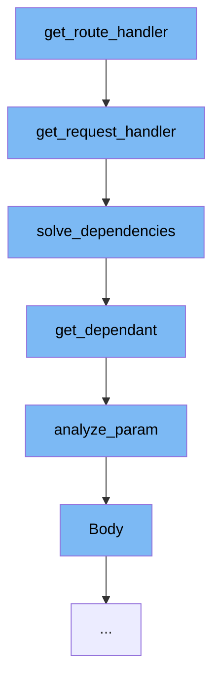

This document will cover the process of handling routes in the FastAPI framework, which includes:

1. Getting the route handler
2. Getting the request handler
3. Solving dependencies
4. Getting the dependent
5. Analyzing the parameter
6. Handling the body of the request.



<SwmSnippet path="/fastapi/routing.py" line="196">

---

# Getting the route handler

The function `get_route_handler` is the starting point of the flow. It's responsible for creating the actual request handler function `app` that will be used to process the incoming HTTP requests. This function takes a `Dependant` object, which contains all the dependencies that need to be resolved before the route function can be called.

```python
def get_request_handler(
    dependant: Dependant,
    body_field: Optional[ModelField] = None,
    status_code: Optional[int] = None,
    response_class: Union[Type[Response], DefaultPlaceholder] = Default(JSONResponse),
    response_field: Optional[ModelField] = None,
    response_model_include: Optional[IncEx] = None,
    response_model_exclude: Optional[IncEx] = None,
    response_model_by_alias: bool = True,
    response_model_exclude_unset: bool = False,
    response_model_exclude_defaults: bool = False,
    response_model_exclude_none: bool = False,
    dependency_overrides_provider: Optional[Any] = None,
) -> Callable[[Request], Coroutine[Any, Any, Response]]:
    assert dependant.call is not None, "dependant.call must be a function"
    is_coroutine = asyncio.iscoroutinefunction(dependant.call)
    is_body_form = body_field and isinstance(body_field.field_info, params.Form)
    if isinstance(response_class, DefaultPlaceholder):
        actual_response_class: Type[Response] = response_class.value
    else:
        actual_response_class = response_class
```

---

</SwmSnippet>

<SwmSnippet path="/fastapi/routing.py" line="196">

---

# Getting the request handler

The `get_request_handler` function is called within the `get_route_handler` function. It's responsible for processing the incoming HTTP request and returning a response. It does this by first resolving all the dependencies required by the route function, and then calling the route function with the resolved dependencies.

```python
def get_request_handler(
    dependant: Dependant,
    body_field: Optional[ModelField] = None,
    status_code: Optional[int] = None,
    response_class: Union[Type[Response], DefaultPlaceholder] = Default(JSONResponse),
    response_field: Optional[ModelField] = None,
    response_model_include: Optional[IncEx] = None,
    response_model_exclude: Optional[IncEx] = None,
    response_model_by_alias: bool = True,
    response_model_exclude_unset: bool = False,
    response_model_exclude_defaults: bool = False,
    response_model_exclude_none: bool = False,
    dependency_overrides_provider: Optional[Any] = None,
) -> Callable[[Request], Coroutine[Any, Any, Response]]:
    assert dependant.call is not None, "dependant.call must be a function"
    is_coroutine = asyncio.iscoroutinefunction(dependant.call)
    is_body_form = body_field and isinstance(body_field.field_info, params.Form)
    if isinstance(response_class, DefaultPlaceholder):
        actual_response_class: Type[Response] = response_class.value
    else:
        actual_response_class = response_class
```

---

</SwmSnippet>

<SwmSnippet path="/fastapi/dependencies/utils.py" line="524">

---

# Solving dependencies

The `solve_dependencies` function is called within the `get_request_handler` function. It's responsible for resolving all the dependencies required by the route function. It does this by iterating over the dependencies and resolving each one individually. The resolved dependencies are then returned as a dictionary.

```python
async def solve_dependencies(
    *,
    request: Union[Request, WebSocket],
    dependant: Dependant,
    body: Optional[Union[Dict[str, Any], FormData]] = None,
    background_tasks: Optional[StarletteBackgroundTasks] = None,
    response: Optional[Response] = None,
    dependency_overrides_provider: Optional[Any] = None,
    dependency_cache: Optional[Dict[Tuple[Callable[..., Any], Tuple[str]], Any]] = None,
    async_exit_stack: AsyncExitStack,
) -> Tuple[
    Dict[str, Any],
    List[Any],
    Optional[StarletteBackgroundTasks],
    Response,
    Dict[Tuple[Callable[..., Any], Tuple[str]], Any],
]:
    values: Dict[str, Any] = {}
    errors: List[Any] = []
    if response is None:
        response = Response()
```

---

</SwmSnippet>

<SwmSnippet path="/fastapi/dependencies/utils.py" line="241">

---

# Getting the dependent

The `get_dependant` function is called within the `solve_dependencies` function. It's responsible for creating a `Dependant` object for a dependency. This object contains all the information required to resolve the dependency, such as the dependency function and its parameters.

```python
def get_dependant(
    *,
    path: str,
    call: Callable[..., Any],
    name: Optional[str] = None,
    security_scopes: Optional[List[str]] = None,
    use_cache: bool = True,
) -> Dependant:
    path_param_names = get_path_param_names(path)
    endpoint_signature = get_typed_signature(call)
    signature_params = endpoint_signature.parameters
    dependant = Dependant(
        call=call,
        name=name,
        path=path,
        security_scopes=security_scopes,
        use_cache=use_cache,
    )
    for param_name, param in signature_params.items():
        is_path_param = param_name in path_param_names
        type_annotation, depends, param_field = analyze_param(
```

---

</SwmSnippet>

<SwmSnippet path="/fastapi/dependencies/utils.py" line="317">

---

# Analyzing the parameter

The `analyze_param` function is called within the `get_dependant` function. It's responsible for analyzing a parameter of the dependency function. It does this by inspecting the parameter's annotation and default value, and returning a `Field` object that represents the parameter.

```python
def analyze_param(
    *,
    param_name: str,
    annotation: Any,
    value: Any,
    is_path_param: bool,
) -> Tuple[Any, Optional[params.Depends], Optional[ModelField]]:
    field_info = None
    depends = None
    type_annotation: Any = Any
    use_annotation: Any = Any
    if annotation is not inspect.Signature.empty:
        use_annotation = annotation
        type_annotation = annotation
    if get_origin(use_annotation) is Annotated:
        annotated_args = get_args(annotation)
        type_annotation = annotated_args[0]
        fastapi_annotations = [
            arg
            for arg in annotated_args[1:]
            if isinstance(arg, (FieldInfo, params.Depends))
```

---

</SwmSnippet>

<SwmSnippet path="/fastapi/param_functions.py" line="1263">

---

# Handling the body of the request

The `Body` function is called within the `analyze_param` function. It's responsible for creating a `Body` object that represents the body of the HTTP request. This object is used to parse the body of the request when the route function is called.

```python
def Body(  # noqa: N802
    default: Annotated[
        Any,
        Doc(
            """
            Default value if the parameter field is not set.
            """
        ),
    ] = Undefined,
    *,
    default_factory: Annotated[
        Union[Callable[[], Any], None],
        Doc(
            """
            A callable to generate the default value.

            This doesn't affect `Path` parameters as the value is always required.
            The parameter is available only for compatibility.
            """
        ),
    ] = _Unset,
```

---

</SwmSnippet>

&nbsp;

*This is an auto-generated document by Swimm AI 🌊 and has not yet been verified by a human*

<SwmMeta version="3.0.0" repo-id="Z2l0aHViJTNBJTNBREVNTy1mYXN0YXBpJTNBJTNBZ2lsYWRuYXZvdA==" repo-name="DEMO-fastapi" doc-type="flows"><sup>Powered by [Swimm](/)</sup></SwmMeta>
