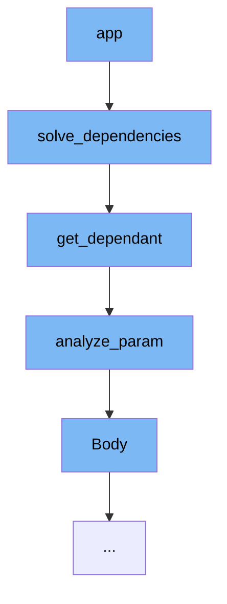

This document will cover the process of routing and dependency resolution in the FastAPI framework, which includes:

1. The initial routing function
2. Solving dependencies
3. Getting dependant
4. Analyzing parameters
5. Body parameter handling.



# Initial Routing Function

The routing process starts in the `app::fastapi/routing.py` file. This is where the initial routing function is defined and the process of routing begins.

<SwmSnippet path="/fastapi/dependencies/utils.py" line="524">

---

# Solving Dependencies

The `solve_dependencies` function is responsible for resolving the dependencies of a given route. It takes in a request and a dependant object, among other parameters, and returns a tuple containing the resolved values, any errors, background tasks, response, and a dependency cache. This function is recursive, as it calls itself to solve sub-dependencies.

```python
async def solve_dependencies(
    *,
    request: Union[Request, WebSocket],
    dependant: Dependant,
    body: Optional[Union[Dict[str, Any], FormData]] = None,
    background_tasks: Optional[StarletteBackgroundTasks] = None,
    response: Optional[Response] = None,
    dependency_overrides_provider: Optional[Any] = None,
    dependency_cache: Optional[Dict[Tuple[Callable[..., Any], Tuple[str]], Any]] = None,
    async_exit_stack: AsyncExitStack,
) -> Tuple[
    Dict[str, Any],
    List[Any],
    Optional[StarletteBackgroundTasks],
    Response,
    Dict[Tuple[Callable[..., Any], Tuple[str]], Any],
]:
    values: Dict[str, Any] = {}
    errors: List[Any] = []
    if response is None:
        response = Response()
```

---

</SwmSnippet>

<SwmSnippet path="/fastapi/dependencies/utils.py" line="241">

---

# Getting Dependant

The `get_dependant` function is used to create a `Dependant` object, which represents a dependency. This function takes in a path and a callable, among other parameters, and returns a `Dependant` object. It uses the `analyze_param` function to analyze each parameter of the callable.

```python
def get_dependant(
    *,
    path: str,
    call: Callable[..., Any],
    name: Optional[str] = None,
    security_scopes: Optional[List[str]] = None,
    use_cache: bool = True,
) -> Dependant:
    path_param_names = get_path_param_names(path)
    endpoint_signature = get_typed_signature(call)
    signature_params = endpoint_signature.parameters
    dependant = Dependant(
        call=call,
        name=name,
        path=path,
        security_scopes=security_scopes,
        use_cache=use_cache,
    )
    for param_name, param in signature_params.items():
        is_path_param = param_name in path_param_names
        type_annotation, depends, param_field = analyze_param(
```

---

</SwmSnippet>

<SwmSnippet path="/fastapi/dependencies/utils.py" line="317">

---

# Analyzing Parameters

The `analyze_param` function is used to analyze a parameter and determine its type, whether it has a dependency, and create a `ModelField` object if necessary. This function is used by `get_dependant` to analyze each parameter of the callable.

```python
def analyze_param(
    *,
    param_name: str,
    annotation: Any,
    value: Any,
    is_path_param: bool,
) -> Tuple[Any, Optional[params.Depends], Optional[ModelField]]:
    field_info = None
    depends = None
    type_annotation: Any = Any
    use_annotation: Any = Any
    if annotation is not inspect.Signature.empty:
        use_annotation = annotation
        type_annotation = annotation
    if get_origin(use_annotation) is Annotated:
        annotated_args = get_args(annotation)
        type_annotation = annotated_args[0]
        fastapi_annotations = [
            arg
            for arg in annotated_args[1:]
            if isinstance(arg, (FieldInfo, params.Depends))
```

---

</SwmSnippet>

<SwmSnippet path="/fastapi/param_functions.py" line="1263">

---

# Body Parameter Handling

The `Body` function is used to create a `Body` parameter. This function takes in a default value and several other optional parameters, and returns a `Body` parameter. This function is used by `analyze_param` when the parameter is a body parameter.

```python
def Body(  # noqa: N802
    default: Annotated[
        Any,
        Doc(
            """
            Default value if the parameter field is not set.
            """
        ),
    ] = Undefined,
    *,
    default_factory: Annotated[
        Union[Callable[[], Any], None],
        Doc(
            """
            A callable to generate the default value.

            This doesn't affect `Path` parameters as the value is always required.
            The parameter is available only for compatibility.
            """
        ),
    ] = _Unset,
```

---

</SwmSnippet>

&nbsp;

*This is an auto-generated document by Swimm AI 🌊 and has not yet been verified by a human*

<SwmMeta version="3.0.0" repo-id="Z2l0aHViJTNBJTNBREVNTy1mYXN0YXBpJTNBJTNBZ2lsYWRuYXZvdA==" repo-name="DEMO-fastapi" doc-type="flows"><sup>Powered by [Swimm](/)</sup></SwmMeta>
