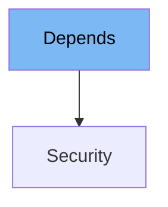

This document will cover the following topics about the `Depends` class in FastAPI:

1. What is `Depends`
2. Variables and functions in `Depends`
3. Usage example of `Depends`



# What is Depends

`Depends` is a class in FastAPI used for declaring dependencies in your application. It's a key part of FastAPI's dependency injection system, allowing you to manage and control how different parts of your application interact with each other and with external resources, such as databases or HTTP requests. It can be used to manage shared resources, configuration, authorization and any other cross-cutting concerns in a clean, Pythonic way.

<SwmSnippet path="/fastapi/params.py" line="762">

---

# Variables and functions

The `Depends` class has two instance variables: `dependency` and `use_cache`. The `dependency` variable is a callable that defines the actual dependency. The `use_cache` variable is a boolean that determines whether the result of the dependency should be cached.

```python
    def __init__(
        self, dependency: Optional[Callable[..., Any]] = None, *, use_cache: bool = True
    ):
        self.dependency = dependency
        self.use_cache = use_cache
```

---

</SwmSnippet>

<SwmSnippet path="/fastapi/params.py" line="768">

---

The `Depends` class has a `__repr__` method, which returns a string representation of the instance. This can be useful for debugging.

```python
    def __repr__(self) -> str:
        attr = getattr(self.dependency, "__name__", type(self.dependency).__name__)
        cache = "" if self.use_cache else ", use_cache=False"
        return f"{self.__class__.__name__}({attr}{cache})"
```

---

</SwmSnippet>

<SwmSnippet path="/fastapi/params.py" line="774">

---

# Usage example

Here is an example of how `Depends` is used in the `Security` class. The `Security` class extends `Depends` and uses it to declare a dependency on a security scheme.

```python
class Security(Depends):
    def __init__(
        self,
        dependency: Optional[Callable[..., Any]] = None,
        *,
        scopes: Optional[Sequence[str]] = None,
        use_cache: bool = True,
    ):
```

---

</SwmSnippet>

&nbsp;

*This is an auto-generated document by Swimm AI 🌊 and has not yet been verified by a human*

<SwmMeta version="3.0.0" repo-id="Z2l0aHViJTNBJTNBREVNTy1mYXN0YXBpJTNBJTNBZ2lsYWRuYXZvdA==" repo-name="DEMO-fastapi" doc-type="class"><sup>Powered by [Swimm](/)</sup></SwmMeta>
