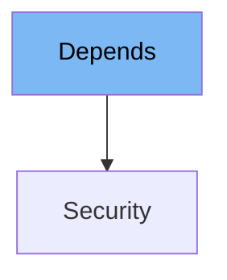

This document will cover the following topics:

1. What is Depends
2. Variables and functions in Depends
3. Usage example of Depends



# What is Depends

Depends is a class in FastAPI that is used to declare dependencies in your application. It is a key part of FastAPI's dependency injection system, allowing you to manage and control how different parts of your application interact with each other. This can be used for a variety of purposes, such as managing database connections, ensuring authentication, or limiting the rate of requests.

<SwmSnippet path="/fastapi/params.py" line="762">

---

# Variables and functions in Depends

The `Depends` class has two instance variables: `dependency` and `use_cache`. `dependency` is an optional callable that defines the dependency to be used. `use_cache` is a boolean that determines whether the result of the dependency should be cached.

```python
    def __init__(
        self, dependency: Optional[Callable[..., Any]] = None, *, use_cache: bool = True
    ):
        self.dependency = dependency
        self.use_cache = use_cache
```

---

</SwmSnippet>

<SwmSnippet path="/fastapi/params.py" line="768">

---

The `Depends` class has a `__repr__` method. This method returns a string representation of the `Depends` instance, including the name of the dependency and whether caching is used.

```python
    def __repr__(self) -> str:
        attr = getattr(self.dependency, "__name__", type(self.dependency).__name__)
        cache = "" if self.use_cache else ", use_cache=False"
        return f"{self.__class__.__name__}({attr}{cache})"
```

---

</SwmSnippet>

<SwmSnippet path="/fastapi/params.py" line="774">

---

# Usage example

Here is an example of how `Depends` is used in the `Security` class. The `Security` class inherits from `Depends` and uses it to declare a dependency on a callable (which could be a function or a class). This dependency will be resolved whenever a `Security` instance is used.

```python
class Security(Depends):
    def __init__(
        self,
        dependency: Optional[Callable[..., Any]] = None,
        *,
        scopes: Optional[Sequence[str]] = None,
        use_cache: bool = True,
    ):
        super().__init__(dependency=dependency, use_cache=use_cache)
```

---

</SwmSnippet>

&nbsp;

*This is an auto-generated document by Swimm AI 🌊 and has not yet been verified by a human*

<SwmMeta version="3.0.0" repo-id="Z2l0aHViJTNBJTNBREVNTy1mYXN0YXBpJTNBJTNBZ2lsYWRuYXZvdA==" repo-name="DEMO-fastapi" doc-type="class"><sup>Powered by [Swimm](/)</sup></SwmMeta>
