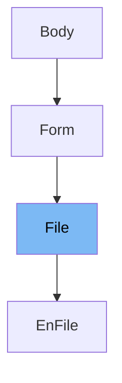

This document will cover the following topics about the `File` class in the `fastapi/params.py` file:

1. What is `File`
2. Variables and functions in `File`
3. Usage example of `File`



# What is File

`File` is a class in the `fastapi/params.py` file. It is a subclass of the `Form` class and is used to handle file data sent through HTTP requests. The `File` class is specifically designed to handle files sent with 'multipart/form-data' media type, which is commonly used in web forms.

<SwmSnippet path="/fastapi/params.py" line="678">

---

# Variables and functions

`__init__` is the constructor function for the `File` class. It takes several parameters including `default`, `default_factory`, `annotation`, `media_type`, `alias`, `alias_priority`, `validation_alias`, `serialization_alias`, `title`, `description`, `gt`, `ge`, `lt`, `le`, `min_length`, `max_length`, `pattern`, `regex`, `discriminator`, `strict`, `multiple_of`, `allow_inf_nan`, `max_digits`, `decimal_places`, `examples`, `example`, `openapi_examples`, `deprecated`, `include_in_schema`, `json_schema_extra`, and `extra`. These parameters are used to configure the behavior of the `File` instance.

```python
    def __init__(
        self,
        default: Any = Undefined,
        *,
        default_factory: Union[Callable[[], Any], None] = _Unset,
        annotation: Optional[Any] = None,
        media_type: str = "multipart/form-data",
        alias: Optional[str] = None,
        alias_priority: Union[int, None] = _Unset,
        # TODO: update when deprecating Pydantic v1, import these types
        # validation_alias: str | AliasPath | AliasChoices | None
        validation_alias: Union[str, None] = None,
        serialization_alias: Union[str, None] = None,
        title: Optional[str] = None,
        description: Optional[str] = None,
        gt: Optional[float] = None,
        ge: Optional[float] = None,
        lt: Optional[float] = None,
        le: Optional[float] = None,
        min_length: Optional[int] = None,
        max_length: Optional[int] = None,
```

---

</SwmSnippet>

&nbsp;

*This is an auto-generated document by Swimm AI 🌊 and has not yet been verified by a human*

<SwmMeta version="3.0.0" repo-id="Z2l0aHViJTNBJTNBREVNTy1mYXN0YXBpJTNBJTNBZ2lsYWRuYXZvdA==" repo-name="DEMO-fastapi" doc-type="class"><sup>Powered by [Swimm](/)</sup></SwmMeta>
