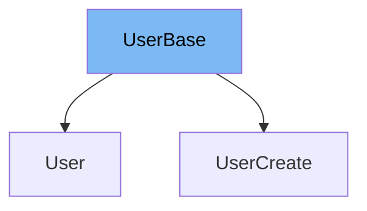

This document will cover the `UserBase` class from the `schemas.py` file. We'll cover:

1. What is `UserBase`
2. Variables and functions in `UserBase`
3. Usage example of `UserBase`



# What is UserBase

`UserBase` is a class that serves as a base model for user-related classes in the application. It is defined using the `BaseModel` from the `pydantic` library, which is a data validation library used to validate data classes. `UserBase` is used to define common attributes for user-related classes.

<SwmSnippet path="/docs_src/sql_databases/sql_app_py39/schemas.py" line="24">

---

# Variables in UserBase

The `email` variable is a string that stores the email of the user. It is the only attribute defined in the `UserBase` class.

```python
    email: str
```

---

</SwmSnippet>

<SwmSnippet path="/docs_src/sql_databases/sql_app_py39/schemas.py" line="27">

---

# Usage example

`UserBase` is used as a base class for the `UserCreate` class. `UserCreate` extends `UserBase` and adds an additional attribute `password`.

```python
class UserCreate(UserBase):
    password: str
```

---

</SwmSnippet>

&nbsp;

*This is an auto-generated document by Swimm AI 🌊 and has not yet been verified by a human*

<SwmMeta version="3.0.0" repo-id="Z2l0aHViJTNBJTNBREVNTy1mYXN0YXBpJTNBJTNBZ2lsYWRuYXZvdA==" repo-name="DEMO-fastapi" doc-type="general-class"><sup>Powered by [Swimm](/)</sup></SwmMeta>
