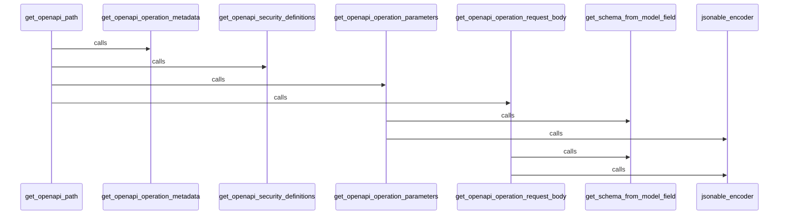

OpenAPI in the DEMO-fastapi repository refers to a specification used for defining and describing RESTful APIs. It's used in the codebase to generate detailed, interactive API documentation that developers can use to understand the API's endpoints, request/response models, and other details. The OpenAPI specification is also used to generate client SDKs, server stubs, and other code artifacts.

<SwmSnippet path="/fastapi/openapi/utils.py" line="438">

---

# OpenAPI Schema Generation

This is the `get_openapi` function which is used to generate the OpenAPI schema. It takes various parameters like the title, version, routes, etc., and returns a dictionary representing the OpenAPI schema.

```python
def get_openapi(
    *,
    title: str,
    version: str,
    openapi_version: str = "3.1.0",
    summary: Optional[str] = None,
    description: Optional[str] = None,
    routes: Sequence[BaseRoute],
    webhooks: Optional[Sequence[BaseRoute]] = None,
    tags: Optional[List[Dict[str, Any]]] = None,
    servers: Optional[List[Dict[str, Union[str, Any]]]] = None,
    terms_of_service: Optional[str] = None,
    contact: Optional[Dict[str, Union[str, Any]]] = None,
    license_info: Optional[Dict[str, Union[str, Any]]] = None,
    separate_input_output_schemas: bool = True,
) -> Dict[str, Any]:
    info: Dict[str, Any] = {"title": title, "version": version}
    if summary:
        info["summary"] = summary
    if description:
        info["description"] = description
```

---

</SwmSnippet>

<SwmSnippet path="/fastapi/openapi/utils.py" line="215">

---

# OpenAPI Path Generation

This is the `get_openapi_path` function which is used to generate the OpenAPI paths for the API. It takes various parameters like the route, operation_ids, etc., and returns a dictionary representing the OpenAPI paths.

```python
def get_openapi_path(
    *,
    route: routing.APIRoute,
    operation_ids: Set[str],
    schema_generator: GenerateJsonSchema,
    model_name_map: ModelNameMap,
    field_mapping: Dict[
        Tuple[ModelField, Literal["validation", "serialization"]], JsonSchemaValue
    ],
    separate_input_output_schemas: bool = True,
) -> Tuple[Dict[str, Any], Dict[str, Any], Dict[str, Any]]:
    path = {}
    security_schemes: Dict[str, Any] = {}
    definitions: Dict[str, Any] = {}
    assert route.methods is not None, "Methods must be a list"
    if isinstance(route.response_class, DefaultPlaceholder):
        current_response_class: Type[Response] = route.response_class.value
    else:
        current_response_class = route.response_class
    assert current_response_class, "A response class is needed to generate OpenAPI"
    route_response_media_type: Optional[str] = current_response_class.media_type
```

---

</SwmSnippet>

<SwmSnippet path="/fastapi/openapi/utils.py" line="189">

---

# OpenAPI Operation Metadata Generation

This is the `get_openapi_operation_metadata` function which is used to generate the OpenAPI operation metadata for the API. It takes various parameters like the route, method, operation_ids, etc., and returns a dictionary representing the OpenAPI operation metadata.

```python
def get_openapi_operation_metadata(
    *, route: routing.APIRoute, method: str, operation_ids: Set[str]
) -> Dict[str, Any]:
    operation: Dict[str, Any] = {}
    if route.tags:
        operation["tags"] = route.tags
    operation["summary"] = generate_operation_summary(route=route, method=method)
    if route.description:
        operation["description"] = route.description
    operation_id = route.operation_id or route.unique_id
    if operation_id in operation_ids:
        message = (
            f"Duplicate Operation ID {operation_id} for function "
            + f"{route.endpoint.__name__}"
        )
        file_name = getattr(route.endpoint, "__globals__", {}).get("__file__")
        if file_name:
            message += f" at {file_name}"
        warnings.warn(message, stacklevel=1)
    operation_ids.add(operation_id)
    operation["operationId"] = operation_id
```

---

</SwmSnippet>

# OpenAPI Functions

This section provides an overview of the key OpenAPI functions used in the DEMO-fastapi repository.

<SwmSnippet path="/fastapi/openapi/utils.py" line="215">

---

## get_openapi_path

The `get_openapi_path` function generates the OpenAPI paths for the API routes. It uses other functions like `get_openapi_operation_metadata`, `get_openapi_security_definitions`, `get_openapi_operation_parameters`, and `get_openapi_operation_request_body` to generate the complete path information.

```python
def get_openapi_path(
    *,
    route: routing.APIRoute,
    operation_ids: Set[str],
    schema_generator: GenerateJsonSchema,
    model_name_map: ModelNameMap,
    field_mapping: Dict[
        Tuple[ModelField, Literal["validation", "serialization"]], JsonSchemaValue
    ],
    separate_input_output_schemas: bool = True,
) -> Tuple[Dict[str, Any], Dict[str, Any], Dict[str, Any]]:
    path = {}
    security_schemes: Dict[str, Any] = {}
    definitions: Dict[str, Any] = {}
    assert route.methods is not None, "Methods must be a list"
    if isinstance(route.response_class, DefaultPlaceholder):
        current_response_class: Type[Response] = route.response_class.value
    else:
        current_response_class = route.response_class
    assert current_response_class, "A response class is needed to generate OpenAPI"
    route_response_media_type: Optional[str] = current_response_class.media_type
```

---

</SwmSnippet>

<SwmSnippet path="/fastapi/openapi/utils.py" line="189">

---

## get_openapi_operation_metadata

The `get_openapi_operation_metadata` function generates the metadata for an API operation, including tags, summary, description, operationId, and deprecated status.

```python
def get_openapi_operation_metadata(
    *, route: routing.APIRoute, method: str, operation_ids: Set[str]
) -> Dict[str, Any]:
    operation: Dict[str, Any] = {}
    if route.tags:
        operation["tags"] = route.tags
    operation["summary"] = generate_operation_summary(route=route, method=method)
    if route.description:
        operation["description"] = route.description
    operation_id = route.operation_id or route.unique_id
    if operation_id in operation_ids:
        message = (
            f"Duplicate Operation ID {operation_id} for function "
            + f"{route.endpoint.__name__}"
        )
        file_name = getattr(route.endpoint, "__globals__", {}).get("__file__")
        if file_name:
            message += f" at {file_name}"
        warnings.warn(message, stacklevel=1)
    operation_ids.add(operation_id)
    operation["operationId"] = operation_id
```

---

</SwmSnippet>

<SwmSnippet path="/fastapi/openapi/utils.py" line="73">

---

## get_openapi_security_definitions

The `get_openapi_security_definitions` function generates the security definitions for an API operation. It uses the `jsonable_encoder` function to convert the security scheme model to a JSON-serializable format.

```python
def get_openapi_security_definitions(
    flat_dependant: Dependant,
) -> Tuple[Dict[str, Any], List[Dict[str, Any]]]:
    security_definitions = {}
    operation_security = []
    for security_requirement in flat_dependant.security_requirements:
        security_definition = jsonable_encoder(
            security_requirement.security_scheme.model,
            by_alias=True,
            exclude_none=True,
        )
        security_name = security_requirement.security_scheme.scheme_name
        security_definitions[security_name] = security_definition
        operation_security.append({security_name: security_requirement.scopes})
    return security_definitions, operation_security
```

---

</SwmSnippet>

<SwmSnippet path="/fastapi/openapi/utils.py" line="90">

---

## get_openapi_operation_parameters

The `get_openapi_operation_parameters` function generates the parameters for an API operation. It uses the `get_schema_from_model_field` and `jsonable_encoder` functions to generate the schema and examples for each parameter.

```python
def get_openapi_operation_parameters(
    *,
    all_route_params: Sequence[ModelField],
    schema_generator: GenerateJsonSchema,
    model_name_map: ModelNameMap,
    field_mapping: Dict[
        Tuple[ModelField, Literal["validation", "serialization"]], JsonSchemaValue
    ],
    separate_input_output_schemas: bool = True,
) -> List[Dict[str, Any]]:
    parameters = []
    for param in all_route_params:
        field_info = param.field_info
        field_info = cast(Param, field_info)
        if not field_info.include_in_schema:
            continue
        param_schema = get_schema_from_model_field(
            field=param,
            schema_generator=schema_generator,
            model_name_map=model_name_map,
            field_mapping=field_mapping,
```

---

</SwmSnippet>

<SwmSnippet path="/fastapi/openapi/utils.py" line="131">

---

## get_openapi_operation_request_body

The `get_openapi_operation_request_body` function generates the request body for an API operation. It uses the `get_schema_from_model_field` and `jsonable_encoder` functions to generate the schema and examples for the request body.

```python
def get_openapi_operation_request_body(
    *,
    body_field: Optional[ModelField],
    schema_generator: GenerateJsonSchema,
    model_name_map: ModelNameMap,
    field_mapping: Dict[
        Tuple[ModelField, Literal["validation", "serialization"]], JsonSchemaValue
    ],
    separate_input_output_schemas: bool = True,
) -> Optional[Dict[str, Any]]:
    if not body_field:
        return None
    assert isinstance(body_field, ModelField)
    body_schema = get_schema_from_model_field(
        field=body_field,
        schema_generator=schema_generator,
        model_name_map=model_name_map,
        field_mapping=field_mapping,
        separate_input_output_schemas=separate_input_output_schemas,
    )
    field_info = cast(Body, body_field.field_info)
```

---

</SwmSnippet>



&nbsp;

*This is an auto-generated document by Swimm AI 🌊 and has not yet been verified by a human*

<SwmMeta version="3.0.0" repo-id="Z2l0aHViJTNBJTNBREVNTy1mYXN0YXBpJTNBJTNBZ2lsYWRuYXZvdA==" repo-name="DEMO-fastapi" doc-type="overview"><sup>Powered by [Swimm](/)</sup></SwmMeta>
