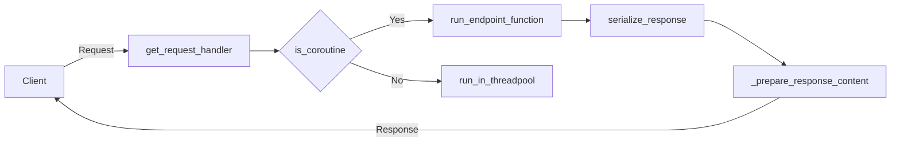

Routing in FastAPI is the process of taking a URL path, and executing a specific function (also known as a 'route handler') that corresponds to that path. This is essential for directing users to the correct page or function in your application.

<SwmSnippet path="/fastapi/routing.py" line="812">

---

The `route` function in FastAPI is used to associate a URL path with a specific function. When a request is made to the provided path, the associated function is executed.

```python
    def route(
        self,
        path: str,
        methods: Optional[List[str]] = None,
        name: Optional[str] = None,
        include_in_schema: bool = True,
    ) -> Callable[[DecoratedCallable], DecoratedCallable]:
        def decorator(func: DecoratedCallable) -> DecoratedCallable:
            self.add_route(
                path,
                func,
                methods=methods,
                name=name,
                include_in_schema=include_in_schema,
            )
            return func

        return decorator
```

---

</SwmSnippet>

<SwmSnippet path="/fastapi/routing.py" line="389">

---

The `APIRoute` class in FastAPI represents a single route in the application. It contains information about the path, the associated function (endpoint), and various other options such as the response model, status code, tags, dependencies, etc.

```python
class APIRoute(routing.Route):
    def __init__(
        self,
        path: str,
        endpoint: Callable[..., Any],
        *,
        response_model: Any = Default(None),
        status_code: Optional[int] = None,
        tags: Optional[List[Union[str, Enum]]] = None,
        dependencies: Optional[Sequence[params.Depends]] = None,
        summary: Optional[str] = None,
        description: Optional[str] = None,
        response_description: str = "Successful Response",
        responses: Optional[Dict[Union[int, str], Dict[str, Any]]] = None,
        deprecated: Optional[bool] = None,
        name: Optional[str] = None,
        methods: Optional[Union[Set[str], List[str]]] = None,
        operation_id: Optional[str] = None,
        response_model_include: Optional[IncEx] = None,
        response_model_exclude: Optional[IncEx] = None,
        response_model_by_alias: bool = True,
```

---

</SwmSnippet>

<SwmSnippet path="/fastapi/routing.py" line="1312">

---

FastAPI provides several methods such as `get`, `post`, `put`, `delete`, etc., which are shortcuts for creating an `APIRoute` with the corresponding HTTP method.

```python
    def get(
        self,
        path: Annotated[
            str,
            Doc(
                """
                The URL path to be used for this *path operation*.

                For example, in `http://example.com/items`, the path is `/items`.
                """
            ),
        ],
        *,
        response_model: Annotated[
            Any,
            Doc(
                """
                The type to use for the response.

                It could be any valid Pydantic *field* type. So, it doesn't have to
                be a Pydantic model, it could be other things, like a `list`, `dict`,
```

---

</SwmSnippet>

<SwmSnippet path="/fastapi/routing.py" line="1072">

---

The `include_router` function is used to include routes from another `APIRouter` into the current one. This is useful for splitting your application into multiple files or modules.

```python
    def include_router(
        self,
        router: Annotated["APIRouter", Doc("The `APIRouter` to include.")],
        *,
        prefix: Annotated[str, Doc("An optional path prefix for the router.")] = "",
        tags: Annotated[
            Optional[List[Union[str, Enum]]],
            Doc(
                """
                A list of tags to be applied to all the *path operations* in this
                router.

                It will be added to the generated OpenAPI (e.g. visible at `/docs`).

                Read more about it in the
                [FastAPI docs for Path Operation Configuration](https://fastapi.tiangolo.com/tutorial/path-operation-configuration/).
                """
            ),
        ] = None,
        dependencies: Annotated[
            Optional[Sequence[params.Depends]],
```

---

</SwmSnippet>

# Defining a route

Here we define two routes. The `@app.get("/")` decorator tells FastAPI that the function below corresponds to the GET method at the '/' path. The `@app.get("/items/{item_id}")` decorator corresponds to the GET method at the '/items/{item_id}' path, where '{item_id}' is a variable part of the URL.

<SwmSnippet path="/fastapi/routing.py" line="389">

---

# Using the `APIRoute` class

The `APIRoute` class is used internally by FastAPI to represent a route. It takes the path, the endpoint function, and various other parameters that define the behavior of the route. It also handles the serialization of the response, among other things.

```python
class APIRoute(routing.Route):
    def __init__(
        self,
        path: str,
        endpoint: Callable[..., Any],
        *,
        response_model: Any = Default(None),
        status_code: Optional[int] = None,
        tags: Optional[List[Union[str, Enum]]] = None,
        dependencies: Optional[Sequence[params.Depends]] = None,
        summary: Optional[str] = None,
        description: Optional[str] = None,
        response_description: str = "Successful Response",
        responses: Optional[Dict[Union[int, str], Dict[str, Any]]] = None,
        deprecated: Optional[bool] = None,
        name: Optional[str] = None,
        methods: Optional[Union[Set[str], List[str]]] = None,
        operation_id: Optional[str] = None,
        response_model_include: Optional[IncEx] = None,
        response_model_exclude: Optional[IncEx] = None,
        response_model_by_alias: bool = True,
```

---

</SwmSnippet>

<SwmSnippet path="/fastapi/routing.py" line="1072">

---

# Including a router

The `include_router` function is used to include the routes from another `APIRouter` in the current `APIRouter`. This is useful for splitting a large application into multiple smaller, more manageable routers, each with its own set of routes.

```python
    def include_router(
        self,
        router: Annotated["APIRouter", Doc("The `APIRouter` to include.")],
        *,
        prefix: Annotated[str, Doc("An optional path prefix for the router.")] = "",
        tags: Annotated[
            Optional[List[Union[str, Enum]]],
            Doc(
                """
                A list of tags to be applied to all the *path operations* in this
                router.

                It will be added to the generated OpenAPI (e.g. visible at `/docs`).

                Read more about it in the
                [FastAPI docs for Path Operation Configuration](https://fastapi.tiangolo.com/tutorial/path-operation-configuration/).
                """
            ),
        ] = None,
        dependencies: Annotated[
            Optional[Sequence[params.Depends]],
```

---

</SwmSnippet>

# Routing in FastAPI

This section covers the main functions and classes involved in routing in the FastAPI framework.

<SwmSnippet path="/fastapi/routing.py" line="75">

---

## \_prepare_response_content Function

The `_prepare_response_content` function is used to prepare the content of a response. It checks the type of the response and prepares it accordingly. For instance, if the response is an instance of a Pydantic model, it dumps the model into a dictionary. If the response is a list or a dictionary, it recursively prepares the content. If the response is a dataclass, it converts it into a dictionary.

```python
def _prepare_response_content(
    res: Any,
    *,
    exclude_unset: bool,
    exclude_defaults: bool = False,
    exclude_none: bool = False,
) -> Any:
    if isinstance(res, BaseModel):
        read_with_orm_mode = getattr(_get_model_config(res), "read_with_orm_mode", None)
        if read_with_orm_mode:
            # Let from_orm extract the data from this model instead of converting
            # it now to a dict.
            # Otherwise, there's no way to extract lazy data that requires attribute
            # access instead of dict iteration, e.g. lazy relationships.
            return res
        return _model_dump(
            res,
            by_alias=True,
            exclude_unset=exclude_unset,
            exclude_defaults=exclude_defaults,
            exclude_none=exclude_none,
```

---

</SwmSnippet>

<SwmSnippet path="/fastapi/routing.py" line="122">

---

## serialize_response Function

The `serialize_response` function is used to serialize the content of a response. It takes into account various factors such as whether the response is a coroutine, whether it has a field to serialize, and whether there are any errors during serialization. It uses the `_prepare_response_content` function to prepare the content before serialization.

```python
async def serialize_response(
    *,
    field: Optional[ModelField] = None,
    response_content: Any,
    include: Optional[IncEx] = None,
    exclude: Optional[IncEx] = None,
    by_alias: bool = True,
    exclude_unset: bool = False,
    exclude_defaults: bool = False,
    exclude_none: bool = False,
    is_coroutine: bool = True,
) -> Any:
    if field:
        errors = []
        if not hasattr(field, "serialize"):
            # pydantic v1
            response_content = _prepare_response_content(
                response_content,
                exclude_unset=exclude_unset,
                exclude_defaults=exclude_defaults,
                exclude_none=exclude_none,
```

---

</SwmSnippet>

<SwmSnippet path="/fastapi/routing.py" line="183">

---

## run_endpoint_function Function

The `run_endpoint_function` function is used to run the function associated with an endpoint. It checks whether the function is a coroutine and runs it accordingly.

```python
async def run_endpoint_function(
    *, dependant: Dependant, values: Dict[str, Any], is_coroutine: bool
) -> Any:
    # Only called by get_request_handler. Has been split into its own function to
    # facilitate profiling endpoints, since inner functions are harder to profile.
    assert dependant.call is not None, "dependant.call must be a function"

    if is_coroutine:
        return await dependant.call(**values)
    else:
        return await run_in_threadpool(dependant.call, **values)
```

---

</SwmSnippet>

<SwmSnippet path="/fastapi/routing.py" line="196">

---

## get_request_handler Function

The `get_request_handler` function is used to get the request handler for a given request. It sets up the necessary parameters and dependencies, and defines the `app` function that will be used to handle the request.

```python
def get_request_handler(
    dependant: Dependant,
    body_field: Optional[ModelField] = None,
    status_code: Optional[int] = None,
    response_class: Union[Type[Response], DefaultPlaceholder] = Default(JSONResponse),
    response_field: Optional[ModelField] = None,
    response_model_include: Optional[IncEx] = None,
    response_model_exclude: Optional[IncEx] = None,
    response_model_by_alias: bool = True,
    response_model_exclude_unset: bool = False,
    response_model_exclude_defaults: bool = False,
    response_model_exclude_none: bool = False,
    dependency_overrides_provider: Optional[Any] = None,
) -> Callable[[Request], Coroutine[Any, Any, Response]]:
    assert dependant.call is not None, "dependant.call must be a function"
    is_coroutine = asyncio.iscoroutinefunction(dependant.call)
    is_body_form = body_field and isinstance(body_field.field_info, params.Form)
    if isinstance(response_class, DefaultPlaceholder):
        actual_response_class: Type[Response] = response_class.value
    else:
        actual_response_class = response_class
```

---

</SwmSnippet>

<SwmSnippet path="/fastapi/routing.py" line="389">

---

## APIRoute Class

The `APIRoute` class is used to define a route in the API. It takes various parameters such as the path, endpoint, response model, status code, dependencies, and others. It also defines methods for matching the route and getting the route handler.

```python
class APIRoute(routing.Route):
    def __init__(
        self,
        path: str,
        endpoint: Callable[..., Any],
        *,
        response_model: Any = Default(None),
        status_code: Optional[int] = None,
        tags: Optional[List[Union[str, Enum]]] = None,
        dependencies: Optional[Sequence[params.Depends]] = None,
        summary: Optional[str] = None,
        description: Optional[str] = None,
        response_description: str = "Successful Response",
        responses: Optional[Dict[Union[int, str], Dict[str, Any]]] = None,
        deprecated: Optional[bool] = None,
        name: Optional[str] = None,
        methods: Optional[Union[Set[str], List[str]]] = None,
        operation_id: Optional[str] = None,
        response_model_include: Optional[IncEx] = None,
        response_model_exclude: Optional[IncEx] = None,
        response_model_by_alias: bool = True,
```

---

</SwmSnippet>

<SwmSnippet path="/fastapi/routing.py" line="545">

---

## APIRouter Class

The `APIRouter` class is used to group path operations and structure the app in multiple files. It extends the `Router` class from the `starlette.routing` module and adds additional functionality for handling API routes.

````python
class APIRouter(routing.Router):
    """
    `APIRouter` class, used to group *path operations*, for example to structure
    an app in multiple files. It would then be included in the `FastAPI` app, or
    in another `APIRouter` (ultimately included in the app).

    Read more about it in the
    [FastAPI docs for Bigger Applications - Multiple Files](https://fastapi.tiangolo.com/tutorial/bigger-applications/).

    ## Example

    ```python
    from fastapi import APIRouter, FastAPI

    app = FastAPI()
    router = APIRouter()


    @router.get("/users/", tags=["users"])
    async def read_users():
        return [{"username": "Rick"}, {"username": "Morty"}]
````

---

</SwmSnippet>



&nbsp;

*This is an auto-generated document by Swimm AI 🌊 and has not yet been verified by a human*

<SwmMeta version="3.0.0" repo-id="Z2l0aHViJTNBJTNBREVNTy1mYXN0YXBpJTNBJTNBZ2lsYWRuYXZvdA==" repo-name="DEMO-fastapi" doc-type="overview"><sup>Powered by [Swimm](/)</sup></SwmMeta>
