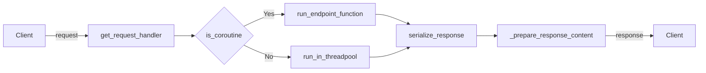

Routing in FastAPI is the process of taking a URL path, and executing a specific function (also known as a route handling function) that corresponds to that path. This is essential for directing users to different parts of a web application based on the URL they are accessing. In FastAPI, routes are created using decorators for different HTTP methods (like @app.get(), @app.post(), etc.) applied to route handling functions. These functions are then mapped to specific URL paths. FastAPI also supports dynamic routing, where parts of the URL path can be treated as parameters and passed to the route handling function.

<SwmSnippet path="/fastapi/routing.py" line="812">

---

This is the definition of the `route` function in FastAPI. It's a decorator that registers a new route handling function for a specific URL path and HTTP method. The `add_route` method is called to register the new route.

```python
    def route(
        self,
        path: str,
        methods: Optional[List[str]] = None,
        name: Optional[str] = None,
        include_in_schema: bool = True,
    ) -> Callable[[DecoratedCallable], DecoratedCallable]:
        def decorator(func: DecoratedCallable) -> DecoratedCallable:
            self.add_route(
                path,
                func,
                methods=methods,
                name=name,
                include_in_schema=include_in_schema,
            )
            return func

        return decorator
```

---

</SwmSnippet>

<SwmSnippet path="/fastapi/routing.py" line="389">

---

This is the `APIRoute` class, which represents a single API route in FastAPI. It takes the path, endpoint (the route handling function), and other optional parameters in its constructor. It also compiles the path into a regular expression for matching incoming requests.

```python
class APIRoute(routing.Route):
    def __init__(
        self,
        path: str,
        endpoint: Callable[..., Any],
        *,
        response_model: Any = Default(None),
        status_code: Optional[int] = None,
        tags: Optional[List[Union[str, Enum]]] = None,
        dependencies: Optional[Sequence[params.Depends]] = None,
        summary: Optional[str] = None,
        description: Optional[str] = None,
        response_description: str = "Successful Response",
        responses: Optional[Dict[Union[int, str], Dict[str, Any]]] = None,
        deprecated: Optional[bool] = None,
        name: Optional[str] = None,
        methods: Optional[Union[Set[str], List[str]]] = None,
        operation_id: Optional[str] = None,
        response_model_include: Optional[IncEx] = None,
        response_model_exclude: Optional[IncEx] = None,
        response_model_by_alias: bool = True,
```

---

</SwmSnippet>

<SwmSnippet path="/fastapi/routing.py" line="1072">

---

This is the `include_router` function in FastAPI. It's used to include all the routes from another router into the current one, optionally with a common path prefix. This is useful for splitting a large application into smaller, more manageable parts.

```python
    def include_router(
        self,
        router: Annotated["APIRouter", Doc("The `APIRouter` to include.")],
        *,
        prefix: Annotated[str, Doc("An optional path prefix for the router.")] = "",
        tags: Annotated[
            Optional[List[Union[str, Enum]]],
            Doc(
                """
                A list of tags to be applied to all the *path operations* in this
                router.

                It will be added to the generated OpenAPI (e.g. visible at `/docs`).

                Read more about it in the
                [FastAPI docs for Path Operation Configuration](https://fastapi.tiangolo.com/tutorial/path-operation-configuration/).
                """
            ),
        ] = None,
        dependencies: Annotated[
            Optional[Sequence[params.Depends]],
```

---

</SwmSnippet>

<SwmSnippet path="/fastapi/routing.py" line="389">

---

# APIRoute Class

The `APIRoute` class in FastAPI is used to define a single API route. It takes in the path, the endpoint (a callable that is invoked when the route is accessed), and various other optional parameters that configure the route. This class is typically not used directly, but is integral to how FastAPI's routing works.

```python
class APIRoute(routing.Route):
    def __init__(
        self,
        path: str,
        endpoint: Callable[..., Any],
        *,
        response_model: Any = Default(None),
        status_code: Optional[int] = None,
        tags: Optional[List[Union[str, Enum]]] = None,
        dependencies: Optional[Sequence[params.Depends]] = None,
        summary: Optional[str] = None,
        description: Optional[str] = None,
        response_description: str = "Successful Response",
        responses: Optional[Dict[Union[int, str], Dict[str, Any]]] = None,
        deprecated: Optional[bool] = None,
        name: Optional[str] = None,
        methods: Optional[Union[Set[str], List[str]]] = None,
        operation_id: Optional[str] = None,
        response_model_include: Optional[IncEx] = None,
        response_model_exclude: Optional[IncEx] = None,
        response_model_by_alias: bool = True,
```

---

</SwmSnippet>

<SwmSnippet path="/fastapi/routing.py" line="1312">

---

# Route Decorators

FastAPI provides several decorators like `get`, `post`, `put`, etc., which are used to define routes. These decorators take in the path as an argument and return a decorator that can be used on a function to register it as a route handler. The function decorated with one of these decorators is called when a request is made to the specified path with the corresponding HTTP method.

```python
    def get(
        self,
        path: Annotated[
            str,
            Doc(
                """
                The URL path to be used for this *path operation*.

                For example, in `http://example.com/items`, the path is `/items`.
                """
            ),
        ],
        *,
        response_model: Annotated[
            Any,
            Doc(
                """
                The type to use for the response.

                It could be any valid Pydantic *field* type. So, it doesn't have to
                be a Pydantic model, it could be other things, like a `list`, `dict`,
```

---

</SwmSnippet>

<SwmSnippet path="/fastapi/routing.py" line="1072">

---

# Including Routers

FastAPI allows for including routers using the `include_router` function. This is useful for splitting a large application into smaller, more manageable parts. Each router can have its own routes, dependencies, and even middleware, and can be mounted in the main application at a specific path.

```python
    def include_router(
        self,
        router: Annotated["APIRouter", Doc("The `APIRouter` to include.")],
        *,
        prefix: Annotated[str, Doc("An optional path prefix for the router.")] = "",
        tags: Annotated[
            Optional[List[Union[str, Enum]]],
            Doc(
                """
                A list of tags to be applied to all the *path operations* in this
                router.

                It will be added to the generated OpenAPI (e.g. visible at `/docs`).

                Read more about it in the
                [FastAPI docs for Path Operation Configuration](https://fastapi.tiangolo.com/tutorial/path-operation-configuration/).
                """
            ),
        ] = None,
        dependencies: Annotated[
            Optional[Sequence[params.Depends]],
```

---

</SwmSnippet>

# Routing in FastAPI

This section will cover the main functions related to routing in the FastAPI framework.

<SwmSnippet path="/fastapi/routing.py" line="75">

---

## \_prepare_response_content

The `_prepare_response_content` function is used to prepare the response content before it is sent back to the client. It checks the type of the response and formats it accordingly. For instance, if the response is a list, it will iterate over the items and prepare each one. If it's a dictionary, it will prepare each value in the dictionary.

```python
def _prepare_response_content(
    res: Any,
    *,
    exclude_unset: bool,
    exclude_defaults: bool = False,
    exclude_none: bool = False,
) -> Any:
    if isinstance(res, BaseModel):
        read_with_orm_mode = getattr(_get_model_config(res), "read_with_orm_mode", None)
        if read_with_orm_mode:
            # Let from_orm extract the data from this model instead of converting
            # it now to a dict.
            # Otherwise, there's no way to extract lazy data that requires attribute
            # access instead of dict iteration, e.g. lazy relationships.
            return res
        return _model_dump(
            res,
            by_alias=True,
            exclude_unset=exclude_unset,
            exclude_defaults=exclude_defaults,
            exclude_none=exclude_none,
```

---

</SwmSnippet>

<SwmSnippet path="/fastapi/routing.py" line="122">

---

## serialize_response

The `serialize_response` function is used to serialize the response content. It takes into account various factors such as whether the response is a coroutine, whether there are any errors, and the type of the field. It uses the `jsonable_encoder` function to convert the response content into JSON format.

```python
async def serialize_response(
    *,
    field: Optional[ModelField] = None,
    response_content: Any,
    include: Optional[IncEx] = None,
    exclude: Optional[IncEx] = None,
    by_alias: bool = True,
    exclude_unset: bool = False,
    exclude_defaults: bool = False,
    exclude_none: bool = False,
    is_coroutine: bool = True,
) -> Any:
    if field:
        errors = []
        if not hasattr(field, "serialize"):
            # pydantic v1
            response_content = _prepare_response_content(
                response_content,
                exclude_unset=exclude_unset,
                exclude_defaults=exclude_defaults,
                exclude_none=exclude_none,
```

---

</SwmSnippet>

<SwmSnippet path="/fastapi/routing.py" line="183">

---

## run_endpoint_function

The `run_endpoint_function` function is used to run the endpoint function and return its result. It checks whether the function is a coroutine and runs it accordingly.

```python
async def run_endpoint_function(
    *, dependant: Dependant, values: Dict[str, Any], is_coroutine: bool
) -> Any:
    # Only called by get_request_handler. Has been split into its own function to
    # facilitate profiling endpoints, since inner functions are harder to profile.
    assert dependant.call is not None, "dependant.call must be a function"

    if is_coroutine:
        return await dependant.call(**values)
    else:
        return await run_in_threadpool(dependant.call, **values)
```

---

</SwmSnippet>

<SwmSnippet path="/fastapi/routing.py" line="196">

---

## get_request_handler

The `get_request_handler` function is used to get the request handler for a given request. It sets up the necessary parameters and dependencies, and returns a function that can be called to handle the request.

```python
def get_request_handler(
    dependant: Dependant,
    body_field: Optional[ModelField] = None,
    status_code: Optional[int] = None,
    response_class: Union[Type[Response], DefaultPlaceholder] = Default(JSONResponse),
    response_field: Optional[ModelField] = None,
    response_model_include: Optional[IncEx] = None,
    response_model_exclude: Optional[IncEx] = None,
    response_model_by_alias: bool = True,
    response_model_exclude_unset: bool = False,
    response_model_exclude_defaults: bool = False,
    response_model_exclude_none: bool = False,
    dependency_overrides_provider: Optional[Any] = None,
) -> Callable[[Request], Coroutine[Any, Any, Response]]:
    assert dependant.call is not None, "dependant.call must be a function"
    is_coroutine = asyncio.iscoroutinefunction(dependant.call)
    is_body_form = body_field and isinstance(body_field.field_info, params.Form)
    if isinstance(response_class, DefaultPlaceholder):
        actual_response_class: Type[Response] = response_class.value
    else:
        actual_response_class = response_class
```

---

</SwmSnippet>

<SwmSnippet path="/fastapi/routing.py" line="353">

---

## APIWebSocketRoute

The `APIWebSocketRoute` class is used to handle WebSocket routes. It extends the `WebSocketRoute` class from the Starlette framework and adds additional functionality for handling dependencies and path parameters.

```python
class APIWebSocketRoute(routing.WebSocketRoute):
    def __init__(
        self,
        path: str,
        endpoint: Callable[..., Any],
        *,
        name: Optional[str] = None,
        dependencies: Optional[Sequence[params.Depends]] = None,
        dependency_overrides_provider: Optional[Any] = None,
    ) -> None:
        self.path = path
        self.endpoint = endpoint
        self.name = get_name(endpoint) if name is None else name
        self.dependencies = list(dependencies or [])
        self.path_regex, self.path_format, self.param_convertors = compile_path(path)
        self.dependant = get_dependant(path=self.path_format, call=self.endpoint)
        for depends in self.dependencies[::-1]:
            self.dependant.dependencies.insert(
                0,
                get_parameterless_sub_dependant(depends=depends, path=self.path_format),
            )
```

---

</SwmSnippet>

<SwmSnippet path="/fastapi/routing.py" line="389">

---

## APIRoute

The `APIRoute` class is used to handle HTTP routes. It extends the `Route` class from the Starlette framework and adds additional functionality for handling dependencies, path parameters, and response models.

```python
class APIRoute(routing.Route):
    def __init__(
        self,
        path: str,
        endpoint: Callable[..., Any],
        *,
        response_model: Any = Default(None),
        status_code: Optional[int] = None,
        tags: Optional[List[Union[str, Enum]]] = None,
        dependencies: Optional[Sequence[params.Depends]] = None,
        summary: Optional[str] = None,
        description: Optional[str] = None,
        response_description: str = "Successful Response",
        responses: Optional[Dict[Union[int, str], Dict[str, Any]]] = None,
        deprecated: Optional[bool] = None,
        name: Optional[str] = None,
        methods: Optional[Union[Set[str], List[str]]] = None,
        operation_id: Optional[str] = None,
        response_model_include: Optional[IncEx] = None,
        response_model_exclude: Optional[IncEx] = None,
        response_model_by_alias: bool = True,
```

---

</SwmSnippet>

<SwmSnippet path="/fastapi/routing.py" line="545">

---

## APIRouter

The `APIRouter` class is used to group path operations and includes them in the FastAPI application or in another `APIRouter`. It extends the `Router` class from the Starlette framework and adds additional functionality for handling dependencies, path parameters, and response models.

````python
class APIRouter(routing.Router):
    """
    `APIRouter` class, used to group *path operations*, for example to structure
    an app in multiple files. It would then be included in the `FastAPI` app, or
    in another `APIRouter` (ultimately included in the app).

    Read more about it in the
    [FastAPI docs for Bigger Applications - Multiple Files](https://fastapi.tiangolo.com/tutorial/bigger-applications/).

    ## Example

    ```python
    from fastapi import APIRouter, FastAPI

    app = FastAPI()
    router = APIRouter()


    @router.get("/users/", tags=["users"])
    async def read_users():
        return [{"username": "Rick"}, {"username": "Morty"}]
````

---

</SwmSnippet>



&nbsp;

*This is an auto-generated document by Swimm AI 🌊 and has not yet been verified by a human*

<SwmMeta version="3.0.0" repo-id="Z2l0aHViJTNBJTNBREVNTy1mYXN0YXBpJTNBJTNBZ2lsYWRuYXZvdA==" repo-name="DEMO-fastapi" doc-type="overview"><sup>Powered by [Swimm](/)</sup></SwmMeta>
