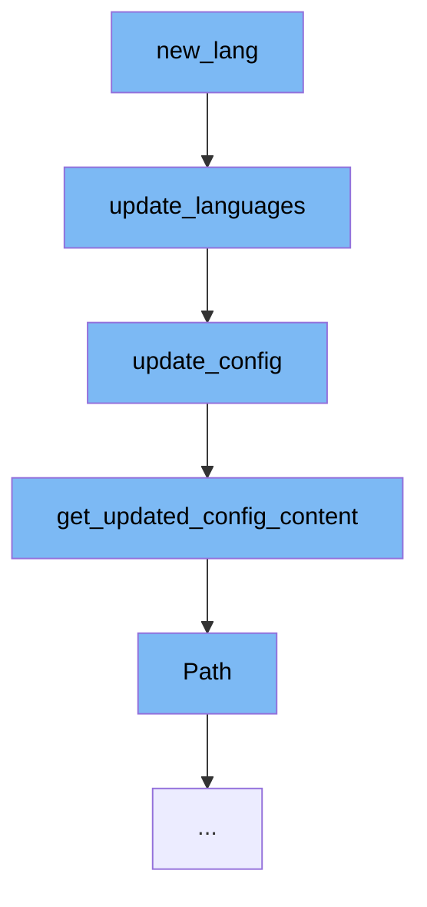

This document will cover the process of updating the language configuration in the FastAPI documentation. The process includes the following steps:

1. Calling the `new_lang` function
2. Updating the languages with `update_languages`
3. Updating the configuration with `update_config`
4. Getting the updated configuration content with `get_updated_config_content`
5. Utilizing the `Path` function from FastAPI's param_functions.



<SwmSnippet path="/scripts/docs.py" line="1">

---

# Calling the `new_lang` function

The process begins with the `new_lang` function, which is the entry point for adding a new language to the documentation. This function calls `update_languages` to start the process of updating the language configuration.

```python
import json
```

---

</SwmSnippet>

<SwmSnippet path="/scripts/docs.py" line="216">

---

# Updating the languages with `update_languages`

`update_languages` is responsible for updating the `mkdocs.yml` file Languages section to include all the available languages. It does this by calling the `update_config` function.

```python
def update_languages() -> None:
    """
    Update the mkdocs.yml file Languages section including all the available languages.
    """
    update_config()
```

---

</SwmSnippet>

<SwmSnippet path="/scripts/docs.py" line="300">

---

# Updating the configuration with `update_config`

`update_config` retrieves the updated configuration content by calling `get_updated_config_content`. It then writes this updated configuration to the `en_config_path`.

```python
def update_config() -> None:
    config = get_updated_config_content()
    en_config_path.write_text(
        yaml.dump(config, sort_keys=False, width=200, allow_unicode=True),
        encoding="utf-8",
    )
```

---

</SwmSnippet>

<SwmSnippet path="/scripts/docs.py" line="269">

---

# Getting the updated configuration content with `get_updated_config_content`

`get_updated_config_content` constructs the updated configuration content. It retrieves the English configuration and the paths for all languages. It then iterates over each language, adding it to the configuration. If a language is missing from the local language names, it raises an error.

```python
def get_updated_config_content() -> Dict[str, Any]:
    config = get_en_config()
    languages = [{"en": "/"}]
    new_alternate: List[Dict[str, str]] = []
    # Language names sourced from https://quickref.me/iso-639-1
    # Contributors may wish to update or change these, e.g. to fix capitalization.
    language_names_path = Path(__file__).parent / "../docs/language_names.yml"
    local_language_names: Dict[str, str] = mkdocs.utils.yaml_load(
        language_names_path.read_text(encoding="utf-8")
    )
    for lang_path in get_lang_paths():
        if lang_path.name in {"en", "em"} or not lang_path.is_dir():
            continue
        code = lang_path.name
        languages.append({code: f"/{code}/"})
    for lang_dict in languages:
        code = list(lang_dict.keys())[0]
        url = lang_dict[code]
        if code not in local_language_names:
            print(
                f"Missing language name for: {code}, "
```

---

</SwmSnippet>

<SwmSnippet path="/fastapi/param_functions.py" line="11">

---

# Utilizing the `Path` function from FastAPI's param_functions

The `Path` function from FastAPI's param_functions is used to handle file paths. In this context, it is used to read the `language_names.yml` file which contains the names of all supported languages.

```python
def Path(  # noqa: N802
    default: Annotated[
        Any,
        Doc(
            """
            Default value if the parameter field is not set.

            This doesn't affect `Path` parameters as the value is always required.
            The parameter is available only for compatibility.
            """
        ),
    ] = ...,
    *,
    default_factory: Annotated[
        Union[Callable[[], Any], None],
        Doc(
            """
            A callable to generate the default value.

            This doesn't affect `Path` parameters as the value is always required.
            The parameter is available only for compatibility.
```

---

</SwmSnippet>

&nbsp;

*This is an auto-generated document by Swimm AI 🌊 and has not yet been verified by a human*

<SwmMeta version="3.0.0" repo-id="Z2l0aHViJTNBJTNBREVNTy1mYXN0YXBpJTNBJTNBZ2lsYWRuYXZvdA==" repo-name="DEMO-fastapi" doc-type="flows"><sup>Powered by [Swimm](/)</sup></SwmMeta>
