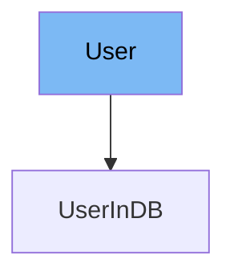

This document will cover the User class in the DEMO-fastapi repository. We'll cover:

1. What is User
2. Variables and functions in User
3. Usage example of User



# What is User

The User class is a Pydantic model that represents a user in the application. It is used to validate the data of a user and to provide a clear model of what a user object should look like. It includes fields such as username, email, full_name, and disabled.

<SwmSnippet path="/docs_src/security/tutorial005_an.py" line="52">

---

# Variables in User

The `username` variable is a required string that represents the username of the user.

```python
    username: str
```

---

</SwmSnippet>

<SwmSnippet path="/docs_src/security/tutorial005_an.py" line="53">

---

The `email` variable is an optional string that represents the email of the user. It can be None.

```python
    email: Union[str, None] = None
```

---

</SwmSnippet>

<SwmSnippet path="/docs_src/security/tutorial005_an.py" line="54">

---

The `full_name` variable is an optional string that represents the full name of the user. It can be None.

```python
    full_name: Union[str, None] = None
```

---

</SwmSnippet>

<SwmSnippet path="/docs_src/security/tutorial005_an.py" line="55">

---

The `disabled` variable is an optional boolean that represents whether the user is disabled or not. It can be None.

```python
    disabled: Union[bool, None] = None
```

---

</SwmSnippet>

<SwmSnippet path="/docs_src/security/tutorial005_an.py" line="58">

---

# Usage example

The User class is extended by the UserInDB class. This class adds a `hashed_password` variable to the User class. This shows how the User class can be extended to add more fields when needed.

```python
class UserInDB(User):
    hashed_password: str
```

---

</SwmSnippet>

&nbsp;

*This is an auto-generated document by Swimm AI 🌊 and has not yet been verified by a human*

<SwmMeta version="3.0.0" repo-id="Z2l0aHViJTNBJTNBREVNTy1mYXN0YXBpJTNBJTNBZ2lsYWRuYXZvdA==" repo-name="DEMO-fastapi" doc-type="general-class"><sup>Powered by [Swimm](/)</sup></SwmMeta>
