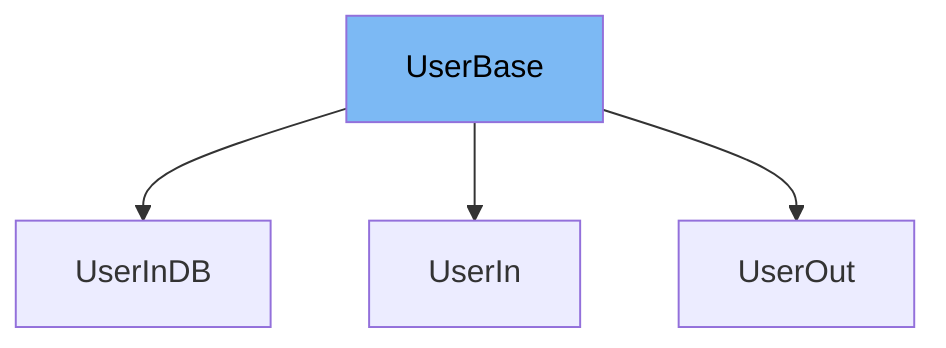

This document will cover the `UserBase` class in the DEMO-fastapi repository. We'll cover:

1. What is UserBase
2. Variables and functions in UserBase
3. Usage example of UserBase



# What is UserBase

The `UserBase` class is a Pydantic model that represents the base attributes of a user in the application. It is used as a base class for other user-related models, providing a common set of attributes that are shared across these models.

<SwmSnippet path="/docs_src/extra_models/tutorial002_py310.py" line="8">

---

# Variables in UserBase

The `username` variable is a string that stores the username of the user.

```python
    username: str
```

---

</SwmSnippet>

<SwmSnippet path="/docs_src/extra_models/tutorial002_py310.py" line="9">

---

The `email` variable is an instance of `EmailStr` from Pydantic, which validates that the input is a valid email address.

```python
    email: EmailStr
```

---

</SwmSnippet>

<SwmSnippet path="/docs_src/extra_models/tutorial002_py310.py" line="10">

---

The `full_name` variable is an optional string that stores the full name of the user. It can be `None`.

```python
    full_name: str | None = None
```

---

</SwmSnippet>

<SwmSnippet path="/docs_src/extra_models/tutorial002_py310.py" line="13">

---

# Usage example

`UserBase` is used as a base class for `UserIn`. `UserIn` inherits all attributes from `UserBase` and adds a `password` attribute.

```python
class UserIn(UserBase):
    password: str
```

---

</SwmSnippet>

&nbsp;

*This is an auto-generated document by Swimm AI 🌊 and has not yet been verified by a human*

<SwmMeta version="3.0.0" repo-id="Z2l0aHViJTNBJTNBREVNTy1mYXN0YXBpJTNBJTNBZ2lsYWRuYXZvdA==" repo-name="DEMO-fastapi" doc-type="general-class"><sup>Powered by [Swimm](/)</sup></SwmMeta>
