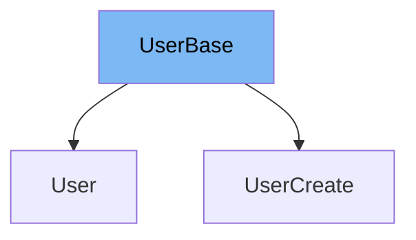

This document will cover the `UserBase` class in the DEMO-fastapi repository. We will discuss:

1. What is `UserBase`.
2. The variables and functions defined in `UserBase`.
3. An example of how `UserBase` is used in `UserCreate`.



# What is UserBase

`UserBase` is a class that serves as a base model for user-related classes in the application. It is defined using the Pydantic `BaseModel` and is used to ensure consistent structure and validation for user data across the application.

<SwmSnippet path="/docs_src/sql_databases/sql_app/schemas.py" line="24">

---

# Variables in UserBase

The `email` variable is used to store the email address of the user. It is a required string.

```python
    email: str
```

---

</SwmSnippet>

<SwmSnippet path="/docs_src/sql_databases/sql_app/schemas.py" line="27">

---

# Usage example

`UserBase` is extended by the `UserCreate` class. In addition to the `email` from `UserBase`, `UserCreate` also includes a `password` variable.

```python
class UserCreate(UserBase):
    password: str
```

---

</SwmSnippet>

&nbsp;

*This is an auto-generated document by Swimm AI 🌊 and has not yet been verified by a human*

<SwmMeta version="3.0.0" repo-id="Z2l0aHViJTNBJTNBREVNTy1mYXN0YXBpJTNBJTNBZ2lsYWRuYXZvdA==" repo-name="DEMO-fastapi" doc-type="general-class"><sup>Powered by [Swimm](/)</sup></SwmMeta>
