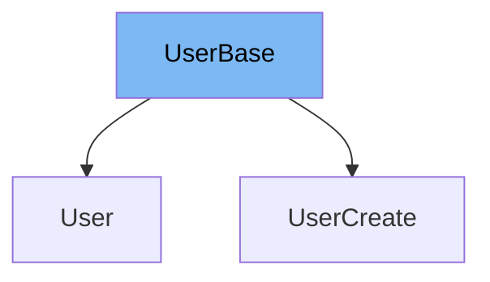

This document will cover the following aspects of the `UserBase` class:

1. What is `UserBase`.
2. Variables and functions defined in `UserBase`.
3. An example of how `UserBase` is used in `UserCreate`.



# What is UserBase

`UserBase` is a class that serves as a base model for user-related classes in the application. It is defined using the Pydantic's `BaseModel` and it includes essential user information.

<SwmSnippet path="/docs_src/sql_databases_peewee/sql_app/schemas.py" line="34">

---

# Variables and functions

`email` is a variable in `UserBase` class. It is used to store the email of the user.

```python
class UserBase(BaseModel):
    email: str

```

---

</SwmSnippet>

<SwmSnippet path="/docs_src/sql_databases_peewee/sql_app/schemas.py" line="38">

---

# Usage example

`UserCreate` class is an example of how `UserBase` is used. `UserCreate` extends `UserBase` and adds an additional `password` field.

```python
class UserCreate(UserBase):
    password: str

```

---

</SwmSnippet>

&nbsp;

*This is an auto-generated document by Swimm AI 🌊 and has not yet been verified by a human*

<SwmMeta version="3.0.0" repo-id="Z2l0aHViJTNBJTNBREVNTy1mYXN0YXBpJTNBJTNBZ2lsYWRuYXZvdA==" repo-name="DEMO-fastapi" doc-type="general-class"><sup>Powered by [Swimm](/)</sup></SwmMeta>
