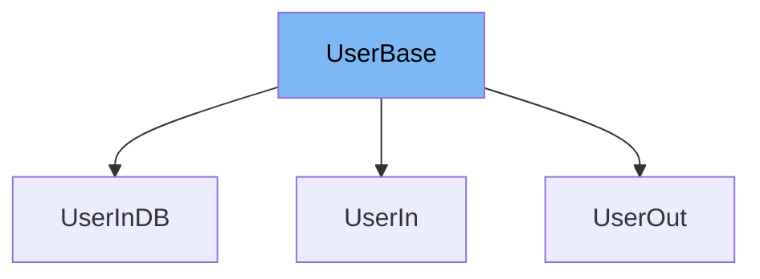

This document will cover the `UserBase` class from the `docs_src/extra_models/tutorial002.py` file. We'll cover:

1. What is `UserBase`.
2. Variables and functions in `UserBase`.
3. An example of how to use `UserBase` in `UserIn`.



# What is UserBase

`UserBase` is a class that serves as a base model for user-related classes in the application. It is used to define the common attributes that all user-related classes should have.

<SwmSnippet path="/docs_src/extra_models/tutorial002.py" line="10">

---

# Variables in UserBase

The `username` variable is a string that stores the username of the user.

```python
    username: str
```

---

</SwmSnippet>

<SwmSnippet path="/docs_src/extra_models/tutorial002.py" line="11">

---

The `email` variable is an instance of `EmailStr` from the `pydantic` library, which validates that the input is a valid email address.

```python
    email: EmailStr
```

---

</SwmSnippet>

<SwmSnippet path="/docs_src/extra_models/tutorial002.py" line="12">

---

The `full_name` variable is a string that stores the full name of the user. It can also be `None` if the user does not provide a full name.

```python
    full_name: Union[str, None] = None
```

---

</SwmSnippet>

<SwmSnippet path="/docs_src/extra_models/tutorial002.py" line="15">

---

# Usage example

`UserIn` is an example of how to use `UserBase`. It extends `UserBase` and adds an additional `password` variable.

```python
class UserIn(UserBase):
    password: str
```

---

</SwmSnippet>

&nbsp;

*This is an auto-generated document by Swimm AI 🌊 and has not yet been verified by a human*

<SwmMeta version="3.0.0" repo-id="Z2l0aHViJTNBJTNBREVNTy1mYXN0YXBpJTNBJTNBZ2lsYWRuYXZvdA==" repo-name="DEMO-fastapi" doc-type="general-class"><sup>Powered by [Swimm](/)</sup></SwmMeta>
