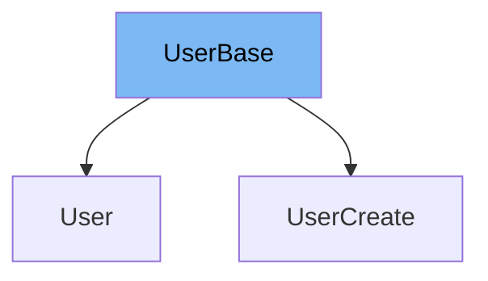

This document will cover the `UserBase` class in the DEMO-fastapi repository. We'll cover:

1. What is `UserBase`
2. Variables and functions in `UserBase`
3. An example of how to use `UserBase`



# What is UserBase

`UserBase` is a class that represents a user in the codebase. It is used to store information about a user and serves as a base class for other user-related classes.

<SwmSnippet path="/docs_src/sql_databases/sql_app_py310/schemas.py" line="22">

---

# Variables in UserBase

The variable `email` is used to store the email of the user. It is a required string.

```python
    email: str
```

---

</SwmSnippet>

# Functions in UserBase

The `UserBase` class does not define any functions. It only contains data about a user.

<SwmSnippet path="/docs_src/sql_databases/sql_app_py310/schemas.py" line="25">

---

# Usage example

`UserCreate` is an example of how `UserBase` is used. `UserCreate` extends `UserBase` and adds an additional `password` field.

```python
class UserCreate(UserBase):
    password: str
```

---

</SwmSnippet>

&nbsp;

*This is an auto-generated document by Swimm AI 🌊 and has not yet been verified by a human*

<SwmMeta version="3.0.0" repo-id="Z2l0aHViJTNBJTNBREVNTy1mYXN0YXBpJTNBJTNBZ2lsYWRuYXZvdA==" repo-name="DEMO-fastapi" doc-type="general-class"><sup>Powered by [Swimm](/)</sup></SwmMeta>
