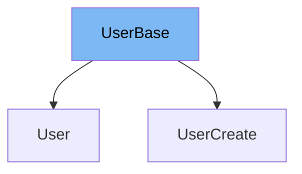

This document will cover the UserBase class in the DEMO-fastapi repository. We'll cover:

1. What UserBase is and its purpose.
2. The variables and functions defined in UserBase.
3. An example of how UserBase is used in UserCreate.



# What is UserBase

UserBase is a class defined in the `schemas.py` file of the DEMO-fastapi repository. It is a Pydantic model that represents the base properties of a user in the application. It is used as a base class for other user-related classes in the application, providing a common set of properties that all user classes should have.

<SwmSnippet path="/docs_src/sql_databases_peewee/sql_app/schemas.py" line="34">

---

# Variables in UserBase

The `email` variable is a string that stores the email of the user. It is the only property defined in the UserBase class.

```python
class UserBase(BaseModel):
    email: str
```

---

</SwmSnippet>

<SwmSnippet path="/docs_src/sql_databases_peewee/sql_app/schemas.py" line="38">

---

# Usage example

UserBase is used as a base class in the UserCreate class. UserCreate extends UserBase and adds an additional `password` property. This shows how UserBase can be used to provide common properties for other user-related classes.

```python
class UserCreate(UserBase):
    password: str
```

---

</SwmSnippet>

&nbsp;

*This is an auto-generated document by Swimm AI 🌊 and has not yet been verified by a human*

<SwmMeta version="3.0.0" repo-id="Z2l0aHViJTNBJTNBREVNTy1mYXN0YXBpJTNBJTNBZ2lsYWRuYXZvdA==" repo-name="DEMO-fastapi" doc-type="general-class"><sup>Powered by [Swimm](/)</sup></SwmMeta>
